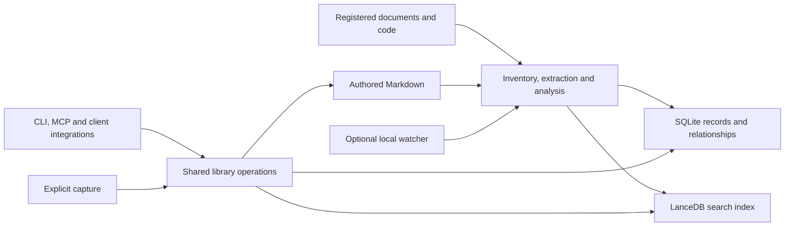

# Agentic Inquiry design

Agentic Inquiry is a local library for documents, code, observations and authored knowledge. Its command is `ai`, its Python package is `agentic_inquiry`, and its distribution is `agentic-inquiry`.

This document defines the target product and acceptance contract. [README.md](README.md) describes available behavior; [IMPLEMENTATION_PLAN.md](IMPLEMENTATION_PLAN.md) contains open work.

## Required outcomes

| ID | Outcome |
| --- | --- |
| R1 | Register multiple repositories and document collections, refresh incrementally, and retrieve exact or semantic evidence with verifiable citations. |
| R2 | Read PDF and Office documents, tables, scanned material and source code directly, retaining meaningful locations and structure. |
| R3 | Explore definitions, references, calls, imports, inheritance and dependencies; trace bounded impact and lineage across files. |
| R4 | Remember observations, decisions and corrections across sessions, with explicit project or shared scope, provenance and supersession. |
| R5 | Build cited Markdown knowledge pages, detect stale dependencies and contradictions, and preserve manual edits. |
| R6 | Refresh changed sources and capture selected session knowledge through explicitly enabled local integrations, with durable acknowledgments and restart recovery. |
| R7 | Use the same operations through a CLI, stdio MCP, Codex and Pi. |
| R8 | Measure retrieval and answer quality, latency, resources and total tokens per accepted outcome, including failures and setup cost. |
| R9 | Install, operate, back up and recover on a workstation without a cloud account, hosted service or paid model requirement. |

All nine outcomes are in implementation scope. A working search CLI alone does not satisfy this contract. Required local capabilities cannot be deferred merely to reduce implementation size. Comparative quality and capability coverage require separate evidence.

## Product boundaries

The runtime accesses explicitly registered local sources. It has no cloud database adapters, tenant management, hosted embedding gateway, REST application server, remote job queue or mandatory container environment. A foreground watcher and client-owned stdio server are supported process lifetimes. No background service is installed implicitly.

The host agent performs reasoning and synthesis. Agentic Inquiry retrieves evidence, manages durable knowledge and validates citations. It does not start another general-purpose agent or store a generative API key. A host may supply a proposed memory or draft page; the host's generation usage belongs to that outcome's cost.

Documents, code and session payloads are data, including instructions embedded inside them. Retrieved content cannot authorize execution, expand allowed roots or alter capture policy. Ingestion never executes source code, macros or embedded commands.

Product code, documentation and distributions have their own identity and Apache-2.0 license. Dependency names, model identifiers and legally required notices remain accurate. Local development tooling is excluded from Git and published artifacts. The runtime does not depend on a development workflow pack.

## Architecture

Use Python 3.11 or newer, standard-library CLI parsing and a shared application core. Collection, ingestion, retrieval, relationship, memory and knowledge operations own their behavior once; transport adapters only translate requests and responses. Use modules for these responsibilities as needed, without parallel provider hierarchies.

LanceDB owns local full-text/vector retrieval and native reciprocal-rank fusion. SQLite owns durable records, collection identity, capture receipts, publication state and relationship tables. Markdown owns editable knowledge-page bodies. The search index is rebuildable; durable memories and authored pages are not disposable. [LanceDB hybrid search](https://docs.lancedb.com/search/hybrid-search), [Python SQLite support](https://docs.python.org/3/library/sqlite3.html).

Use local FastEmbed embeddings initially. `BAAI/bge-small-en-v1.5` is the bootstrap configuration, not a quality ceiling or proof of optimal code retrieval. Record model/artifact identity, dimensions, tokenizer, query/passage conventions and chunking version. A better local model or reranker may become the default after a measured comparison. Keep adaptation at the real model boundary without a cloud-provider registry. [FastEmbed models](https://qdrant.github.io/fastembed/examples/Supported_Models/).

## Storage and recovery

The default library directory is `.agentic-inquiry/`. Existing index operations retain explicit `--db PATH`; expanded operations use consistent library selection. Multiple collections share a library only by explicit registration. Stable project and collection IDs are independent of filesystem paths. Relocation requires an explicit root update and hash reconciliation.

| Data | Authority and recovery |
| --- | --- |
| Original documents/code | Original files. Indexing never rewrites them. |
| `records.sqlite3` | Durable memories, revisions, configuration, capture receipts and publication state. Back up with SQLite's backup API. |
| `knowledge/` | User-editable Markdown and structured citations. Back up as authored data; support export to ordinary version-controlled directories. |
| `index/` | Derived chunks, vectors and full-text indexes. Rebuild from sources, records and pages. |
| Parser/relationship data | Derived from source versions, except explicitly authored relationships, which remain durable. |
| Model cache and temporary files | Disposable, with exact model identity recorded separately. |

Ignore the entire default library in Git to prevent accidental private-data publication. Users explicitly export selected records/pages. Backup captures a consistent SQLite snapshot and authored pages under the writer lock; it never relies on vectors as the only copy of knowledge. Restore validates schema and content before replacing a library and preserves a recoverable prior copy.

Serialize writers with one library lock and explicit SQLite transactions. Prepare all text, chunks, embeddings and relationships for a source before publishing it. Stage derived rows under immutable source-version IDs, then activate that version in SQLite only after required derived writes commit. Retrieval must exclude unpublished and superseded rows. Preparation/publication failure preserves the previous published version. A crash between derived writes and publication leaves identifiable orphan rows, not current evidence.

A read pins publication state and validates returned evidence against it. Apply version and scope eligibility before ranking where supported; otherwise expand candidates within a declared bound and report incomplete retrieval when obsolete rows could hide eligible evidence. Cleanup preserves versions used by active read snapshots. Do not create a second distributed transaction system.

Failed, skipped, pending, excluded and unavailable sources are distinct. Delete vanished sources only after a complete inventory of that registered root. A disconnected volume or permission failure cannot erase a collection. A newly excluded source becomes immediately ineligible for retrieval; exclusion and logical deletion are not secure erasure. Model/schema changes use a separate rebuild and atomic activation. Reject unknown newer formats without destructive repair.

## Ingestion and citations

Collections record allowed roots, include/exclude rules, parser settings and project scope. Git inventory includes tracked and non-ignored untracked files, with private-file and dependency exclusions still applied to tracked files. Ordinary directories use the same eligibility policy. Reject symlink escapes and revalidate at read time. Bound size, recursion, decompression, extraction time, output and memory. Reports identify failures without dumping source content.

Direct formats include UTF-8 text, Markdown, HTML, JSON, YAML, XML, CSV, PDF, DOCX, PPTX and XLSX. Retain headings and table structure. PDF citations use page and text-region information; Office citations use paragraph, slide, sheet and cell ranges. Extracted text offsets must not masquerade as original file lines. Encrypted, malformed, unsupported and image-only inputs have explicit statuses. Provide a local OCR path for scanned PDFs/images, with prerequisite diagnostics and provenance distinguishing recognized text. No hosted OCR is required.

Use maintained format parsers and tree-sitter grammars after checking dependency licenses and platform support. Structural coverage includes Python, JavaScript, TypeScript/TSX, Java, Go, Rust, C, C++, C# and Apex. Publish actual coverage for additional bundled grammars. Unsupported or invalid code remains searchable through text fallback with explicit reduced structural coverage.

Code chunks follow symbols where possible, preserve signatures and enclosing definitions, and carry accurate byte/line spans. Split oversized symbols within the selected tokenizer limit with correctly attributed child spans. Identifier expansion for search never alters displayed source text. Extract imports, definitions, references, calls and inheritance with language-specific resolution status. Ambiguous imports and dynamic dispatch remain unresolved; guesses are not resolved facts.

A citation includes collection/source IDs, source version/hash, chunk or symbol, and format-appropriate location. `read` exposes indexed evidence and current-source status: current, changed, missing or unavailable. Historical evidence stays inspectable and labeled. Search defaults to current eligible evidence; explicit stale inclusion supports investigation. Report freshness and coverage even for empty results.

## Retrieval and relationships

Support lexical, dense and hybrid search with collection/project/type/language/path filters. Apply scope before ranking. Use bounded native fusion, overlap deduplication and source diversity while preserving exact identifier matches. Return ranking mode, citations, freshness and coverage limitations. A local reranker and bounded relationship expansion are supported configurations, measured independently before default activation.

`context` assembles evidence and memory within an explicit token budget. Report the tokenizer or estimation method and omitted material. Never silently truncate citations or call an estimate exact provider usage. No supporting evidence produces an explained empty response, not a synthesized answer.

Relationship operations cover definitions, references, callers, callees, imports, dependencies, inheritance, impact and lineage. Return provenance, source version and resolution status. Bound traversal depth, nodes, time and output; handle cycles and expose truncation. Static impact is not a claim to resolve every runtime behavior. Indexed relationship tables support traversal without a graph service.

## Memory and knowledge

A memory has a stable ID, project or explicit shared scope, kind, content, origin, timestamps, revision, evidence links and lifecycle state. Kinds include observations, decisions, preferences and corrections. Capture defaults to project scope; shared recall is explicit. One repository cannot silently receive another repository's context.

Corrections create revisions or superseding records with provenance. Superseded/retracted assertions do not reappear as current facts through stale indexes. Contradictions remain inspectable. Model wording is not objective confidence. Distinguish user-supplied facts, extracted evidence and agent-authored synthesis. Source-backed memories inherit dependency freshness; user-supplied facts without files never receive fabricated citations.

Capture requires explicit enablement and a stable event ID. Commit content and its idempotency receipt before acknowledging success. Duplicate delivery cannot duplicate memories. Failed writes remain visible; retries are durable when capture is enabled. Store selected structured observations, not raw transcripts, command-output dumps or hidden reasoning by default. Host session-end events are not guaranteed delivery, so expose pending/failed captures. Disabling integration stops new capture and automatic recall.

The host authors Markdown drafts with structured citations. Validate referenced evidence and retain unresolved/stale support. Updating a page requires an expected content hash, preserving manual edits. Saving a page does not certify every assertion. Track page-to-source and page-to-page dependencies with cycle detection; source changes mark dependent knowledge stale transitively. Refresh supplies affected pages and evidence to the host without silently rewriting them. Export retains citations and unresolved status.

Memory forget, collection removal and cache cleanup are separate operations with previewable scope. Logical removal is not secure erasure of backups or storage history. Restart, compaction and index rebuild must preserve acknowledged records, supersession and authored pages.

## CLI and integrations

Existing commands keep their meanings: `ai index`, `ai search`, `ai read`, `ai status`, `ai remove`. JSON is the stable machine format; progress goes to stderr. Success, partial completion and failure have distinct exit statuses. Introduce a response schema version before expanding results. Never interpolate user input into SQL or shell commands.

| Family | Target operations |
| --- | --- |
| `ai collection` | Register, list, inspect, relocate and explicitly detach roots. |
| `ai index`, `ai search`, `ai read`, `ai context` | Refresh, retrieve, inspect evidence and assemble bounded context. |
| `ai symbols`, `ai relations`, `ai impact`, `ai lineage` | Inspect structural evidence and bounded relationships. |
| `ai memory` | Add, recall, inspect, correct, supersede, retract and export records. |
| `ai knowledge` | Inspect, validate, write with an expected hash, find stale dependencies and export pages. |
| `ai capture`, `ai watch` | Accept durable events and run optional foreground refresh. |
| `ai status`, `ai doctor` | Report freshness, coverage, model availability, processes and prerequisites. |
| `ai backup`, `ai restore` | Protect durable records/pages and recover independently of cached vectors. |
| `ai mcp` | Serve shared operations over stdio with explicit roots and capabilities. |

Use the maintained MCP SDK, no listening network port and narrow read/write tools. Core scope/write checks apply identically across transports. Help, status and lexical retrieval do not initialize embeddings unnecessarily. Explicit setup/indexing may download model artifacts with size/identity disclosure; search never downloads a missing model or sends source data to the model host.

The Pi extension provides `/ai` with optional explicit lifecycle integration. The Codex skill is named `ai` and uses its native skill invocation surface; bare `/ai` is not a universal cross-client promise. Both use the CLI or stdio MCP. Installers preview changes, preserve unrelated configuration, detect name collisions and remove only owned entries. Global skill presence does not activate collection access or capture. Cursor-specific packaging is deferred; the stdio interface remains reusable.

### Native consumer capability contract

The native integration is a complete local consumer plugin with commands, hooks, skills and specialized invocation roles. A skill-only projection does not satisfy R7. The standalone distribution supplies alternative client integrations; the native workflow pack supplies its own plugin registration. Exactly one owner may register automatic events or the short `/ai` alias in a client/project. Installers detect an existing owner before applying changes. The runtime remains standalone and owns scope, policy, persistence and all hook business logic.

| Consumer capability | Product operation and native disposition |
| --- | --- |
| Setup, environment and onboarding | Local `setup`, `doctor`, `status`, collection registration and indexing; environment helper role reports prerequisites and recovery. No cloud provisioning is required. |
| Search, context and code exploration | Lexical/dense/hybrid evidence, bounded context, symbols and relationships; codebase explorer role validates source locations. |
| Memory and corrections | Scoped durable records, revisions, contradictions, supersession and explicit recall. |
| Entities and architectural patterns | Symbol/entity lookup and cited evidence for host-authored pattern analysis. Patterns are hypotheses until source-backed, not automatic architectural truth. |
| Impact, lineage and services | Bounded static dependencies, callers/callees, inheritance and cited host exploration. Dynamic service topology and data flow remain explicitly unresolved where static evidence cannot establish them. |
| Knowledge validation | Citation, freshness, dependency and manual-edit validation; host synthesis is never certified merely by storage. |
| Session continuity | Opt-in recall, selected observation capture and artifact refresh through native lifecycle events, including compaction where supported; pending/error outcomes remain visible. |
| Command guidance | Specialized command guide role with native invocation, available operations and recovery guidance. |
| Search advice | Command/skill guidance replaces automatic prompt-based interception of unrelated searches. No hidden generative hook is required. |
| Session reflection | Hosts may propose selected observations; no forced reasoning dump, transcript capture, extra agent execution or implicit paid calls. |
| Cloud services and development workflows | Outside this local consumer runtime; not needed for any required local outcome. |

`ai capabilities --json` publishes `schema_version: 1`, CLI/MCP/hook contract versions, runtime capabilities, client event support, ownership and prerequisite diagnostics. `ai integration hook --client codex|pi --event EVENT` reads bounded JSON from stdin. Event names are `SessionStart`, `UserPromptSubmit`, `PostToolUse`, `TaskCompleted`, `PreCompact`, `Stop` and `SessionEnd`; unsupported client events are advertised and rejected explicitly.

Input includes `schema_version: 1`, canonical `project_root`, `session_id`, a stable `event_id` for mutation, and admitted `query`, `observations` or `artifacts` fields. Responses contain `schema_version`, `status` (`inert`, `ok`, `partial`, `error`, `unsupported`), bounded `context`, `receipts`, `pending` and `errors`. Receipt kinds distinguish `indexed`, `remembered` and `queued`. A missing stable event identity cannot produce a capture success. Native delivery or host completion cannot establish persistence. Unsupported or missing capabilities and version mismatch are visible errors.

Integration defaults to inert until explicit per-project enablement. Collection access and shared memory remain separately scoped. The runtime never reads a transcript path or hidden reasoning from hook payloads. Native translation only maps supported host events and stable identities to this interface. The Pi integration uses supported extension lifecycle events for compaction; no second event bridge may be simultaneously active alongside a workflow-pack plugin.

The watcher is opt-in and foreground by default. Debounce/coalesce per source, reconcile at startup and periodically, and serialize publication. Filesystem events are hints, not deletion authority. Shutdown completes or cancels with a visible checkpoint. Restart recovers missed changes and acknowledged captures without duplicate current versions.

## Acceptance

Use installed public operations and actual native clients. Component checks cover failure/recovery boundaries but do not replace live use. Exercise real repositories and available real documents without altering originals. Do not label simulated journeys end-to-end evidence. Unavailable input/client coverage is unverified, never passed.

| Requirement | Observable evidence |
| --- | --- |
| R1 | Register two real collections, retrieve/read citations, refresh a changed source and repeat an unchanged scan while preserving originals. |
| R2 | Inspect meaningful locations and tables for each supported format and local OCR on real scanned input; explicit encrypted/unsupported outcomes. |
| R3 | Check real definitions and cross-file edges against source, including unresolved links, cycles and bounded impact/lineage. |
| R4 | Save and recall in different processes/sessions, correct a fact and verify supersession, isolation and explicit shared recall. |
| R5 | Create a cited page, change a dependency, observe transitive staleness and preserve a concurrent manual edit. |
| R6 | Observe real client capture/recall, durable receipts, duplicate-delivery behavior, failure reporting and watcher restart reconciliation. |
| R7 | Install the wheel and observe CLI, actual stdio MCP, Codex and Pi operations. Distinguish installation, discovery and use. |
| R8 | Produce replayable trial reports with full denominators and resource/token accounting; unknown usage is null. |
| R9 | Validate supported workstation installation, cached offline operation, durable backup/restore, derived-index rebuild and package contents. |

## Quality and outcome efficiency

Freeze task text, corpus revision, independent atomic-fact rubrics, thresholds, model identity/effort, context, tools and turn/time/token limits before comparative execution. Separate development examples from sealed questions. A six-question cross-file pilot is exploratory. External comparisons belong to an independently owned study; another published score is not directly comparable without matching conditions.

Measure lexical/dense/hybrid ablations and ordinary file search. Compare configured products separately from component ablations. Include memory correction, scope, temporal freshness and missing evidence, plus document/code evidence recovery. Calibrate any model judge with independently labeled answers and inspect disagreements.

Trial acceptance requires at least 0.85 weighted fact coverage, valid citations for all required source-backed claims, no material unsupported assertion, and completion within declared limits. Report continuous scores as well. Critical scope, preservation or fabricated-citation failures fail the relevant capability regardless of average score.

Report input, output and cached-input tokens separately using provider semantics, without double-counting cached input. Include every attempt, retry, worker and failed answer. Answering tokens per accepted outcome equals total answering execution tokens across the cohort divided by accepted outcomes. Zero accepted outcomes yields an undefined ratio with the full cost/failure denominator; incomplete usage yields null ratios. Grader usage is separate and included in all-in totals.

Report extraction/indexing/embedding work, model-download size, disk, peak memory, cold/warm latency and wall time. Local embedding units are separate from generation tokens. Preparation, knowledge synthesis and grading appear separately and in cold all-in totals. Amortized totals disclose the number of uses. Lower resource use does not excuse reduced quality.

Do not claim equal quality from component checks or a small pilot. Before a no-quality-loss claim, require a sufficiently powered matched paired study: no omitted required capability, no critical preservation/scope failure, and no reduction in observed weighted coverage or required capability groups. Report paired confidence intervals. Use a zero-loss margin for a formal non-inferiority claim; if a one-sided 95% bound still permits a loss, the result remains inconclusive. A relaxed margin requires an explicit study decision, not an implementation shortcut. Paid runs require a separate spending ceiling; implementation and local validation proceed independently.
