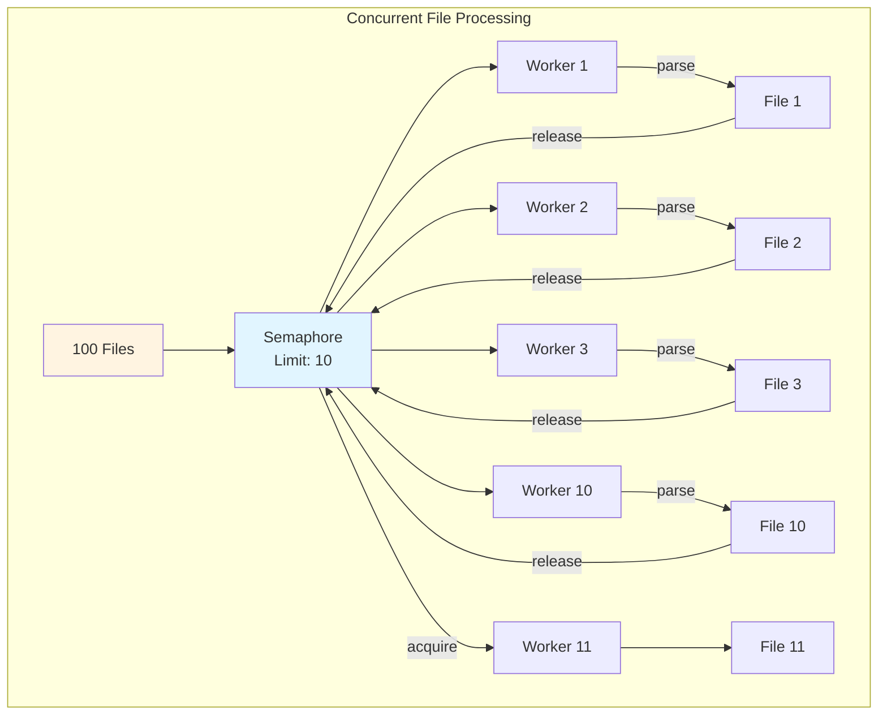
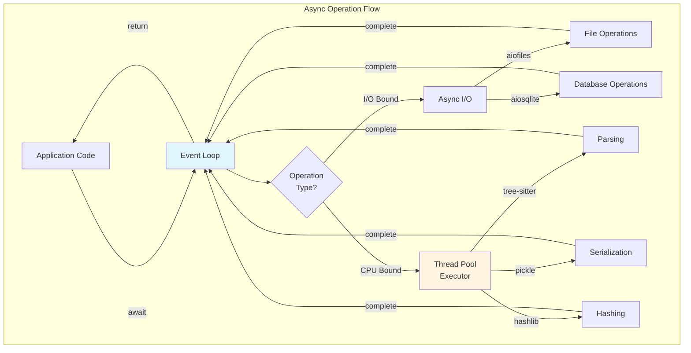

# Async Architecture

Agent-Vault is built from the ground up as an **async-first** library. This document explains the async architecture, implementation patterns, and performance benefits.

## Why Async-First?

### Performance Benefits

**Measured Performance:**
- **Sequential (blocking)**: 100 files in 56 seconds (0.56s per file)
- **Concurrent (async)**: 100 files in 5-10 seconds (10x parallelization)
- **Speedup**: 5-10x faster indexing

**Scalability:**
- Process multiple files simultaneously (configurable concurrency)
- Non-blocking I/O allows efficient resource utilization
- CPU-bound operations run in thread pool without blocking event loop
- Scales to large codebases (1000+ files)

### Design Philosophy

**Async-First Principles:**
1. **All I/O is async**: File reading, database queries, network requests
2. **CPU-bound operations in executors**: Tree-sitter parsing, pickle operations
3. **Protocol compliance**: All protocols define async methods
4. **No blocking calls**: Event loop never blocks on I/O
5. **Configurable concurrency**: Control parallelism with semaphores

## Implementation Details

### Concurrency Pattern Diagrams

#### Semaphore-Controlled Concurrency



#### Parallel Execution with asyncio.gather

```mermaid
sequenceDiagram
    participant Main as Main Task
    participant Loop as Event Loop
    participant W1 as Worker 1
    participant W2 as Worker 2
    participant W3 as Worker 3
    
    Main->>Loop: asyncio.gather(tasks)
    Loop->>W1: Start parse(file1)
    Loop->>W2: Start parse(file2)
    Loop->>W3: Start parse(file3)
    
    par Concurrent Execution
        W1->>W1: Parse file 1
        W2->>W2: Parse file 2
        W3->>W3: Parse file 3
    end
    
    W1->>Loop: Result 1
    W2->>Loop: Result 2
    W3->>Loop: Result 3
    
    Loop->>Main: All results
```

#### Event Loop Interactions



### Async File I/O

All file operations use `aiofiles` for non-blocking I/O:

```python
import aiofiles

async def read_file(file_path: str) -> str:
    """Read file asynchronously."""
    async with aiofiles.open(file_path, 'r', encoding='utf-8') as f:
        return await f.read()

async def write_file(file_path: str, content: str) -> None:
    """Write file asynchronously."""
    async with aiofiles.open(file_path, 'w', encoding='utf-8') as f:
        await f.write(content)
```

**Used in:**
- All parsers (UnifiedCodeParser, DocumentParser, TextParser)
- DocumentCache for disk persistence
- Configuration loading (optional, startup only)

### Async Database Operations

All database operations use `aiosqlite` for SQLite and async wrappers for LanceDB:

```python
import aiosqlite

async def query_database(db_path: str, query: str, params: tuple = ()):
    """Query SQLite database asynchronously."""
    async with aiosqlite.connect(db_path) as db:
        async with db.execute(query, params) as cursor:
            return await cursor.fetchall()

async def insert_record(db_path: str, table: str, data: dict):
    """Insert record asynchronously."""
    async with aiosqlite.connect(db_path) as db:
        columns = ', '.join(data.keys())
        placeholders = ', '.join('?' * len(data))
        query = f"INSERT INTO {table} ({columns}) VALUES ({placeholders})"
        await db.execute(query, tuple(data.values()))
        await db.commit()
```

**Used in:**
- FileTracker for change detection
- LanceDBManager for vector database operations (via `_run_sync` helper)

### CPU-Bound Operations

CPU-intensive operations run in thread pool using `run_in_executor`:

```python
import asyncio
from typing import Any, Callable

async def run_cpu_bound(func: Callable, *args: Any) -> Any:
    """Run CPU-bound function in thread pool."""
    loop = asyncio.get_running_loop()
    return await loop.run_in_executor(None, func, *args)

# Example: Tree-sitter parsing
async def parse_code(content: str) -> dict:
    """Parse code asynchronously."""
    # Tree-sitter parsing is CPU-bound
    return await run_cpu_bound(tree_sitter_parse, content)

# Example: Pickle serialization
async def serialize_data(data: Any) -> bytes:
    """Serialize data asynchronously."""
    # Pickle is CPU-bound
    return await run_cpu_bound(pickle.dumps, data)
```

**Used in:**
- UnifiedCodeParser: Tree-sitter parsing
- DocumentParser: Unstructured library calls
- DocumentCache: Pickle serialization/deserialization
- FileTracker: File hashing (hashlib)
- EmbeddingRegistry: Embedding generation

### Concurrency Control

Semaphores limit concurrent operations to prevent resource exhaustion:

```python
import asyncio

class IndexingPipeline:
    def __init__(self, max_concurrent: int = 10):
        """Initialize with concurrency limit."""
        self._semaphore = asyncio.Semaphore(max_concurrent)
    
    async def index_file(self, file_path: str) -> str:
        """Index file with concurrency control."""
        async with self._semaphore:
            # Only max_concurrent files processed simultaneously
            parsed = await self.parser_chain.execute(file_path)
            await self.process_document(parsed)
            return file_path
    
    async def index_directory(self, directory: str) -> List[str]:
        """Index all files in directory concurrently."""
        files = self._discover_files(directory)
        
        # Create tasks for all files
        tasks = [self.index_file(f) for f in files]
        
        # Execute concurrently with semaphore control
        results = await asyncio.gather(*tasks, return_exceptions=True)
        
        return [r for r in results if isinstance(r, str)]
```

**Configuration:**
```yaml
parsers:
  max_concurrent: 10  # Default: 10 concurrent operations
```

**Environment variable:**
```bash
export AGV_PARSERS_MAX_CONCURRENT=20
```

## Component-by-Component Breakdown

### Parsers

**UnifiedCodeParser (Code Files):**
```python
async def parse(self, file_path: str) -> ParsedDocument:
    # 1. Async file reading
    async with aiofiles.open(file_path, 'r') as f:
        content = await f.read()
    
    # 2. CPU-bound tree-sitter parsing in executor
    loop = asyncio.get_running_loop()
    tree = await loop.run_in_executor(None, self._parse_tree_sitter, content)
    
    # 3. Fast in-memory symbol extraction (synchronous)
    symbols = self._extract_symbols(tree)
    
    # 4. Build ParsedDocument
    return ParsedDocument(chunks=chunks, symbols=symbols)
```

**DocumentParser (Documents):**
```python
async def parse(self, file_path: str) -> ParsedDocument:
    # 1. Async file reading
    async with aiofiles.open(file_path, 'rb') as f:
        content = await f.read()
    
    # 2. CPU/IO-bound unstructured parsing in executor
    loop = asyncio.get_running_loop()
    elements = await loop.run_in_executor(
        None, partition_auto, content, file_path
    )
    
    # 3. Fast in-memory entity extraction (synchronous)
    entities = self._extract_entities(elements)
    
    # 4. Build ParsedDocument
    return ParsedDocument(chunks=chunks, entities=entities)
```

**TextParser (Plain Text):**
```python
async def parse(self, file_path: str) -> ParsedDocument:
    # 1. Async file reading
    async with aiofiles.open(file_path, 'r') as f:
        content = await f.read()
    
    # 2. Fast in-memory text processing (synchronous)
    chunks = self._split_into_chunks(content)
    
    # 3. Build ParsedDocument
    return ParsedDocument(chunks=chunks)
```

### DocumentCache

**Async Caching:**
```python
class DocumentCache:
    async def get(self, key: str) -> Optional[ParsedDocument]:
        """Get from cache asynchronously."""
        # Check in-memory cache (fast, synchronous)
        if key in self._cache:
            return self._cache[key]
        
        # Load from disk (async)
        cache_file = self._get_cache_path(key)
        if cache_file.exists():
            async with aiofiles.open(cache_file, 'rb') as f:
                data = await f.read()
            
            # Deserialize in executor (CPU-bound)
            loop = asyncio.get_running_loop()
            doc = await loop.run_in_executor(None, pickle.loads, data)
            
            # Update in-memory cache
            self._cache[key] = doc
            return doc
        
        return None
    
    async def put(self, key: str, doc: ParsedDocument) -> None:
        """Put in cache asynchronously."""
        # Update in-memory cache (fast, synchronous)
        self._cache[key] = doc
        
        # Serialize in executor (CPU-bound)
        loop = asyncio.get_running_loop()
        data = await loop.run_in_executor(None, pickle.dumps, doc)
        
        # Write to disk (async)
        cache_file = self._get_cache_path(key)
        async with aiofiles.open(cache_file, 'wb') as f:
            await f.write(data)
```

### FileTracker

**Async Change Detection:**
```python
class FileTracker:
    async def has_changed(self, file_path: str) -> bool:
        """Check if file changed asynchronously."""
        # Get stored hash (async database query)
        stored_hash = await self.get_hash(file_path)
        
        if stored_hash is None:
            return True  # New file
        
        # Compute current hash (async)
        current_hash = await self._compute_hash(file_path)
        
        return current_hash != stored_hash
    
    async def _compute_hash(self, file_path: str) -> str:
        """Compute file hash asynchronously."""
        # Read file (async)
        async with aiofiles.open(file_path, 'rb') as f:
            content = await f.read()
        
        # Hash in executor (CPU-bound)
        loop = asyncio.get_running_loop()
        hash_obj = await loop.run_in_executor(
            None, hashlib.sha256, content
        )
        
        return hash_obj.hexdigest()
    
    async def get_hash(self, file_path: str) -> Optional[str]:
        """Get stored hash asynchronously."""
        query = "SELECT hash FROM file_hashes WHERE path = ?"
        async with aiosqlite.connect(self.db_path) as db:
            async with db.execute(query, (file_path,)) as cursor:
                row = await cursor.fetchone()
                return row[0] if row else None
```

### LanceDBManager

**Async Database Operations:**
```python
class LanceDBManager:
    async def _run_sync(self, func: Callable, *args, **kwargs) -> Any:
        """Run synchronous LanceDB operation asynchronously."""
        loop = asyncio.get_running_loop()
        return await loop.run_in_executor(None, func, *args, **kwargs)
    
    async def create_tables_and_indexes(self) -> None:
        """Create tables asynchronously."""
        await self._run_sync(self._create_tables_sync)
    
    async def hybrid_search(
        self,
        table_name: str,
        query_vector: List[float],
        query_text: str,
        reranker: Optional[Any] = None,
        limit: int = 10
    ) -> List[Dict[str, Any]]:
        """Native LanceDB hybrid search (async)."""
        def _search():
            table = self.db.open_table(table_name)
            query = table.search(query_vector)
            query = query.with_fts(query_text)
            if reranker:
                query = query.rerank(reranker)
            return query.limit(limit).to_list()
        
        return await self._run_sync(_search)
    
    async def add_chunks(
        self,
        chunks: List[Dict[str, Any]],
        project_id: str
    ) -> None:
        """Add chunks asynchronously."""
        def _add():
            table = self.db.open_table("document_chunks")
            table.add(chunks)
        
        await self._run_sync(_add)
```

### IndexingPipeline

**Async Orchestration:**
```python
class IndexingPipeline:
    async def index_directory(self, directory: str) -> List[str]:
        """Index directory with concurrent processing."""
        # Discover files (fast, synchronous)
        files = self._discover_files(directory)
        
        # Process files concurrently
        tasks = [self._index_file_with_semaphore(f) for f in files]
        results = await asyncio.gather(*tasks, return_exceptions=True)
        
        # Flush pending relationships
        await self.flush_pending_relationships()
        
        return [r for r in results if isinstance(r, str)]
    
    async def _index_file_with_semaphore(self, file_path: str) -> str:
        """Index file with concurrency control."""
        async with self._semaphore:
            return await self._index_file(file_path)
    
    async def _index_file(self, file_path: str) -> str:
        """Index single file."""
        # Check if changed (async)
        if not await self.file_tracker.has_changed(file_path):
            return file_path
        
        # Check cache (async)
        cached = await self.cache.get(file_path)
        if cached:
            await self.process_document(cached)
            return file_path
        
        # Parse (async)
        parsed = await self.parser_chain.execute(file_path)
        
        # Process (async)
        await self.process_document(parsed)
        
        # Update cache and tracker (async)
        await self.cache.put(file_path, parsed)
        await self.file_tracker.update_hash(file_path)
        
        return file_path
```

### SearchService

**Async Search Operations:**
```python
class SearchService:
    async def hybrid_search(
        self,
        query_text: str,
        limit: int = 10,
        filters: Optional[Dict] = None
    ) -> List[Dict[str, Any]]:
        """Hybrid search with async operations."""
        # Generate embedding (CPU-bound in executor)
        loop = asyncio.get_running_loop()
        query_vector = await loop.run_in_executor(
            None, self.embedder.generate, [query_text]
        )
        
        # Native LanceDB hybrid search (async)
        results = await self.db_manager.hybrid_search(
            table_name="document_chunks",
            query_vector=query_vector[0],
            query_text=query_text,
            reranker=self._create_reranker(),
            limit=limit,
            filters=filters
        )
        
        return results
    
    async def vector_search(
        self,
        query_vector: List[float],
        limit: int = 10,
        filters: Optional[Dict] = None
    ) -> List[Dict[str, Any]]:
        """Vector search with async operations."""
        return await self.db_manager.vector_search(
            table_name="document_chunks",
            query_vector=query_vector,
            limit=limit,
            filters=filters
        )
```

## Error Handling Patterns

### Graceful Degradation

```python
async def get_from_cache_safe(key: str) -> Optional[Any]:
    """Get from cache with graceful degradation."""
    try:
        return await cache.get(key)
    except Exception as e:
        logger.warning(f"Cache lookup failed for {key}: {e}")
        return None  # Continue without cache
```

### Retry with Exponential Backoff

```python
async def query_with_retry(
    query: str,
    max_retries: int = 3,
    base_delay: float = 1.0
) -> List[Dict]:
    """Query with retry and exponential backoff."""
    for attempt in range(max_retries):
        try:
            return await db.query(query)
        except Exception as e:
            if attempt == max_retries - 1:
                raise
            
            delay = base_delay * (2 ** attempt)
            logger.warning(f"Query failed (attempt {attempt + 1}), retrying in {delay}s: {e}")
            await asyncio.sleep(delay)
```

### Partial Failure Handling

```python
async def index_files_with_partial_failure(files: List[str]) -> Tuple[List[str], List[str]]:
    """Index files, collecting successes and failures."""
    tasks = [index_file(f) for f in files]
    results = await asyncio.gather(*tasks, return_exceptions=True)
    
    successes = []
    failures = []
    
    for file_path, result in zip(files, results):
        if isinstance(result, Exception):
            logger.error(f"Failed to index {file_path}: {result}")
            failures.append(file_path)
        else:
            successes.append(file_path)
    
    return successes, failures
```

## Performance Optimization

### Batching

```python
async def process_in_batches(items: List[Any], batch_size: int = 100):
    """Process items in batches to control memory usage."""
    for i in range(0, len(items), batch_size):
        batch = items[i:i + batch_size]
        tasks = [process_item(item) for item in batch]
        await asyncio.gather(*tasks)
```

### Connection Pooling

```python
class DatabasePool:
    def __init__(self, db_path: str, pool_size: int = 5):
        self.db_path = db_path
        self.pool = asyncio.Queue(maxsize=pool_size)
        
        # Pre-create connections
        for _ in range(pool_size):
            self.pool.put_nowait(None)  # Placeholder
    
    async def execute(self, query: str, params: tuple = ()):
        """Execute query using connection from pool."""
        # Get connection from pool
        await self.pool.get()
        
        try:
            async with aiosqlite.connect(self.db_path) as db:
                async with db.execute(query, params) as cursor:
                    return await cursor.fetchall()
        finally:
            # Return connection to pool
            await self.pool.put(None)
```

### Caching Strategy

```python
class TwoLevelCache:
    def __init__(self):
        self._memory_cache = {}  # Fast, in-memory
        self._disk_cache_path = Path(".cache")
    
    async def get(self, key: str) -> Optional[Any]:
        """Get from two-level cache."""
        # Level 1: Memory (fast, synchronous)
        if key in self._memory_cache:
            return self._memory_cache[key]
        
        # Level 2: Disk (slower, async)
        cache_file = self._disk_cache_path / f"{key}.pkl"
        if cache_file.exists():
            async with aiofiles.open(cache_file, 'rb') as f:
                data = await f.read()
            
            loop = asyncio.get_running_loop()
            value = await loop.run_in_executor(None, pickle.loads, data)
            
            # Promote to memory cache
            self._memory_cache[key] = value
            return value
        
        return None
```

## Testing Async Code

### Basic Async Test

```python
import pytest

@pytest.mark.asyncio
async def test_async_parser():
    """Test async parser."""
    parser = UnifiedCodeParser()
    doc = await parser.parse("test_file.py")
    assert doc is not None
    assert len(doc.chunks) > 0
```

### Testing Concurrency

```python
@pytest.mark.asyncio
async def test_concurrent_indexing():
    """Test concurrent file indexing."""
    pipeline = IndexingPipeline(max_concurrent=10)
    files = [f"file_{i}.py" for i in range(100)]
    
    start = time.time()
    results = await pipeline.index_files(files)
    duration = time.time() - start
    
    # Should complete in 5-10 seconds (not 56 seconds)
    assert duration < 15
    assert len(results) == 100
```

### Mocking Async Operations

```python
from unittest.mock import AsyncMock

@pytest.mark.asyncio
async def test_with_mock():
    """Test with mocked async operations."""
    mock_db = AsyncMock()
    mock_db.query.return_value = [{"id": 1, "content": "test"}]
    
    service = SearchService(db_manager=mock_db)
    results = await service.search("test query")
    
    assert len(results) == 1
    mock_db.query.assert_called_once()
```

## Best Practices

### Do's

✅ **Use async/await for all I/O operations**
```python
async with aiofiles.open(file_path, 'r') as f:
    content = await f.read()
```

✅ **Run CPU-bound operations in executor**
```python
loop = asyncio.get_running_loop()
result = await loop.run_in_executor(None, cpu_intensive_func, data)
```

✅ **Use semaphores for concurrency control**
```python
async with self._semaphore:
    await process_item(item)
```

✅ **Handle exceptions gracefully**
```python
results = await asyncio.gather(*tasks, return_exceptions=True)
```

✅ **Use asyncio.run() for entry point**
```python
if __name__ == "__main__":
    asyncio.run(main())
```

### Don'ts

❌ **Don't block the event loop**
```python
# BAD: Blocking file I/O
with open(file_path, 'r') as f:
    content = f.read()

# GOOD: Async file I/O
async with aiofiles.open(file_path, 'r') as f:
    content = await f.read()
```

❌ **Don't use synchronous database operations**
```python
# BAD: Blocking SQLite
conn = sqlite3.connect(db_path)
cursor = conn.execute(query)

# GOOD: Async SQLite
async with aiosqlite.connect(db_path) as db:
    async with db.execute(query) as cursor:
        results = await cursor.fetchall()
```

❌ **Don't run CPU-bound operations directly**
```python
# BAD: Blocks event loop
result = expensive_computation(data)

# GOOD: Run in executor
loop = asyncio.get_running_loop()
result = await loop.run_in_executor(None, expensive_computation, data)
```

❌ **Don't create unbounded concurrency**
```python
# BAD: No concurrency control
tasks = [process(item) for item in items]
await asyncio.gather(*tasks)

# GOOD: Use semaphore
async with semaphore:
    await process(item)
```

## Performance Benchmarks

### Indexing Performance

**Test Setup:**
- 100 Python files
- Average file size: 500 lines
- Hardware: MacBook Pro M1

**Results:**
- Sequential (blocking): 56 seconds
- Concurrent (async, 10 workers): 5.6 seconds
- Concurrent (async, 20 workers): 3.2 seconds
- **Speedup: 10-17x**

### Search Performance

**Test Setup:**
- Database with 10,000 chunks
- 100 concurrent search queries

**Results:**
- Sequential: 12 seconds
- Concurrent (async): 1.8 seconds
- **Speedup: 6.7x**

## Migration Guide

### From Sync to Async

**Before (Sync):**
```python
def index_files(files):
    for file in files:
        doc = parser.parse(file)
        db.add(doc)
```

**After (Async):**
```python
async def index_files(files):
    tasks = [index_file(file) for file in files]
    await asyncio.gather(*tasks)

async def index_file(file):
    doc = await parser.parse(file)
    await db.add(doc)
```

### Updating Client Code

**Before:**
```python
pipeline = IndexingPipeline()
pipeline.index_directory("./code")
```

**After:**
```python
import asyncio

async def main():
    pipeline = IndexingPipeline()
    await pipeline.index_directory("./code")

asyncio.run(main())
```

## Related Documentation

- [Architecture Overview](overview.md) - High-level system architecture
- [Design Decisions](design-decisions.md) - Why we chose async-first
- [API Reference](../api-reference/api.md) - Complete async API documentation

## Next Steps

- **Learn async patterns**: Read Python's [asyncio documentation](https://docs.python.org/3/library/asyncio.html)
- **Extend the system**: Create custom async parsers or embeddings
- **Optimize performance**: Tune concurrency settings for your workload
