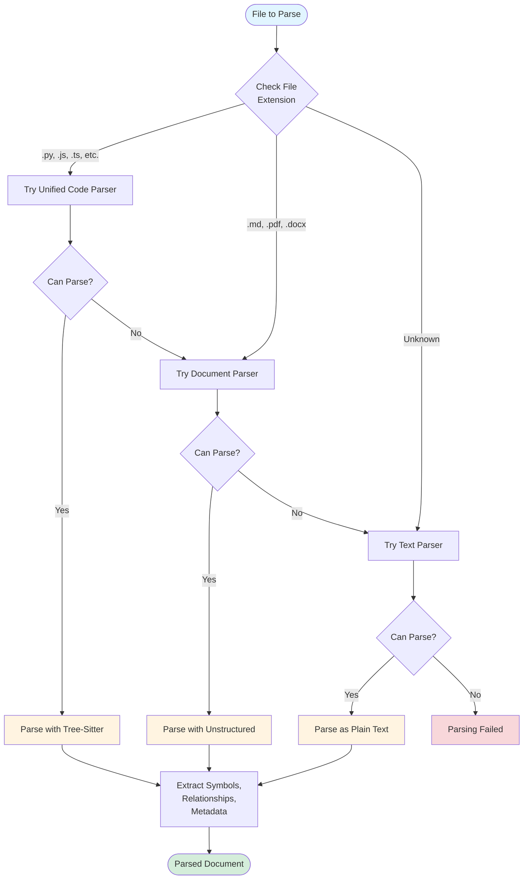
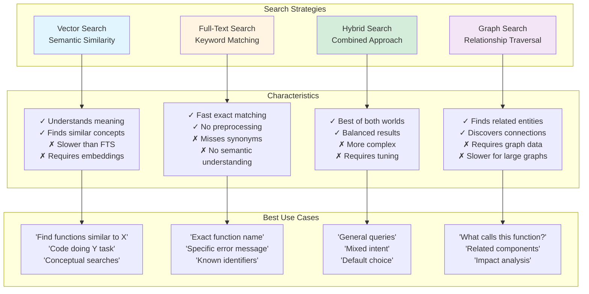
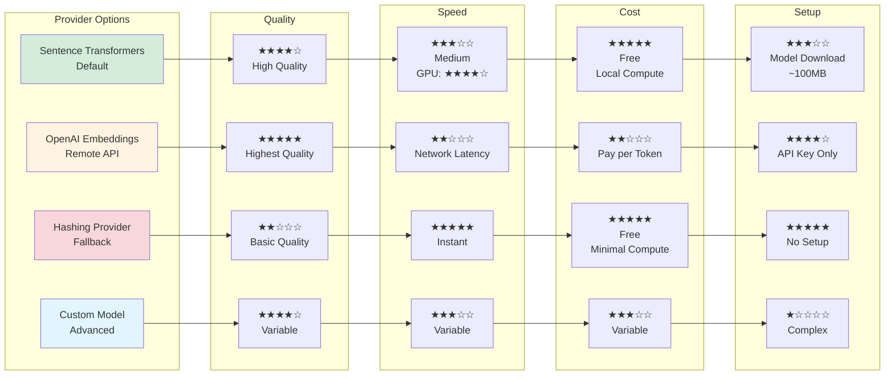

# Design Decisions

This document explains the key architectural decisions made in Agent-Vault, the rationale behind them, and the trade-offs considered.

## Parser System

### Decision: Chain-of-Responsibility Pattern

**Rationale:**
- Allows flexible handling of diverse file formats
- Easy to add new parsers without modifying existing code
- Parsers can be prioritized and configured independently
- Graceful fallback when specialized parsers fail

**Alternatives Considered:**
- **Single Universal Parser**: Rejected due to complexity and maintenance burden
- **File Extension Mapping**: Rejected as too rigid (same extension, different formats)
- **Manual Parser Selection**: Rejected as requiring too much user knowledge

**Trade-offs:**
- **Pro**: Extensible, maintainable, flexible
- **Con**: Slight overhead from trying multiple parsers
- **Mitigation**: Fast `can_parse()` checks minimize overhead

#### Parser Selection Decision Tree

**Decision Flow:**
1. **File Extension Check**: Initial routing based on file type
2. **Unified Code Parser**: First attempt for code files (tree-sitter)
3. **Document Parser**: Second attempt for structured documents (unstructured)
4. **Text Parser**: Final fallback for any text content
4. **Failure**: Only if all parsers reject the file

### Decision: Tree-Sitter for Code Parsing

**Rationale:**
- Robust, battle-tested parser generator
- Supports many languages with consistent API
- Incremental parsing for performance
- Error-tolerant (handles incomplete/invalid code)

**Alternatives Considered:**
- **Language-Specific Parsers**: Rejected due to maintenance burden
- **Regex-Based Parsing**: Rejected as too fragile
- **AST Libraries**: Rejected as language-specific and less robust

**Trade-offs:**
- **Pro**: Reliable, fast, multi-language support
- **Con**: Requires tree-sitter grammars (not all languages supported)
- **Mitigation**: Fallback text parser for unsupported languages

### Decision: Unstructured Library for Documents

**Rationale:**
- Handles many document formats (PDF, DOCX, HTML, Markdown)
- Extracts structure (headings, sections, tables)
- Active development and community support
- Consistent API across formats

**Alternatives Considered:**
- **Format-Specific Libraries**: Rejected due to inconsistent APIs
- **OCR-Based Extraction**: Rejected as overkill for text documents
- **Custom Parsers**: Rejected due to development cost

**Trade-offs:**
- **Pro**: Wide format support, structure extraction
- **Con**: External dependency, some formats require additional libraries
- **Mitigation**: Fallback text parser for unsupported formats

## Indexing Pipeline

### Decision: Two-Pass Relationship Resolution

**Rationale:**
- First pass resolves high-confidence relationships quickly
- Second pass uses learned patterns to improve low-confidence resolutions
- Balances accuracy and performance
- Enables cross-file symbol resolution

**Alternatives Considered:**
- **Single-Pass Resolution**: Rejected as less accurate
- **Multi-Pass Iterative**: Rejected as too slow
- **No Resolution**: Rejected as limiting graph functionality

**Trade-offs:**
- **Pro**: High accuracy, reasonable performance
- **Con**: More complex than single-pass
- **Mitigation**: Configurable confidence thresholds

### Decision: Symbol Registry for Cross-File Linking

**Rationale:**
- Enables accurate resolution of imports and function calls
- Supports fuzzy matching for similar names
- Tracks symbol metadata (file, line, type)
- Essential for knowledge graph construction

**Alternatives Considered:**
- **No Cross-File Linking**: Rejected as limiting functionality
- **Database-Only Resolution**: Rejected as too slow
- **Static Analysis Tools**: Rejected as language-specific

**Trade-offs:**
- **Pro**: Fast lookups, accurate resolution
- **Con**: Memory overhead for large codebases
- **Mitigation**: Configurable cache size, lazy loading

### Decision: Incremental Updates

**Rationale:**
- Avoids re-indexing entire codebase on file changes
- Improves developer experience (fast updates)
- Reduces computational cost
- Essential for file watching integration

**Alternatives Considered:**
- **Full Re-indexing**: Rejected as too slow
- **No Updates**: Rejected as impractical
- **Differential Updates**: Considered but deferred (complexity)

**Trade-offs:**
- **Pro**: Fast, efficient, practical
- **Con**: Must track file changes and dependencies
- **Mitigation**: File watcher integration, content hashing

## Search System

### Decision: Multiple Search Strategies

**Rationale:**
- Different queries benefit from different strategies
- Vector search for semantic similarity
- FTS for exact keyword matching
- Hybrid for best of both worlds
- Graph search for related content

**Alternatives Considered:**
- **Single Strategy**: Rejected as limiting
- **Automatic Strategy Selection**: Deferred to future (requires ML)
- **User-Specified Only**: Current approach

**Trade-offs:**
- **Pro**: Flexibility, optimal results per use case
- **Con**: Users must understand strategies
- **Mitigation**: Hybrid as sensible default

#### Search Strategy Comparison

**Strategy Selection Guide:**
- **Vector Search**: When meaning matters more than exact words
- **Full-Text Search**: When you know exact terms or identifiers
- **Hybrid Search**: When unsure or for general-purpose queries (recommended default)
- **Graph Search**: When exploring relationships and dependencies

### Decision: Reciprocal Rank Fusion for Hybrid Search

**Rationale:**
- Simple, effective method for combining rankings
- No parameter tuning required (unlike weighted sum)
- Robust to score scale differences
- Well-studied in information retrieval

**Alternatives Considered:**
- **Weighted Sum**: Rejected as requiring careful tuning
- **CombMNZ**: Rejected as less robust
- **Learning to Rank**: Deferred to future (requires training data)

**Trade-offs:**
- **Pro**: Simple, effective, no tuning
- **Con**: Fixed combination formula
- **Mitigation**: Configurable weights for vector/FTS balance

### Decision: Optional Graph-Based Reranking

**Rationale:**
- Boosts well-connected, important entities
- Improves result quality for code navigation
- Optional to avoid performance overhead
- Uses PageRank-style algorithm

**Alternatives Considered:**
- **Always Enabled**: Rejected due to performance cost
- **No Graph Reranking**: Rejected as missing opportunity
- **Different Graph Algorithms**: Considered (HITS, etc.) but PageRank sufficient

**Trade-offs:**
- **Pro**: Improves result quality, optional
- **Con**: Computational overhead, requires graph data
- **Mitigation**: Configurable, cached PageRank scores

## Database Layer

### Decision: LanceDB as Storage Backend

**Rationale:**
- Native vector search support (no separate vector DB)
- Full-text search built-in
- ACID transactions
- Efficient updates and deletes
- Python-native, easy integration

**Alternatives Considered:**
- **Separate Vector DB + SQL DB**: Rejected as complex
- **Elasticsearch**: Rejected as heavyweight
- **Chroma/Weaviate**: Rejected as less mature
- **SQLite + FAISS**: Rejected as requiring more integration work

**Trade-offs:**
- **Pro**: All-in-one solution, performant, easy to use
- **Con**: Relatively new project, smaller community
- **Mitigation**: Abstraction layer allows future backend changes

### Decision: Three-Table Schema

**Rationale:**
- `document_chunks`: Searchable content with embeddings
- `graph_entities`: Nodes in knowledge graph
- `graph_relationships`: Edges in knowledge graph
- Separation enables efficient queries for each use case

**Alternatives Considered:**
- **Single Table**: Rejected as inefficient for graph queries
- **More Tables**: Rejected as unnecessary complexity
- **Document Store**: Rejected as less structured

**Trade-offs:**
- **Pro**: Efficient queries, clear separation of concerns
- **Con**: Requires joins for some queries
- **Mitigation**: Denormalization where needed (e.g., chunk metadata)

### Decision: IVF-PQ Vector Indexing

**Rationale:**
- Fast approximate nearest neighbor search
- Good balance of speed and accuracy
- Configurable trade-offs (partitions, sub-vectors)
- Industry standard for large-scale vector search

**Alternatives Considered:**
- **Exact Search**: Rejected as too slow for large datasets
- **HNSW**: Considered but IVF-PQ sufficient
- **LSH**: Rejected as less accurate

**Trade-offs:**
- **Pro**: Fast, scalable, configurable
- **Con**: Approximate (not exact) results
- **Mitigation**: Configurable accuracy parameters

## Embedding System

### Decision: Pluggable Embedding Providers

**Rationale:**
- Different models for different use cases
- Easy to swap models without code changes
- Supports local and remote models
- Future-proof as models improve

**Alternatives Considered:**
- **Single Fixed Model**: Rejected as inflexible
- **Model Zoo**: Deferred to future
- **Automatic Model Selection**: Deferred to future

**Trade-offs:**
- **Pro**: Flexible, future-proof
- **Con**: Users must choose model
- **Mitigation**: Sensible default (all-MiniLM-L6-v2)

#### Embedding Provider Trade-offs

**Provider Comparison:**

| Provider | Quality | Speed | Cost | Setup | Best For |
|----------|---------|-------|------|-------|----------|
| **Sentence Transformers** | High | Medium-Fast | Free | Medium | General use, production |
| **OpenAI** | Highest | Slow (API) | Pay-per-use | Easy | Highest quality needs |
| **Hashing** | Basic | Instant | Free | None | Testing, development |
| **Custom** | Variable | Variable | Variable | Complex | Specialized domains |

**Recommendation Decision Tree:**
- **Production with quality needs** → Sentence Transformers (default)
- **Highest quality, budget available** → OpenAI Embeddings
- **Testing or development** → Hashing Provider
- **Specialized domain** → Custom Model (requires expertise)

### Decision: Sentence Transformers as Default

**Rationale:**
- Good balance of quality and speed
- Runs locally (no API calls)
- Wide language support
- Active development

**Alternatives Considered:**
- **OpenAI Embeddings**: Rejected due to API dependency and cost
- **Word2Vec**: Rejected as outdated
- **Custom Model**: Rejected due to training cost

**Trade-offs:**
- **Pro**: Good quality, local, free
- **Con**: Requires model download, GPU recommended
- **Mitigation**: Hashing provider as fast fallback

### Decision: Hashing Provider as Fallback

**Rationale:**
- Extremely fast (no model loading)
- Deterministic (reproducible)
- No dependencies
- Useful for testing and development

**Alternatives Considered:**
- **Random Embeddings**: Rejected as useless
- **TF-IDF**: Considered but hashing simpler
- **No Fallback**: Rejected as limiting

**Trade-offs:**
- **Pro**: Fast, simple, no dependencies
- **Con**: Lower quality than neural embeddings
- **Mitigation**: Only used when explicitly configured

## Caching Strategy

### Decision: Multi-Level Caching

**Rationale:**
- Document cache: Avoid re-parsing unchanged files
- Embedding cache: Avoid re-computing embeddings
- Query cache: Avoid re-executing identical searches
- Each level provides different benefits

**Alternatives Considered:**
- **No Caching**: Rejected as too slow
- **Single Cache**: Rejected as less flexible
- **Database-Only Caching**: Rejected as insufficient

**Trade-offs:**
- **Pro**: Significant performance improvements
- **Con**: Memory overhead, cache invalidation complexity
- **Mitigation**: Configurable cache sizes, LRU eviction

### Decision: Content-Based Cache Keys

**Rationale:**
- Hash file content for cache key
- Detects changes even if timestamp unchanged
- Avoids false cache hits
- Enables cache sharing across machines

**Alternatives Considered:**
- **Timestamp-Based**: Rejected as unreliable
- **File Path Only**: Rejected as missing changes
- **Version Numbers**: Rejected as requiring manual management

**Trade-offs:**
- **Pro**: Reliable, accurate
- **Con**: Must read file to compute hash
- **Mitigation**: Fast hashing algorithm (MD5)

## Configuration System

### Decision: YAML Configuration Files

**Rationale:**
- Human-readable and editable
- Supports comments and documentation
- Hierarchical structure matches config needs
- Wide tool support

**Alternatives Considered:**
- **JSON**: Rejected due to no comments
- **TOML**: Considered but YAML more familiar
- **Python Files**: Rejected as less safe

**Trade-offs:**
- **Pro**: Readable, flexible, well-supported
- **Con**: YAML parsing quirks (indentation, types)
- **Mitigation**: Schema validation, clear examples

### Decision: Three-Tier Configuration

**Rationale:**
- Default config: Sensible defaults for all settings
- Project config: Per-project customization
- Environment variables: Deployment-specific overrides
- Clear precedence order

**Alternatives Considered:**
- **Single Config File**: Rejected as inflexible
- **Command-Line Only**: Rejected as cumbersome
- **Database Config**: Rejected as overkill

**Trade-offs:**
- **Pro**: Flexible, clear precedence
- **Con**: Multiple places to check
- **Mitigation**: Clear documentation, validation

### Decision: Runtime Project ID Specification

**Rationale:**
- Project ID is a runtime concern, not configuration
- Enables multi-project support from single config
- Separates storage location from project identity
- Allows dynamic project switching

**Alternatives Considered:**
- **Config-Based Project ID**: Rejected as inflexible
- **Automatic Detection**: Rejected as unreliable
- **Global Singleton**: Rejected as limiting

**Trade-offs:**
- **Pro**: Flexible, supports multiple projects
- **Con**: Must pass project_id to components
- **Mitigation**: Factory functions handle injection

## Component Architecture

### Decision: Protocol-Based Interfaces

**Rationale:**
- Defines clear contracts without inheritance
- Enables duck typing and flexibility
- Supports testing with minimal mocks
- Pythonic approach to interfaces

**Protocols Defined:**
- **DatabaseProtocol**: Database operations
- **CacheProtocol**: Caching operations
- **EmbeddingProtocol**: Embedding generation
- **ParserProtocol**: Document parsing
- **SymbolRegistryProtocol**: Symbol resolution

**Alternatives Considered:**
- **Abstract Base Classes**: Rejected as too rigid
- **Implicit Interfaces**: Rejected as unclear
- **Type Hints Only**: Rejected as insufficient

**Trade-offs:**
- **Pro**: Flexible, testable, clear contracts
- **Con**: Requires Python 3.8+ typing features
- **Mitigation**: Type checking with mypy

### Decision: Dependency Injection Pattern

**Rationale:**
- Components receive dependencies explicitly
- Enables testing with mock implementations
- Makes dependencies visible and manageable
- Supports multiple configurations

**Implementation:**
- Factory functions create configured components
- Components accept protocol-typed dependencies
- No global singletons or hidden dependencies

**Alternatives Considered:**
- **Service Locator**: Rejected as hiding dependencies
- **Global Singletons**: Rejected as inflexible
- **Constructor Injection Only**: Current approach

**Trade-offs:**
- **Pro**: Testable, flexible, explicit
- **Con**: More verbose initialization
- **Mitigation**: Factory functions simplify common cases

## Error Handling

### Decision: Graceful Degradation

**Rationale:**
- System continues working when components fail
- Parser failure → try next parser
- Embedding failure → use fallback or skip
- Search failure → return empty results
- Better than complete failure

**Alternatives Considered:**
- **Fail Fast**: Rejected as too disruptive
- **Silent Failures**: Rejected as hiding problems
- **Retry Logic**: Implemented for transient failures

**Trade-offs:**
- **Pro**: Robust, user-friendly
- **Con**: May hide underlying issues
- **Mitigation**: Comprehensive logging

### Decision: Structured Logging

**Rationale:**
- Python's logging module is standard
- Configurable log levels
- Multiple handlers (console, file)
- Structured context (file path, operation)

**Alternatives Considered:**
- **Print Statements**: Rejected as unprofessional
- **Custom Logging**: Rejected as reinventing wheel
- **Third-Party Logger**: Rejected as unnecessary dependency

**Trade-offs:**
- **Pro**: Standard, flexible, well-understood
- **Con**: Requires configuration
- **Mitigation**: Sensible defaults, clear documentation

## Testing Strategy

### Decision: Pytest as Test Framework

**Rationale:**
- Industry standard for Python
- Rich fixture system
- Excellent plugin ecosystem
- Clear, readable test syntax

**Alternatives Considered:**
- **unittest**: Rejected as more verbose
- **nose**: Rejected as deprecated
- **Custom Framework**: Rejected as unnecessary

**Trade-offs:**
- **Pro**: Powerful, well-supported, familiar
- **Con**: Learning curve for advanced features
- **Mitigation**: Clear examples, documentation

### Decision: In-Memory Database for Tests

**Rationale:**
- Fast test execution
- No cleanup required
- Isolated test environment
- Reproducible results

**Alternatives Considered:**
- **Real Database**: Rejected as slow
- **Mocking**: Rejected as missing integration issues
- **Temporary Files**: Considered but in-memory faster

**Trade-offs:**
- **Pro**: Fast, clean, isolated
- **Con**: May miss disk-related issues
- **Mitigation**: Separate integration tests with real DB

## Future Considerations

### Potential Improvements

**Distributed Indexing:**
- Parallel indexing across multiple machines
- Shared symbol registry
- Distributed database

**Advanced Search:**
- Automatic strategy selection based on query
- Learning to rank with user feedback
- Multi-modal search (code + docs + images)

**Enhanced Graph:**
- Temporal relationships (code evolution)
- Probabilistic relationships (uncertain links)
- Graph neural networks for ranking

**Performance:**
- GPU acceleration for embeddings
- Streaming indexing for large files
- Incremental graph updates

**Usability:**
- Web UI for search and navigation
- IDE integrations
- Natural language query interface

### Deferred Decisions

**Multi-Language Support:**
- Currently English-focused
- Deferred until user demand

**Distributed Deployment:**
- Currently single-machine
- Deferred until scalability needs

**Real-Time Indexing:**
- Currently batch-oriented
- Deferred until latency requirements

## Lessons Learned

### What Worked Well

- **Modular Architecture**: Easy to extend and maintain
- **Progressive Disclosure**: Users can start simple, go deep as needed
- **Comprehensive Testing**: Caught many issues early
- **Clear Abstractions**: Database, parser, search layers well-separated

### What Could Be Improved

- **Documentation**: Always needs more examples
- **Performance Tuning**: More profiling and optimization needed
- **Error Messages**: Could be more actionable
- **Configuration**: Could be simpler for common cases

### Key Insights

- **Flexibility vs. Simplicity**: Hard to balance, erred toward flexibility
- **Performance vs. Accuracy**: Trade-offs everywhere, made configurable
- **Abstraction Layers**: Essential for maintainability, but add complexity
- **User Experience**: Most important, but hardest to get right

## References

### Academic Papers

- **BM25**: Robertson & Zaragoza, "The Probabilistic Relevance Framework: BM25 and Beyond"
- **RRF**: Cormack et al., "Reciprocal Rank Fusion outperforms Condorcet and individual Rank Learning Methods"
- **PageRank**: Page et al., "The PageRank Citation Ranking: Bringing Order to the Web"

### Libraries and Tools

- **Tree-Sitter**: https://tree-sitter.github.io/
- **Unstructured**: https://github.com/Unstructured-IO/unstructured
- **LanceDB**: https://lancedb.com/
- **Sentence Transformers**: https://www.sbert.net/

### Related Projects

- **Sourcegraph**: Code search and intelligence
- **GitHub Copilot**: AI-powered code completion
- **Elasticsearch**: Search and analytics engine
- **Pinecone**: Vector database

## Contributing to Architecture

If you're considering architectural changes:

1. **Understand Current Design**: Read this document and related code
2. **Identify Problem**: What limitation are you addressing?
3. **Consider Alternatives**: What other approaches exist?
4. **Evaluate Trade-offs**: What are the pros and cons?
5. **Prototype**: Build a proof-of-concept
6. **Document**: Update this document with your decision
7. **Discuss**: Get feedback from maintainers

**Questions to Ask:**
- Does this change align with design principles?
- What are the performance implications?
- How does this affect existing users?
- Is this the simplest solution?
- Can this be done incrementally?

## Conclusion

Agent-Vault's architecture reflects careful consideration of trade-offs between flexibility, performance, and usability. The modular design enables extension and customization while maintaining a clean, understandable structure. As the project evolves, these decisions will be revisited and refined based on user feedback and changing requirements.
