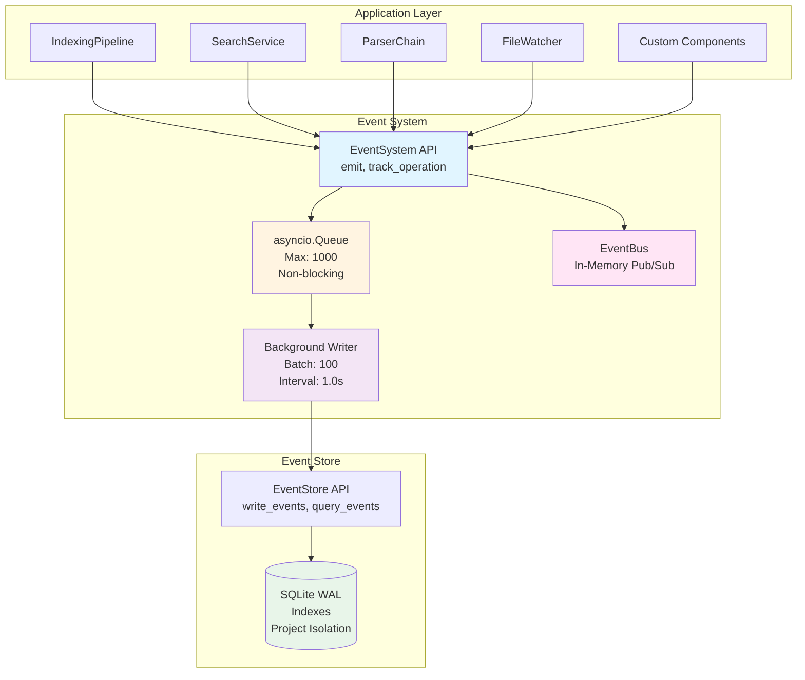
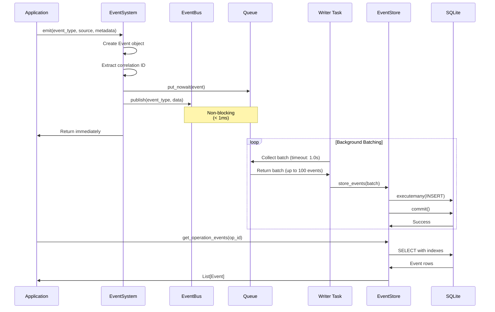
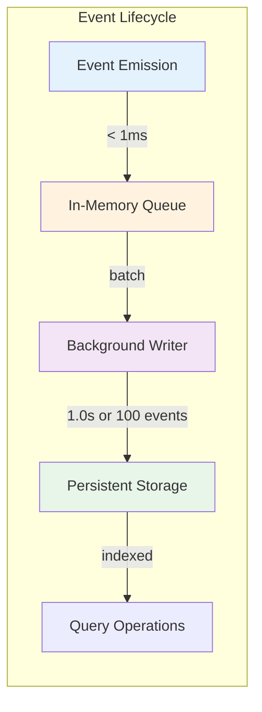

# Event System Architecture

> Historical reference. This page describes PostgreSQL-family providers, cloud connectors or remote embedders that are not part of this local-only distribution. It is retained as design input for the external provider contract in [storage-backends.md](../storage-backends.md).

This document provides a detailed architectural overview of the Event Tracking System in Agentic Inquiry, explaining design decisions, implementation patterns, and integration points.

## System Components

The event tracking system consists of three main components:

1. **EventSystem**: Queue-based batching system that manages event emission, buffering, and background persistence
2. **EventBus**: Simple pub/sub observer pattern for in-memory event handlers (used by EventSystem for synchronous notifications)
3. **EventStore**: SQLite-backed persistence layer for querying and long-term storage

## Design Principles

### 1. Performance First

The event system is designed to have minimal impact on application performance:

- **Non-blocking Emission**: Events queued in memory with `asyncio.Queue.put_nowait()` (< 1ms)
- **Background Batching**: Separate async task collects and writes events via EventStore
- **Efficient Storage**: SQLite with WAL mode for concurrent reads
- **Batch Writes**: Use `executemany()` for bulk inserts
- **In-Memory Pub/Sub**: EventBus provides synchronous event notifications without persistence overhead

**Performance Targets:**
- Event emission: < 1ms latency
- Batch write: > 1000 events/sec
- Query performance: < 10ms for 1000 events
- Memory usage: < 10MB for queue under normal load

### 2. Fail-Safe Operation

Event tracking failures must never break system operations:

- **Error Isolation**: All exceptions caught and logged by EventSystem
- **Graceful Degradation**: System continues if event tracking fails
- **Queue Overflow**: Sampling strategy preserves critical events (failed events prioritized)
- **Lazy Initialization**: EventStore database initialized on first use
- **Dual Persistence**: Events written to EventStore (SQLite) AND published to EventBus (in-memory handlers)

### 3. Developer Experience

Simple API with minimal integration effort:

- **Context Managers**: `track_operation()` for automatic lifecycle tracking
- **Correlation Integration**: Auto-use correlation IDs from `agentic_inquiry.correlation`
- **Type Safety**: Constants for event types via `EventTypes`
- **Rich Metadata**: Flexible metadata dictionary
- **Dual Interface**: EventSystem for persistence + EventBus for in-memory handlers

### 4. Observability

Built-in monitoring and debugging capabilities:

- **Metrics**: Events emitted, dropped, sampled, queue depth (via EventSystem)
- **Health Checks**: Writer status, queue capacity
- **Query API**: Flexible event retrieval via EventStore
- **Storage Backends**: SQLite (via EventStore) for different database backends

## Component Architecture

### High-Level Architecture



### Event Flow Diagram



### Component Interaction



### Component Details

#### EventSystem

**Responsibilities:**
- Provide public API for event emission (`emit()`, `track_operation()`)
- Manage event queue and background writer task
- Publish events to EventBus for in-memory handlers
- Persist events to EventStore for querying
- Track metrics (emitted, dropped, sampled, queue depth)
- Handle graceful shutdown with flush

**Key Methods:**
```python
class EventSystem:
    async def emit(
        self,
        event_type: str,
        source: str,
        status: EventStatus = EventStatus.PROGRESS,
        operation_id: Optional[str] = None,
        **metadata: Any
    ) -> None:
        """Emit event (non-blocking). Queues for persistence and publishes to EventBus."""

    @classmethod
    async def from_config(
        cls,
        config: Optional["Config"] = None,
        project_id: Optional[str] = None,
    ) -> "EventSystem":
        """Create and start event system."""

    async def start(self) -> None:
        """Start background writer and cleanup tasks."""

    async def stop(self, timeout: float = 5.0) -> bool:
        """Stop and flush pending events."""

    # Access to components
    bus: EventBus  # In-memory pub/sub
    store: EventStore  # Persistent storage
```

**Async Patterns:**
- Non-blocking queue operations (`asyncio.Queue`)
- Background task for batch writing
- Graceful shutdown with timeout
- Context manager support (`async with EventSystem.from_config() as events`)

#### EventStore

**Responsibilities:**
- Persist events to SQLite database
- Provide query API for event retrieval via EventStorageProtocol
- Manage database connections
- Handle schema initialization

**Key Methods:**
```python
class EventStore:
    async def write_events(self, events: List[Event]) -> int:
        """Store events in batch. Returns number written."""

    async def query_events(
        self,
        event_type: Optional[str] = None,
        since: Optional[datetime] = None,
        until: Optional[datetime] = None,
        limit: int = 100
    ) -> List[Event]:
        """Query events with filters."""

    async def get_operation_events(
        self,
        operation_id: str,
        project_id: Optional[str] = None
    ) -> List[Event]:
        """Get all events for operation."""

    async def get_operation_status(
        self,
        operation_id: str,
        project_id: Optional[str] = None
    ) -> Dict[str, Any]:
        """Get aggregated status for an operation."""

    async def count_events(
        self,
        project_id: Optional[str] = None,
        event_type: Optional[str] = None,
        since: Optional[datetime] = None,
        until: Optional[datetime] = None
    ) -> int:
        """Count events matching filters."""

    async def delete_before(self, cutoff: datetime) -> int:
        """Delete events before cutoff timestamp."""
```

**Database Patterns:**
- WAL mode for concurrent reads
- Persistent writer connection (reused)
- Per-query reader connections (isolated)
- Lazy initialization (`_ensure_initialized()`)
- Project isolation via `project_id`

**Storage Provider:**
EventStore uses `SQLiteEventStorage` which implements `EventStorageProtocol` from `agentic_inquiry.storage.protocols.events`. This allows future backend swappability (PostgreSQL, AlloyDB).

#### EventBus

**Responsibilities:**
- In-memory pub/sub for synchronous event notifications
- Simple observer pattern (no batching, queuing, or persistence)
- Used by EventSystem to notify in-memory handlers
- Separate from EventStore persistence layer

**Key Methods:**
```python
class EventBus:
    def subscribe(self, event_type: str, handler: Callable) -> None:
        """Subscribe handler to event type."""

    def unsubscribe(self, event_type: str, handler: Callable) -> None:
        """Unsubscribe handler from event type."""

    async def publish(self, event_type: str, data: Dict[str, Any]) -> None:
        """Publish event to all subscribers. Calls handlers concurrently."""
```

**Use Cases:**
- File watching (immediate notifications)
- Real-time UI updates
- Synchronous component integration
- Testing hooks

#### Context Managers

**Responsibilities:**
- Simplify operation tracking with automatic lifecycle events
- Integration with correlation context (`agentic_inquiry.correlation`)
- Progress tracking support
- Error handling with automatic failed event emission

**Key Components:**
```python
class OperationTracker:
    async def progress(self, **metadata) -> None:
        """Emit progress event."""

    async def complete(self, **metadata) -> None:
        """Emit completion event and exit context."""

    async def fail(self, error: str, **metadata) -> None:
        """Emit failure event."""

@asynccontextmanager
async def track_operation(
    event_system: EventSystem,
    operation_type: str,
    source: str,
    operation_id: Optional[str] = None,
    **start_metadata: Any
) -> AsyncIterator[OperationTracker]:
    """Track operation lifecycle. Emits started/completed/failed events."""
```

## Data Flow

### Event Emission Flow

```
1. Application calls EventSystem.emit()
   ↓
2. EventSystem creates Event object
   - Auto-extract correlation ID if not provided
   - Add timestamp and event_id
   - Set project_id from EventSystem
   ↓
3. Dual dispatch:
   a) Queue.put_nowait(event) → Background writer → EventStore
   b) EventBus.publish(event_type, data) → In-memory handlers
   ↓
4. Return to caller immediately
   - Non-blocking operation (< 1ms)
   - Increment events_emitted_count
   - No waiting for persistence
   - No error propagation
```

### Background Writing Flow

```
1. Writer task waits for events (asyncio.Task)
   - Timeout: flush_interval (1.0s default)
   - Batch size: batch_size (100 default)
   ↓
2. Collect batch from asyncio.Queue
   - Wait for timeout or batch full
   - Handle CancelledError for shutdown
   ↓
3. Write batch to EventStore
   - EventStore.write_events(batch)
   - Uses executemany() for efficiency
   - Single commit per batch
   - WAL mode for concurrent reads
   ↓
4. Handle errors
   - Retry with exponential backoff
   - Log failures without losing events
   - No error propagation to emit()
   ↓
5. Repeat until EventSystem.stop()
```

### Query Flow

```
1. Application calls EventStore query method
   - get_operation_events(operation_id)
   - query_events(event_type, since, until)
   - get_operation_status(operation_id)
   - count_events(filters)
   ↓
2. EventStore creates new connection
   - Set query_only pragma
   - Use connection-per-query pattern (concurrent-safe)
   ↓
3. Execute SQL query
   - Use indexes for efficiency (idx_operation_id, idx_event_type, etc.)
   - Filter by project_id for isolation
   - Order by timestamp
   ↓
4. Convert rows to Event objects
   - Deserialize metadata JSON
   - Convert status to EventStatus enum
   - Parse timestamps
   ↓
5. Close connection and return results
   - No connection pooling (connection-per-query)
   - WAL mode allows concurrent reads during writes
```

## Database Schema

### Events Table

```sql
CREATE TABLE events (
    event_id TEXT PRIMARY KEY,           -- UUID
    project_id TEXT NOT NULL,            -- Project isolation
    operation_id TEXT,                   -- Correlation ID
    session_id TEXT,                     -- Session grouping
    timestamp REAL NOT NULL,             -- Unix timestamp (microseconds)
    event_type TEXT NOT NULL,            -- Hierarchical type
    status TEXT NOT NULL,                -- started|progress|completed|failed
    source TEXT NOT NULL,                -- Component name
    metadata TEXT,                       -- JSON-encoded
    schema_version TEXT NOT NULL DEFAULT '1.0',
    indexed_at TIMESTAMP DEFAULT CURRENT_TIMESTAMP
);
```

### Indexes

```sql
-- Operation queries (most common)
CREATE INDEX idx_operation_id ON events(operation_id, timestamp);

-- Type filtering
CREATE INDEX idx_event_type ON events(event_type);

-- Time range queries
CREATE INDEX idx_timestamp ON events(timestamp);

-- Project isolation with time range
CREATE INDEX idx_project_timestamp ON events(project_id, timestamp);

-- Status filtering
CREATE INDEX idx_status ON events(status);
```

### Index Strategy

**Query Patterns:**
1. **By Operation**: `WHERE operation_id = ? AND project_id = ? ORDER BY timestamp`
   - Uses: `idx_operation_id`
   - Performance: O(log n) + O(k) where k = events per operation

2. **By Type**: `WHERE event_type = ? AND project_id = ? LIMIT ?`
   - Uses: `idx_event_type`
   - Performance: O(log n) + O(limit)

3. **By Time Range**: `WHERE timestamp BETWEEN ? AND ? AND project_id = ?`
   - Uses: `idx_project_timestamp`
   - Performance: O(log n) + O(k) where k = events in range

4. **Latest Events**: `WHERE project_id = ? ORDER BY timestamp DESC LIMIT ?`
   - Uses: `idx_project_timestamp`
   - Performance: O(log n) + O(limit)

## Integration Patterns

### Pattern 1: Automatic Integration (Built-in Components)

Built-in components automatically emit events:

```python
# IndexingPipeline
async def index_directory(self, directory: str):
    async with track_operation(
        self.events,
        "indexing",
        "IndexingPipeline",
        directory=directory
    ) as op:
        files = self._discover_files(directory)
        
        for i, file in enumerate(files):
            await self._index_file(file)
            await op.progress(files_processed=i+1, total=len(files))

# SearchService
async def hybrid_search(self, query: str, limit: int = 10):
    await self.events.emit(
        EventTypes.Search.QUERY_STARTED,
        source="SearchService",
        query_length=len(query),
        limit=limit
    )
    
    try:
        results = await self._execute_search(query, limit)
        
        await self.events.emit(
            EventTypes.Search.RESULTS_RETURNED,
            source="SearchService",
            result_count=len(results)
        )
        
        return results
    except Exception as e:
        await self.events.emit(
            EventTypes.Search.QUERY_FAILED,
            source="SearchService",
            error=str(e)
        )
        raise
```

### Pattern 2: Manual Integration (Custom Components)

Custom components can add event tracking:

```python
from agentic_inquiry.events import EventSystem, track_operation

class MyCustomProcessor:
    def __init__(self, project_id: str):
        self.events = None
        self.project_id = project_id
    
    async def initialize(self):
        self.events = await EventSystem.from_config(
            project_id=self.project_id
        )
        await self.events.start()
    
    async def process_batch(self, items: List[Any]):
        async with track_operation(
            self.events,
            "custom.process",
            "MyCustomProcessor",
            batch_size=len(items)
        ) as op:
            for i, item in enumerate(items):
                await self._process_item(item)
                
                if i % 10 == 0:  # Progress every 10 items
                    await op.progress(
                        items_processed=i+1,
                        percent=(i+1)/len(items)*100
                    )
```

### Pattern 3: Correlation Context Integration

Use correlation context for automatic operation grouping:

```python
from agentic_inquiry.correlation import correlation_context
from agentic_inquiry.events import EventSystem

async def multi_step_operation():
    # Create and start event system
    async with EventSystem.from_config(project_id="my_project") as events:
        # Correlation ID automatically propagates
        with correlation_context() as corr_id:
            await events.emit("step1.started", source="main")
            await step1()

            await events.emit("step2.started", source="main")
            await step2()

            await events.emit("step3.started", source="main")
            await step3()

        # All events share same operation_id (corr_id)
        operation_events = await events.store.get_operation_events(corr_id)
```

### Pattern 4: EventBus for In-Memory Handlers

Use EventBus for real-time notifications without persistence:

```python
from agentic_inquiry.events import EventSystem

async def setup_file_watcher():
    async with EventSystem.from_config(project_id="my_project") as events:
        # Subscribe to file change events
        async def on_file_changed(data: dict):
            print(f"File changed: {data['path']}")

        events.bus.subscribe("file.changed", on_file_changed)

        # Emit file change (persisted + published)
        await events.emit("file.changed", source="watcher", path="/src/main.py")
        # on_file_changed() called immediately
```

## Error Handling and Resilience

### Error Handling Strategy

**1. Event Emission Errors (EventSystem):**
```python
try:
    self._queue.put_nowait(event)
    await self.bus.publish(event.event_type, event.to_dict())
    self.events_emitted_count += 1
except asyncio.QueueFull:
    # Apply sampling if enabled
    if self._should_sample(event):
        self.events_dropped_count += 1
        logger.warning("Event queue full, dropped event: %s", event.event_type)
    # Don't raise - continue operation
except Exception as e:
    logger.error("Failed to emit event: %s", e)
    # Don't raise - graceful degradation
```

**2. Storage Errors (EventStore):**
```python
# Background writer with retry
for attempt in range(3):
    try:
        await self.store.write_events(batch)
        break
    except sqlite3.OperationalError as e:
        if "locked" in str(e) and attempt < 2:
            await asyncio.sleep(0.1 * (2 ** attempt))  # Exponential backoff
        else:
            logger.error("Failed to store events: %s", e)
```

**3. Initialization Errors (EventStore):**
```python
async def _ensure_initialized(self):
    if self._initialized:
        return
    try:
        await self._init_database()
        self._initialized = True
    except Exception as e:
        logger.error("Failed to initialize event store: %s", e)
        # System continues without event tracking
```

**4. EventBus Handler Errors:**
```python
# In EventBus.publish()
results = await asyncio.gather(*tasks, return_exceptions=True)
for result in results:
    if isinstance(result, Exception):
        logger.error("Event handler failed: %s", result)
        # Don't raise - other handlers continue
```

### Resilience Features

**Queue Overflow Handling (EventSystem):**
- Detect queue full condition (`asyncio.QueueFull`)
- Enable sampling (preserve FAILED events, sample PROGRESS)
- Configurable sampling ratio (default: keep 1 in 10)
- Emit warning event when sampling activates
- Track dropped count metric
- Alert threshold for excessive drops

**Database Locking (EventStore):**
- Retry with exponential backoff (3 attempts)
- WAL mode reduces lock contention
- Busy timeout (5 seconds)
- Graceful degradation (log and continue)

**Connection Management (EventStore):**
- Lazy initialization (`_ensure_initialized()`)
- Proper cleanup on shutdown (`stop()`)
- Connection-per-query for reads (isolated)
- Persistent writer connection (reused)
- WAL checkpoint on maintenance

**Dual Persistence:**
- EventBus failures don't block EventStore writes
- EventStore failures don't block EventBus publish
- Independent error handling for each path

## Performance Optimization

### Optimization Techniques

**1. Batch Writing (EventSystem → EventStore):**
```python
# In EventSystem._writer_loop()
# Collect batch with timeout
while len(batch) < self.config.events.batch_size:
    timeout = max(0, deadline - asyncio.get_running_loop().time())
    if timeout <= 0:
        break

    try:
        event = await asyncio.wait_for(self._queue.get(), timeout=timeout)
        batch.append(event)
    except asyncio.TimeoutError:
        break

# Write batch to EventStore
await self.store.write_events(batch)

# In EventStore.write_events()
# Write batch efficiently with executemany
await self._writer_conn.executemany(
    "INSERT INTO events (...) VALUES (?, ?, ...)",
    [(e.event_id, e.project_id, e.timestamp, ...) for e in events]
)
await self._writer_conn.commit()
```

**2. Connection Management (EventStore):**
```python
# Persistent writer connection (reused by background writer)
async def _ensure_initialized(self):
    if not self._writer_conn:
        self._writer_conn = await aiosqlite.connect(self.db_path)
        await self._writer_conn.execute("PRAGMA journal_mode=WAL")

# Per-query reader connections (isolated, concurrent-safe)
async def query_events(self, ...):
    async with aiosqlite.connect(self.db_path) as db:
        await db.execute("PRAGMA query_only=1")
        cursor = await db.execute(query, params)
        rows = await cursor.fetchall()
        return [Event.from_row(row) for row in rows]
```

**3. Index Optimization:**
```sql
-- Composite index for common query pattern
CREATE INDEX idx_operation_id ON events(operation_id, timestamp);

-- Covering index avoids table lookup
CREATE INDEX idx_type_status ON events(event_type, status, timestamp);
```

**4. WAL Mode:**
```sql
-- Enable WAL mode for concurrent reads
PRAGMA journal_mode=WAL;
PRAGMA synchronous=NORMAL;
PRAGMA busy_timeout=5000;
```

### Performance Benchmarks

**Event Emission:**
- Target: < 1ms
- Actual: 0.1-0.5ms (queue put)
- Overhead: < 1% of operation time

**Batch Writing:**
- Target: > 1000 events/sec
- Actual: 2000-5000 events/sec
- Batch size: 100 events
- Flush interval: 1.0s

**Query Performance:**
- Target: < 10ms for 1000 events
- Actual: 2-5ms (with indexes)
- Operation query: O(log n) + O(k)
- Type filter: O(log n) + O(limit)

**Memory Usage:**
- Target: < 10MB for queue
- Actual: 5-8MB (1000 events)
- Event size: ~500 bytes average
- Queue overhead: ~2MB

## Configuration

### Configuration Schema

```yaml
storage:
  event_store:
    path: "events.db"  # Relative to storage root

events:
  enabled: true                    # Enable/disable system
  queue_max_size: 1000            # Max events in queue
  batch_size: 100                 # Events per batch
  flush_interval_seconds: 1.0     # Max time between writes
  retention_days: 30              # Event retention period
  sampling_enabled: false         # Enable sampling on overflow
  sampling_ratio: 10              # Keep 1 in 10 when sampling
```

### Configuration Integration

```python
@dataclass
class EventsConfig:
    enabled: bool = True
    queue_max_size: int = 1000
    batch_size: int = 100
    flush_interval_seconds: float = 1.0
    retention_days: int = 30
    sampling_enabled: bool = False
    sampling_ratio: int = 10

@dataclass
class Config:
    events: EventsConfig = field(default_factory=EventsConfig)
```

### Environment Variables

```bash
export INQUIRY_EVENTS_ENABLED=true
export INQUIRY_EVENTS_QUEUE_MAX_SIZE=2000
export INQUIRY_EVENTS_BATCH_SIZE=200
export INQUIRY_EVENTS_FLUSH_INTERVAL_SECONDS=0.5
export INQUIRY_EVENTS_RETENTION_DAYS=60
```

## Testing Strategy

### Unit Tests

**Event Model Tests:**
- Event creation and serialization
- Status enum validation
- Timestamp generation
- UUID generation

**EventStore Tests:**
- Database initialization
- Event storage (single and batch)
- Query operations
- Connection management
- Error handling

**EventSystem Tests:**
- Event emission
- Background batching
- Queue overflow
- Graceful shutdown
- Metrics tracking

**Context Manager Tests:**
- Operation tracking
- Automatic event emission
- Error handling

### Integration Tests

**End-to-End Tests:**
- Full workflow: emit → batch → store → query
- Correlation ID integration
- Multi-project isolation
- Configuration integration

**Component Integration Tests:**
- Indexing pipeline events
- Search service events
- Parser system events
- File watcher events

### Performance Tests

**Latency Tests:**
- Event emission latency
- Query latency
- Batch write latency

**Throughput Tests:**
- Events per second
- Concurrent operations
- Queue overflow handling

**Load Tests:**
- High event volume
- Memory usage under load
- Database size growth

## Design Decisions

### Why EventSystem + EventBus + EventStore?

**EventSystem (Queue + Background Writer):**
- Non-blocking emit() for minimal performance impact
- Batch writes for efficiency (100 events per batch)
- Sampling support for high-volume scenarios
- Graceful shutdown with flush

**EventBus (In-Memory Pub/Sub):**
- Immediate notifications without persistence overhead
- Simple observer pattern for real-time handlers
- Used by file watcher, UI updates, testing hooks
- No batching or queuing complexity

**EventStore (SQLite Persistence):**
- Long-term storage for analysis and debugging
- Queryable event history
- Project isolation via project_id
- WAL mode for concurrent reads

**Alternatives Considered:**
- Single component: Too complex, violates SRP
- Direct EventStore writes: Too slow, blocking
- EventBus only: No persistence
- External message queue: Additional dependency

### Why SQLite (for EventStore)?

**Advantages:**
- Zero configuration
- Embedded (no separate server)
- ACID transactions
- Efficient for read-heavy workloads
- WAL mode for concurrent reads
- Proven reliability
- Project isolation via table data

**Alternatives Considered:**
- PostgreSQL: Too heavy, requires server (future: EventStorageProtocol allows swapping)
- Redis: No persistence guarantees
- File-based: No query capabilities
- In-memory: No persistence

### Why Async Batching?

**Advantages:**
- Non-blocking emission (< 1ms)
- Efficient batch writes
- Reduced database contention
- Better throughput

**Alternatives Considered:**
- Synchronous writes: Too slow
- Thread pool: More complex
- External queue: Additional dependency

### Why Correlation IDs?

**Advantages:**
- Automatic operation grouping
- Distributed tracing support
- Minimal developer effort
- Consistent with existing patterns

**Alternatives Considered:**
- Manual operation IDs: Error-prone
- Session IDs only: Too coarse
- No grouping: Hard to trace

### Why WAL Mode?

**Advantages:**
- Concurrent reads during writes
- Better write performance
- Reduced lock contention
- Standard SQLite feature

**Alternatives Considered:**
- Default mode: Readers block writers
- DELETE mode: Slower writes
- MEMORY mode: No persistence

## Future Enhancements

### Planned Features

**1. OpenTelemetry Integration:**
- Export events to OTLP
- Distributed tracing support
- Span correlation

**2. Event Streaming:**
- Real-time event consumers
- WebSocket API
- Pub/sub pattern

**3. Advanced Querying:**
- Query builder API
- Aggregation queries
- Event correlation

**4. Compression:**
- Compress old events
- Reduce storage size
- Transparent decompression

**5. Metrics Dashboard:**
- Prometheus integration
- Grafana dashboards
- Real-time monitoring

### Research Areas

**1. Event Sampling:**
- Per-type sampling rates
- Priority-based sampling
- Adaptive sampling

**2. Event Aggregation:**
- Pre-compute statistics
- Reduce query load
- Dashboard optimization

**3. Event Replay:**
- Time-scaled replay
- Testing support
- Debugging tools

## References

**Code:**
- **EventSystem**: `agentic_inquiry/events/system.py` - Queue-based batching
- **EventBus**: `agentic_inquiry/events/bus.py` - In-memory pub/sub
- **EventStore**: `agentic_inquiry/events/store.py` - SQLite persistence
- **EventStorageProtocol**: `agentic_inquiry/storage/protocols/events.py` - Backend abstraction
- **SQLiteEventStorage**: `agentic_inquiry/events/storage/sqlite.py` - Protocol implementation
- **Context Managers**: `agentic_inquiry/events/context_managers.py` - track_operation()
- **Event Types**: `agentic_inquiry/events/types.py` - EventTypes constants
- **Event Models**: `agentic_inquiry/events/models.py` - Event, EventStatus
- **Correlation**: `agentic_inquiry/correlation.py` - Request tracing

**External:**
- **SQLite WAL**: https://www.sqlite.org/wal.html
- **aiosqlite**: https://aiosqlite.omnilib.dev/
- **asyncio**: https://docs.python.org/3/library/asyncio.html

## Next Steps

- **Architecture Overview**: [System Overview](overview.md)
