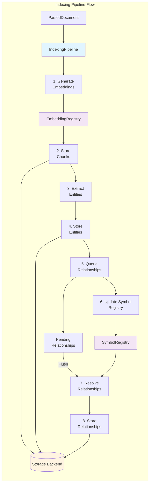
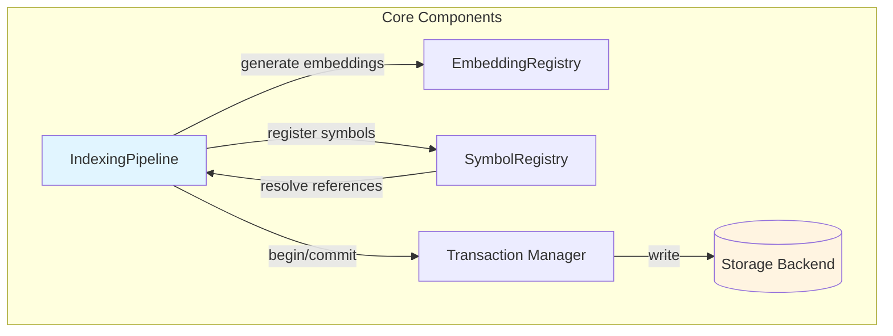

# Indexing Pipeline Architecture

The indexing pipeline transforms parsed documents into searchable database records. This document explains how the pipeline works, its components, and how data flows through the system.

## Overview

The `IndexingPipeline` is the core component that:
1. Receives `ParsedDocument` from parsers
2. Generates embeddings for content chunks
3. Stores chunks in LanceDB
4. Extracts and stores entities
5. Resolves and stores relationships
6. Maintains symbol registry for cross-file linking

## Architecture

### Pipeline Flow Diagram

The indexing pipeline transforms parsed documents through multiple stages:



### Component Interaction



## Core Components

### 1. IndexingPipeline

Main orchestrator for the indexing process.

**Responsibilities:**
- Coordinate parsing and storage
- Generate embeddings
- Manage transactions
- Track symbols for cross-file resolution
- Handle incremental updates

**Key Methods:**
```python
class IndexingPipeline:
    async def index_directory(
        self,
        path: str,
        wait: bool = True,
        timeout: Optional[float] = None,
        connector: Optional[Any] = None
    ) -> None:
        """Index all files in a directory recursively.

        Args:
            path: Directory path to index
            wait: Wait for indexing to complete
            timeout: Maximum time to wait (seconds)
            connector: Optional external connector for cloud data sources
        """

    async def flush_pending_relationships(self) -> int:
        """Resolve and store all pending relationships."""
```

### 2. EmbeddingRegistry

Manages embedding providers and generates vector embeddings.

**Responsibilities:**
- Register embedding providers
- Select appropriate provider
- Generate embeddings for text
- Cache embeddings

**Supported Providers:**
- `sentence_transformer`: Local neural embeddings via HuggingFace
- `hashing`: Fast, deterministic hash-based embeddings (deprecated)

**Example:**
```python
from agentic_inquiry.embeddings.registry import embedding_registry

# Get embedding for text
embedding = embedding_registry.embed("sample text")

# Register custom provider
embedding_registry.register("custom", CustomEmbeddingProvider())
```

### 3. SymbolRegistry

Tracks code symbols for cross-file resolution.

**Responsibilities:**
- Register symbol definitions
- Resolve symbol references
- Track symbol metadata
- Support fuzzy matching

**Symbol Metadata:**
```python
@dataclass
class SymbolMetadata:
    name: str                    # Symbol name
    qualified_name: str          # Fully qualified name
    file_path: str               # Defining file
    symbol_type: str             # function, class, method, etc.
    start_line: int              # Start line number
    end_line: int                # End line number
    parent: Optional[str]        # Parent symbol (for methods)
    visibility: str              # public, private, protected
```

**Resolution Strategies:**
1. Exact match on qualified name
2. Fuzzy match on name
3. Context-based resolution
4. Frequency-based ranking

### 4. Transaction Manager

Ensures ACID properties for database operations.

**Responsibilities:**
- Begin transactions
- Commit changes
- Rollback on errors
- Ensure consistency

**Example:**
```python
from agentic_inquiry.database.transaction import Transaction

async with Transaction(db_manager) as txn:
    # All operations in this block are atomic
    await txn.add_chunks(chunks)
    await txn.add_entities(entities)
    await txn.add_relationships(relationships)
    # Automatically commits on success, rolls back on error
```

## Indexing Flow

### Single File Indexing

For a detailed sequence diagram showing all component interactions during file indexing, see the [File Indexing Sequence Diagram](overview.md#file-indexing-sequence-diagram) in the Architecture Overview.

**High-Level Steps:**

```
1. Parse File
   ↓
2. Generate Embeddings
   ↓
3. Store Chunks
   ↓
4. Extract Entities
   ↓
5. Store Entities
   ↓
6. Queue Relationships
   ↓
7. Update Symbol Registry
```

**Detailed Steps:**

**Step 1: Parse File**
```python
# Parse file using parser chain
parsed_doc = parser_chain.parse(file_path)
```

**Step 2: Generate Embeddings**
```python
# Generate embedding for each chunk
for chunk in parsed_doc.chunks:
    chunk.embedding = embedding_registry.embed(chunk.content)
```

**Step 3: Store Chunks**
```python
# Convert to DocumentChunk and store
chunks = [
    DocumentChunk(
        id=generate_id(),
        file_path=parsed_doc.file_path,
        content=chunk.content,
        vector=chunk.embedding,
        start_line=chunk.start_line,
        end_line=chunk.end_line,
        symbols=chunk.symbols,
        entities=chunk.entities,
        metadata=chunk.metadata
    )
    for chunk in parsed_doc.chunks
]
await db_manager.add_chunks(chunks)
```

**Step 4: Extract Entities**
```python
# Extract entities from parsed document
entities = [
    GraphEntity(
        id=generate_id(),
        name=entity.name,
        type=entity.type,
        file_path=entity.file_path,
        start_line=entity.start_line,
        end_line=entity.end_line,
        metadata=entity.metadata
    )
    for entity in parsed_doc.entities
]
```

**Step 5: Store Entities**
```python
# Store entities in database
await db_manager.add_entities(entities)
```

**Step 6: Queue Relationships**
```python
# Queue relationships for later resolution
for relationship in parsed_doc.relationships:
    self._pending_relationships.append((relationship, file_path))
```

**Step 7: Update Symbol Registry**
```python
# Register symbols for cross-file resolution
for entity in parsed_doc.entities:
    if entity.type in ["function", "class", "method"]:
        symbol_registry.register(
            name=entity.name,
            file_path=entity.file_path,
            metadata=SymbolMetadata(...)
        )
```

### Directory Indexing

```
1. Discover Files
   ↓
2. Filter Files (ignore patterns)
   ↓
3. Index Each File (parallel)
   ↓
4. Flush Relationships
```

**Detailed Steps:**

**Step 1: Discover Files**
```python
# Recursively find all files
files = []
for root, dirs, filenames in os.walk(directory):
    for filename in filenames:
        files.append(os.path.join(root, filename))
```

**Step 2: Filter Files**
```python
# Apply ignore patterns (.gitignore, etc.)
filtered_files = [
    f for f in files
    if not ignore_handler.should_ignore(f)
]
```

**Step 3: Index Each File**
```python
# Index files (can be parallelized)
results = []
for file_path in filtered_files:
    try:
        result = self.index_file(file_path)
        results.append(result)
    except Exception as e:
        logger.error(f"Failed to index {file_path}: {e}")
```

**Step 4: Flush Relationships**
```python
# Resolve and store all pending relationships
num_relationships = await self.flush_pending_relationships()
logger.info(f"Created {num_relationships} relationships")
```

## Relationship Resolution

### Two-Pass Resolution

The pipeline uses a sophisticated two-pass algorithm for resolving relationships:

**Pass 1: High-Confidence Resolution**
1. Resolve relationships with confidence >= 0.8
2. Track successful resolutions
3. Build frequency and co-occurrence statistics

**Pass 2: Low-Confidence Resolution**
1. Re-resolve relationships with confidence < 0.8
2. Use learned patterns from Pass 1
3. Improve resolution accuracy

**Resolution Strategies:**
1. **Exact Match**: Qualified name matches exactly
2. **Fuzzy Match**: Name similarity with Levenshtein distance
3. **Context Match**: Consider file location and imports
4. **Frequency Match**: Prefer frequently used symbols
5. **Co-occurrence Match**: Prefer symbols used together

**Example:**
```python
# Relationship: "parse_file" calls "open"
# Strategy 1: Exact match on "open" → builtin
# Strategy 2: Fuzzy match → "open_file" in utils.py
# Strategy 3: Context match → "open" imported from io
# Strategy 4: Frequency → "open" used 100 times
# Strategy 5: Co-occurrence → "open" often used with "parse_file"
# Result: Resolve to io.open with confidence 0.95
```

### Relationship Storage

```python
@dataclass
class GraphRelationship:
    id: str                      # Unique identifier
    source_id: str               # Source entity ID
    target_id: str               # Target entity ID
    type: str                    # Relationship type
    source_file: str             # Source file path
    target_file: str             # Target file path
    confidence: float            # Resolution confidence (0.0-1.0)
    metadata: Dict[str, Any]     # Additional metadata
```

## Incremental Updates

### File Change Detection

The pipeline supports incremental updates using file watching:

```python
from agentic_inquiry.watching.watcher import FileWatcher

# Create watcher
watcher = FileWatcher(
    watch_path="./src",
    pipeline=pipeline
)

# Start watching
watcher.start()

# Files are automatically re-indexed when modified
```

**Change Detection:**
1. Monitor file system events
2. Detect file modifications, creations, deletions
3. Re-index only changed files
4. Update affected relationships

### Cache Integration

The pipeline integrates with document cache for performance:

```python
# Check cache before parsing
cached_doc = cache.get(file_path)
if cached_doc and not file_modified(file_path):
    return cached_doc

# Parse and cache
parsed_doc = parser_chain.parse(file_path)
cache.set(file_path, parsed_doc)
```

**Cache Strategy:**
- Cache key: File path + content hash
- Cache value: ParsedDocument
- Eviction: LRU, LFU, or FIFO
- TTL: Configurable (default: 1 hour)

## Error Handling

### Parsing Errors

**Strategy:** Skip file and continue

```python
try:
    parsed_doc = parser_chain.parse(file_path)
except ParsingError as e:
    logger.error(f"Failed to parse {file_path}: {e}")
    return None  # Skip this file
```

### Embedding Errors

**Strategy:** Use zero vector as fallback

```python
try:
    embedding = embedding_registry.embed(text)
except Exception as e:
    logger.warning(f"Failed to generate embedding: {e}")
    embedding = [0.0] * ndims  # Zero vector
```

### Database Errors

**Strategy:** Rollback transaction

```python
try:
    async with Transaction(db_manager) as txn:
        await txn.add_chunks(chunks)
        await txn.add_entities(entities)
except Exception as e:
    logger.error(f"Database error: {e}")
    # Transaction automatically rolled back
    raise
```

## Performance Optimization

### Batch Processing

Process multiple files in batches:

```python
# Process in batches of 10
batch_size = 10
for i in range(0, len(files), batch_size):
    batch = files[i:i + batch_size]
    results = pipeline.index_files(batch)
```

### Parallel Processing

Index files in parallel:

```python
from concurrent.futures import ThreadPoolExecutor

with ThreadPoolExecutor(max_workers=4) as executor:
    results = list(executor.map(pipeline.index_file, files))
```

### Embedding Caching

Cache embeddings to avoid recomputation:

```python
# Embedding cache key: content hash
cache_key = hashlib.md5(text.encode()).hexdigest()
embedding = embedding_cache.get(cache_key)
if embedding is None:
    embedding = embedding_registry.embed(text)
    embedding_cache.set(cache_key, embedding)
```

## Monitoring

### Metrics

Track key metrics:
- Files indexed per second
- Chunks created per file
- Entities extracted per file
- Relationships resolved per file
- Embedding generation time
- Database write time

### Logging

Enable detailed logging:

```python
import logging

logging.getLogger("agentic_inquiry.indexing").setLevel(logging.DEBUG)
```

**Log Levels:**
- `DEBUG`: Detailed indexing steps
- `INFO`: File indexing progress
- `WARNING`: Parsing failures, fallbacks
- `ERROR`: Critical failures

## Testing

### Unit Tests

Test individual components:

```python
def test_index_file():
    pipeline = IndexingPipeline(db_manager, project_root)
    result = pipeline.index_file("test.py")
    
    assert result is not None
    assert result.file_path == "test.py"
    assert len(result.chunks) > 0
```

### Integration Tests

Test end-to-end indexing:

```python
def test_index_directory():
    pipeline = IndexingPipeline(db_manager, project_root)
    results = pipeline.index_directory("./test_data")
    
    assert len(results) > 0
    
    # Verify database state
    chunks = await db_manager.get_all_chunks()
    assert len(chunks) > 0
```

---

## Document Parsing Support

The indexing pipeline supports structured document formats (DOCX, PDF, DOC) through the `unstructured` library.

**Supported Formats:**
- Microsoft Word: `.docx`, `.doc`
- PDF: `.pdf`
- HTML: `.html`, `.htm`
- Markdown: `.md`
- Plain text: `.txt`

**Features:**
- Element extraction: headings, paragraphs, tables, lists
- Metadata preservation: titles, authors, creation dates
- Large file handling: 50MB size limit with graceful degradation
- Thread safety: single-threaded executor for library compatibility

See [Parser System Architecture](parsers.md#document-parser) for implementation details.

---

## Next Steps

- Learn about [Architecture Overview](overview.md) for system architecture
- Review [API Reference](../api-reference/api.md#indexing) for detailed API documentation
- Check [Customization Guide](../customization/extending.md#custom-embeddings) for custom providers
