# Architecture Overview

This document provides a comprehensive overview of the Agentic Inquiry system architecture, explaining how components interact to provide intelligent document and code parsing, indexing, and search capabilities.

## Quick Navigation

**Choose your path based on your role:**

### 🚀 For Backend Engineers
Start here to understand the system's core architecture and data flow:
1. [System Architecture](#system-architecture) - High-level component overview
2. [Data Flow](#data-flow) - How data moves through the system
3. [Core Components](#core-components) - Deep dive into each component
4. [Database Layer](#database-layer) - Storage and query architecture

### 🔌 For Integration Engineers
Focus on how to integrate and extend the system:
1. [Extension Points](#extension-points) - Where and how to extend
2. [Configuration](#configuration) - System configuration options
3. [Component Architecture](#component-architecture) - Direct instantiation patterns
4. [Custom Parsers](#custom-parsers) - Adding new file format support

### ⚡ For Performance Engineers
Understand the async-first design and concurrency patterns:
1. [Async-First Design Philosophy](#async-first-design-philosophy) - Why async matters
2. [Async Patterns and Best Practices](#async-patterns-and-best-practices) - Implementation patterns
3. [Concurrency Model](#concurrency-model) - How parallelism works
4. [Performance Characteristics](#performance-characteristics) - Expected performance

### 🔍 For Extension Developers
Learn how to build custom components:
1. [Extension Points](#extension-points) - Available extension mechanisms
2. [Custom Parsers](#custom-parsers) - Parser implementation guide
3. [Custom Embeddings](#custom-embeddings) - Embedding provider guide
4. [Event Tracking Integration](#event-tracking-integration) - Observability patterns

---

## Introduction

Agentic Inquiry is an async-first Python library for semantic code search and codebase intelligence. It combines tree-sitter parsing, vector embeddings, and knowledge graphs using a pluggable storage architecture.

**Core Flow:** `File → Parser → Embeddings → Storage → Search`

**Key Features:**
- **Plugin System**: Claude Code plugins (ai, ai-dev) as primary interface — 14 user commands, 15 developer skills
- **Async-First**: 5-10x faster indexing through true concurrent execution
- **Multi-Format Support**: Code (Python, JS, TS, Java, etc.) and documents (MD, PDF, DOCX, DOC, etc.)
- **Local Storage**: LanceDB for vectors and graph, SQLite for events and file tracking, behind one provider contract
- **Hybrid Search**: Vector + FTS with score-aware RRF, IDF-weighted content boost, proportional normalization
- **Knowledge Graph**: Tracks relationships between code symbols and document entities
- **Event Tracking**: Simple, low-overhead operation tracking with EventStore
- **Extensible**: Custom parsers, embeddings, and storage providers

---

## Plugin System

Agentic Inquiry is primarily accessed through **Claude Code plugins** located in `extensions/claude/`. These provide the main user interface for search, indexing, and codebase intelligence. The repo also exposes `.github/` and `.codex/` mirrors that point back to the same canonical `.claude/` skills and agents for Copilot and Codex.

### Plugin Architecture

**ai Plugin (v1.5.0)** - User-facing interface:
- **14 Commands**: `/ai:search`, `/ai:index`, `/ai:onboard`, `/ai:entity`, `/ai:impact`, `/ai:lineage`, `/ai:memory`, `/ai:setup`, `/ai:env`, `/ai:status`, and more
- **3 Agents**: Technical writer, onboarding specialist, code navigator
- **Hooks**: Pre/post indexing, search result enhancement

**ai-dev Plugin (v1.5.0)** - Developer interface:
- **15 Skills**: `/ai-dev:coding-guidelines`, `/ai-dev:testing`, `/ai-dev:quality`, `/ai-dev:review`, `/ai-dev:commit`, and more
- **3 Agents**: Code reviewer, test generator, documentation writer
- **6 Commands**: Development workflow automation

### Interface Hierarchy

```
Plugin Skills (Primary)
    ↓
CLI Commands (Secondary)
    ↓
MCP Server (Advanced/Integration)
    ↓
Python API (Direct)
```

**Plugins are enabled via** `.claude/settings.json`:
```json
{
  "extraKnownMarketplaces": {
    "agentic-inquiry": {
      "source": { "source": "directory", "path": "./extensions/claude" }
    }
  },
  "enabledPlugins": {
    "ai@agentic-inquiry": true,
    "ai-dev@agentic-inquiry": true
  }
}
```

### Key Plugin Commands

| Command | Purpose | Example |
|---------|---------|---------|
| `/ai:search <query>` | Semantic code/doc search | `/ai:search authentication middleware` |
| `/ai:index <path>` | Index codebase | `/ai:index ./src` |
| `/ai:onboard <path>` | AI-powered onboarding | `/ai:onboard .` |
| `/ai:entity <name>` | Entity lookup | `/ai:entity User.authenticate` |
| `/ai:impact <symbol>` | Change impact analysis | `/ai:impact payment_service` |
| `/ai:setup` | Configure storage backend | `/ai:setup` |

**Learn More:**
- [Plugin Documentation](../plugins/overview.md) - Complete plugin guide
- [Plugin Development](../plugins/development.md) - Creating custom plugins

---

## Async-First Design Philosophy

Agentic Inquiry is built from the ground up as an **async-first** library. Every I/O operation—file reading, database queries, network requests—uses Python's `async/await` patterns to enable true concurrent execution.

### Why Async-First?

**Performance Benefits:**
- **5-10x faster indexing**: Process 100 files in 5-10 seconds vs 56 seconds with blocking I/O
- **True parallelization**: Configure concurrent operations (default: 10 simultaneous tasks)
- **Non-blocking**: Event loop never blocks on I/O operations
- **Scalable**: Efficiently handle large codebases and document collections

**Implementation Details:**
- **Parsers**: Use `aiofiles` for file I/O, `run_in_executor` for CPU-bound operations (tree-sitter, unstructured)
- **Document Cache**: Async file I/O with `aiofiles`, async pickle operations via `run_in_executor`
- **File Tracker**: Async SQLite operations with `aiosqlite`, async file hashing
- **Database Layer**: Fully async LanceDB operations using `_run_sync` helper
- **Protocols**: All protocols define async methods for consistent interfaces

### Concurrency Model

```python
# Configurable concurrency control
config.parsers.max_concurrent = 10  # Default: 10 concurrent parsers

# IndexingPipeline uses asyncio.Semaphore for concurrency control
async with self._semaphore:  # Limits concurrent operations
    parsed_doc = await self.parser_chain.execute(file_path)
    await self.process_document(parsed_doc)
```

This document provides a high-level overview of the Agentic Inquiry system architecture, explaining how components interact to provide intelligent document and code parsing, indexing, and search capabilities.

## System Architecture

### Component Relationship Diagram

This diagram shows all major components and their interactions within the Agentic Inquiry system:

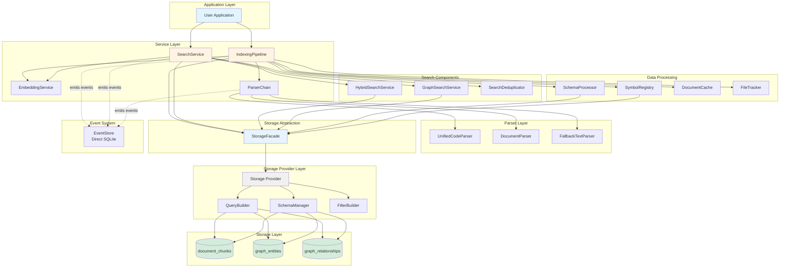

### Layered Architecture Diagram

This diagram illustrates the clear separation between presentation, business logic, and data layers:

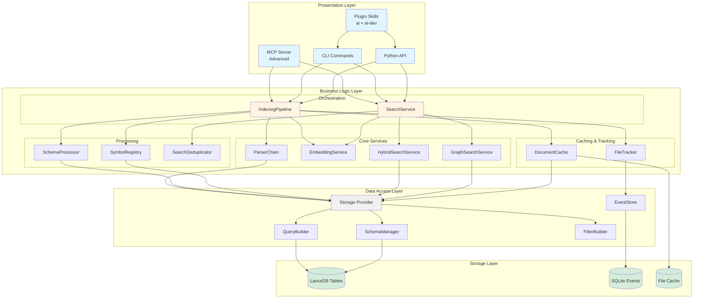

### Async-First Concurrency Model

This diagram shows how the async-first design enables concurrent execution with controlled parallelism:

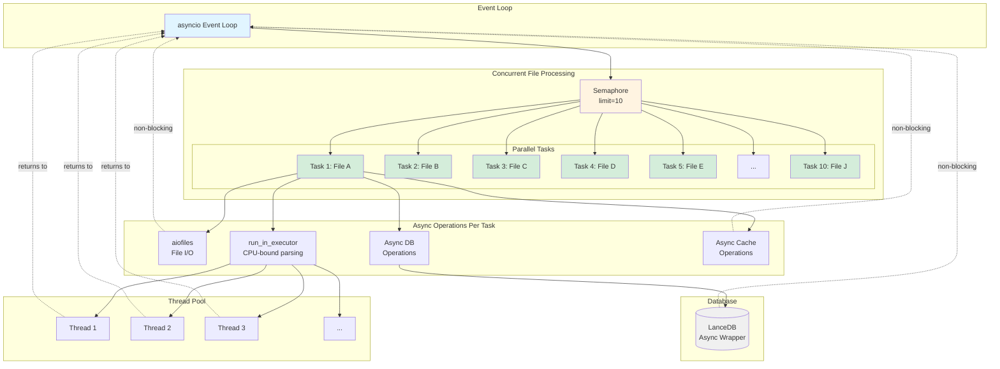

**Key Concurrency Patterns:**

- **Semaphore Control**: Limits concurrent operations (default: 10) to prevent resource exhaustion
- **Non-blocking I/O**: All file and database operations use async I/O, never blocking the event loop
- **Thread Pool Offloading**: CPU-bound operations (parsing, embedding) run in thread pool via `run_in_executor`
- **Parallel Execution**: Multiple files processed simultaneously using `asyncio.gather()`
- **Graceful Degradation**: Exceptions in one task don't affect others when using `return_exceptions=True`

**Performance Impact:**
- Sequential (blocking): 100 files × 0.56s = 56 seconds
- Concurrent (async, 10 workers): 100 files / 10 × 0.56s = 5.6 seconds
- **Actual measured: 5-10 seconds for 100 files (5-10x speedup)**

## Core Components

### Parser System

Extracts structure and content from various file formats using a chain-of-responsibility pattern with **fully async execution**.

#### Parser Chain Architecture

This diagram shows the chain-of-responsibility pattern used for parser selection and execution:

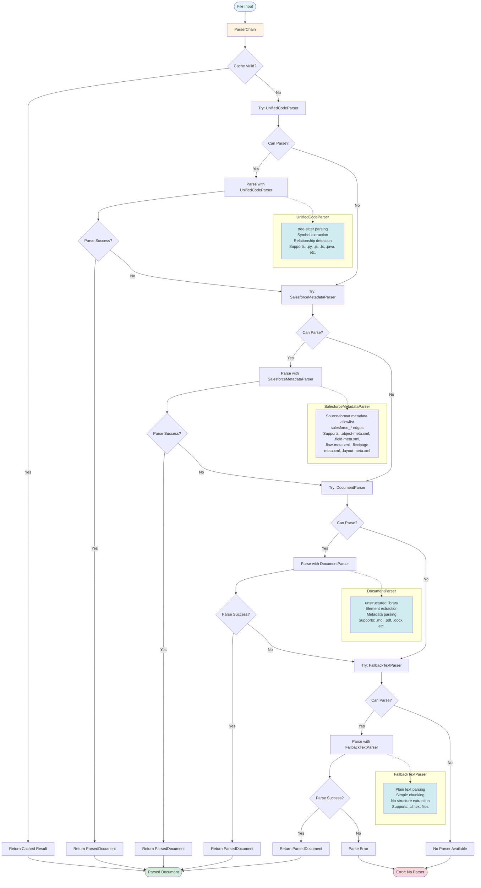

**Chain-of-Responsibility Pattern:**

1. **Priority Order**: UnifiedCodeParser → DocumentParser → FallbackTextParser
2. **Can Parse Check**: Each parser checks if it can handle the file type
3. **Fallback Logic**: If a parser fails or can't handle the file, try the next parser
4. **Guaranteed Success**: FallbackTextParser handles any text file as last resort
5. **Cache Integration**: Cached results bypass the entire chain

**Key Parsers:**
- **UnifiedCodeParser**: Handles code files (Python, JavaScript, TypeScript, etc.) using tree-sitter
  - Async file reading with `aiofiles`
  - CPU-bound tree-sitter parsing in `run_in_executor`
  - Fast in-memory symbol extraction
  
- **DocumentParser**: Handles structured documents (Markdown, PDF, DOCX, etc.) using unstructured library
  - Async file reading with `aiofiles`
  - I/O and CPU-bound unstructured calls in `run_in_executor`
  - Fast in-memory metadata extraction
  
- **FallbackTextParser**: Handles any text file as plain text
  - Async file reading with `aiofiles`
  - Fast in-memory text processing

**Async Implementation:**
```python
async def parse(self, file_path: str) -> ParsedDocument:
    # Non-blocking file I/O
    async with aiofiles.open(file_path, 'r') as f:
        content = await f.read()
    
    # CPU-bound operations in thread pool
    loop = asyncio.get_running_loop()
    parsed = await loop.run_in_executor(None, self._parse_content, content)
    
    return parsed
```

**What It Does:**
- Identifies file type and selects appropriate parser
- Extracts code symbols (functions, classes, methods) or document entities (headings, sections)
- Identifies relationships (function calls, imports, references)
- Splits content into searchable chunks
- **All operations are non-blocking and can run concurrently**

**Learn More:**
- [Parser System Architecture](parsers.md) - Detailed parser architecture
- [Custom Parsers](#custom-parsers) - How to add new parsers

**Related Sections:**
- [Indexing Pipeline](#indexing-pipeline) - Next step after parsing
- [Data Flow: Indexing](#indexing-flow) - Complete indexing sequence

---

### Indexing Pipeline

Transforms parsed documents into searchable database records with **fully async operations and concurrency control**.

#### Indexing Pipeline Internal Architecture

This diagram shows the internal structure and data flow within the IndexingPipeline:

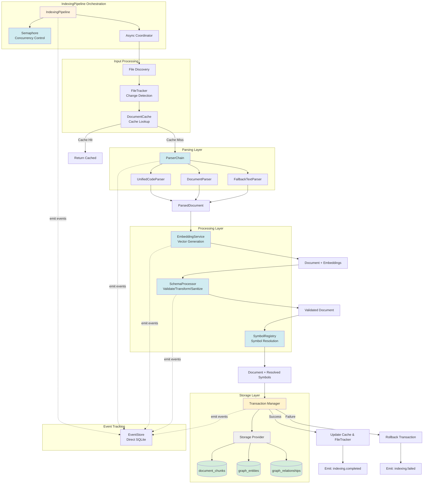

**Pipeline Stages:**

1. **File Discovery**: Identify files to index (respects .gitignore)
2. **Change Detection**: FileTracker checks if file has changed since last index
3. **Cache Lookup**: DocumentCache checks for valid cached parse results
4. **Parsing**: ParserChain selects and executes appropriate parser
5. **Embedding**: EmbeddingService generates vector embeddings for chunks
6. **Schema Processing**: SchemaProcessor validates, transforms, and sanitizes data
7. **Symbol Resolution**: SymbolRegistry resolves cross-file symbol references
8. **Transactional Storage**: Store chunks, entities, and relationships atomically
9. **Cache Update**: Update cache and file tracker on success
10. **Event Emission**: Track operation lifecycle and progress

**Concurrency Control:**

- **Semaphore**: Limits concurrent file processing (default: 10)
- **Async Coordination**: All operations are non-blocking
- **Parallel Execution**: Multiple files processed simultaneously
- **Error Isolation**: Failures in one file don't affect others

**Key Components:**
- **IndexingPipeline**: Orchestrates the indexing process with async coordination
- **EmbeddingService**: Generates vector embeddings for semantic search (simplified from multi-tier to single dimension)
  - **LocalModelEmbedder**: Uses locally-stored ONNX models for offline operation
  - **SentenceTransformerEmbedder**: Uses HuggingFace Sentence Transformers
  - **HashingEmbedder**: Fast deterministic hashing for development
- **SchemaProcessor**: Unified validation, transformation, and sanitization with transactional support
- **SymbolRegistry**: Tracks code symbols for cross-file resolution
- **DocumentCache**: Async caching with `aiofiles` for disk persistence
- **FileTracker**: Async change detection with `aiosqlite`

**Async Implementation:**
```python
async def index_directory(self, directory: str) -> List[str]:
    # Discover files (fast, synchronous)
    files = self._discover_files(directory)
    
    # Process files concurrently with semaphore control
    tasks = [self._index_file_async(f) for f in files]
    results = await asyncio.gather(*tasks, return_exceptions=True)
    
    return results

async def _index_file_async(self, file_path: str) -> str:
    async with self._semaphore:  # Limit concurrent operations
        # Check cache (async)
        cached = await self.cache.get(file_path)
        if cached:
            return file_path
        
        # Parse (async)
        parsed = await self.parser_chain.execute(file_path)
        
        # Process (async database operations)
        await self.process_document(parsed)
        
        # Update cache (async)
        await self.cache.put(file_path, parsed)
        
        return file_path
```

**What It Does:**
- Receives parsed documents from parsers
- Generates embeddings for each content chunk using single configured dimension
- Validates, transforms, and sanitizes chunks in a single transactional operation
- Stores chunks in the database (async operations with rollback support)
- Extracts and stores entities in the knowledge graph
- Resolves relationships between entities
- Supports incremental updates for changed files
- **Processes multiple files concurrently (configurable limit)**
- **All I/O operations are non-blocking**

**Performance:**
- Sequential (blocking): 100 files × 0.56s = 56 seconds
- Concurrent (async, 10 workers): 100 files / 10 × 0.56s = 5.6 seconds
- **Actual performance: 5-10 seconds for 100 files**

**Learn More:**
- [Indexing Architecture](indexing.md) - Detailed indexing architecture

**Related Sections:**
- [Parser System](#parser-system) - Provides input to indexing
- [Search Service](#search-service) - Searches indexed content
- [Data Flow: Indexing](#indexing-flow) - Complete indexing sequence
- [Async Patterns](#async-patterns-and-best-practices) - Concurrency implementation

---

### Search Service

Provides multiple search strategies with intelligent ranking, all using **async database operations**. The search layer has been refactored into focused components for better maintainability.

#### Search Service Architecture

This diagram shows the strategy pattern used for search execution and the internal structure of search components:

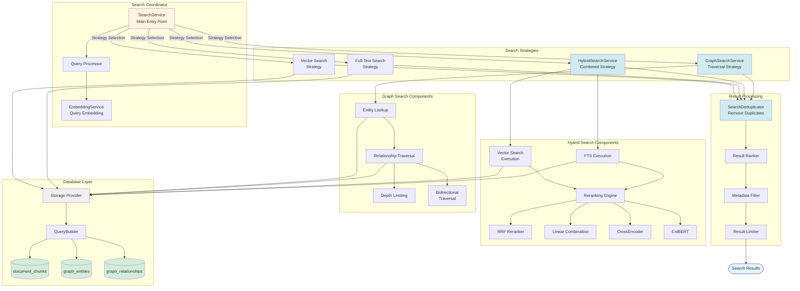

**Strategy Pattern Implementation:**

1. **SearchService**: Main coordinator that routes to appropriate strategy
2. **Strategy Selection**: Based on query type and user preferences
3. **Vector Strategy**: Semantic similarity using embeddings
4. **FTS Strategy**: Keyword matching with BM25
5. **Hybrid Strategy**: Combines vector and FTS with reranking
6. **Graph Strategy**: Traverses entity relationships

**Hybrid Search Pipeline:**

The hybrid search combines vector similarity and full-text search with these enhancements:
1. **Score-aware RRF**: k=30, score_factor multiplication, dual_source_bonus=1.3x
2. **IDF-weighted content boost**: Rare query terms weighted higher than common ones
3. **OR-based FTS**: Two-tier AND+OR queries with CamelCase splitting
4. **Pre-filtering**: MIN_VECTOR_SCORE=0.15, MIN_FTS_SCORE=0.01
5. **Proportional normalization**: Divide by max (not min-max)
6. **Deduplication**: max_results_per_file=2

**Reranking Strategies:**

- **RRF (Reciprocal Rank Fusion)**: Default, score-aware with quality pre-filtering
- **Linear Combination**: Weighted combination of vector and FTS scores
- **CrossEncoder**: Neural reranking with cross-attention (optional)
- **ColBERT**: Late interaction reranking (optional)

**Architecture:**

```
SearchService (coordinator)
├── HybridSearchService (hybrid search with RRF)
├── GraphSearchService (graph traversal)
└── SearchDeduplicator (result deduplication)
```

**Key Components:**

#### SearchService

Main coordinator for search operations:
- Routes to specialized search services
- Manages embedding generation
- Handles result deduplication
- Provides unified search interface

#### HybridSearchService

Combines vector and full-text search with reranking:
- Native LanceDB hybrid search
- Configurable rerankers (RRF, LinearCombination, CrossEncoder, ColBERT)
- Fallback strategies for robustness
- Result deduplication
- Overview boosting

**Example:**
```python
hybrid_service = HybridSearchService(
    db_manager=db_manager,
    config=config,
    deduplicator=deduplicator,
    project_id="my_project"
)

results = await hybrid_service.hybrid_search(
    query_text="authentication middleware",
    query_vector=embedding,
    limit=10,
    filters={"language": "python"}
)
```

**Reranking Strategies:**
- **RRF (Reciprocal Rank Fusion)**: Default, no parameters needed
- **LinearCombination**: Weighted combination of vector and FTS scores
- **CrossEncoder**: Neural reranking with cross-attention
- **ColBERT**: Late interaction reranking

#### GraphSearchService

Traverses entity relationships in the knowledge graph:
- Bidirectional traversal (outgoing, incoming, both)
- Relationship type filtering
- Depth limiting
- Entity resolution
- Metadata inclusion

**Example:**
```python
storage = await StorageFacade.from_config(config, "my_project")
graph_service = GraphSearchService(
    storage=storage,
    config=config,
)

result = await graph_service.traverse_relationships(
    entity_id="func_123",
    relationship_types=["calls", "called_by"],
    direction="both",
    max_depth=2
)

# Access discovered entities and relationships
for rel in result["relationships"]:
    print(f"{rel['source_name']} --{rel['type']}--> {rel['target_name']}")
```

**Search Strategies:**
- **Vector Search**: Semantic similarity using embeddings
- **Full-Text Search**: Keyword matching with BM25
- **Hybrid Search**: Combines vector and FTS with reranking
- **Graph Search**: Traverses entity relationships

**Async Implementation:**
```python
async def hybrid_search(
    self,
    query_text: str,
    limit: int = 10,
    filters: Optional[Dict] = None
) -> List[Dict[str, Any]]:
    # Generate embedding (CPU-bound, in executor)
    loop = asyncio.get_running_loop()
    query_vector = await loop.run_in_executor(
        None, self.embedder.generate, [query_text]
    )
    
    # Delegate to HybridSearchService
    results = await self.hybrid_service.hybrid_search(
        query_text=query_text,
        query_vector=query_vector[0],
        limit=limit,
        filters=filters
    )
    
    return results
```

**What It Does:**
- Converts queries to embeddings (for vector search)
- Executes search strategy based on user needs
- Uses LanceDB's native hybrid search with configurable reranking
- Ranks results by relevance
- Optionally reranks using graph metadata
- Supports filtering by file path, language, and other metadata
- **All database operations are async and non-blocking**

**Learn More:**
- [Search Architecture](search.md) - Detailed search architecture

**Related Sections:**
- [Indexing Pipeline](#indexing-pipeline) - Creates searchable content
- [Knowledge Graph](#knowledge-graph) - Powers graph-aware ranking
- [Data Flow: Search](#search-flow) - Complete search sequence
- [Database Layer](#database-layer) - Executes search queries

---

### Knowledge Graph

Tracks relationships between code symbols and document entities.

**Graph Structure:**
- **Entities**: Functions, classes, methods, headings, sections
- **Relationships**: Function calls, imports, containment, references

**What It Does:**
- Enables cross-file symbol resolution
- Supports code navigation (find callers, find callees)
- Powers graph-aware search ranking
- Provides document structure navigation

**Learn More:**
- [Knowledge Graph Architecture](knowledge-graph.md) - Detailed graph architecture

**Related Sections:**
- [Parser System](#parser-system) - Extracts entities and relationships
- [Search Service](#search-service) - Uses graph for ranking
- [Database Layer](#database-layer) - Stores graph data

---

### Event Tracking System

Provides simple, low-overhead tracking of operations with **direct EventStore persistence**.

**Key Components:**
- **EventStore**: SQLite-based persistence for event history
  - WAL mode for concurrent reads during writes
  - Project isolation via project_id
  - Efficient indexes for querying
  - Direct writes (no EventBus intermediary)

**Simplified Design:**
- Direct EventStore writes from components
- No distributed system features (batching, sampling, correlation IDs)
- Focused on single-process operation tracking
- Minimal overhead

**Async Implementation:**
```python
from agentic_inquiry.events.store import EventStore

# Direct event recording
await event_store.record_event(
    event_type="indexing.completed",
    data={"file_path": path, "chunks": count},
    project_id="my_project"
)

# Query events
events = await event_store.query_events(
    event_type="indexing.completed",
    project_id="my_project",
    limit=100
)
```

**What It Does:**
- Tracks indexing, search, and parsing operations
- Direct async writes to SQLite
- Query event history for debugging and analytics
- **All operations are non-blocking and async**

**Event Flow:**
```
Operation → EventStore.record_event() → SQLite (async)
```

**Performance:**
- Event writes: <1ms with async SQLite
- No queuing or batching overhead
- Minimal memory usage

**Learn More:** 
- [Event System Architecture](event-system.md) - Detailed event architecture and usage examples
- [Event Tracking Integration](#event-tracking-integration) - Adding events to custom components

**Related Sections:**
- [Indexing Pipeline](#indexing-pipeline) - Emits indexing events
- [Search Service](#search-service) - Emits search events
- [Parser System](#parser-system) - Emits parsing events

---

### Storage Layer

Agentic Inquiry uses a **Pluggable Storage Architecture** managed by the `StorageFacade`. LanceDB (vectors and graph), SQLite (events, file tracking, onboarding metadata) and the in-memory provider are accessed through one unified **fully async interface**, and a future external provider plugs into the same contract.

#### Storage Layer Structure

This diagram shows the internal structure of the database layer and how components interact:

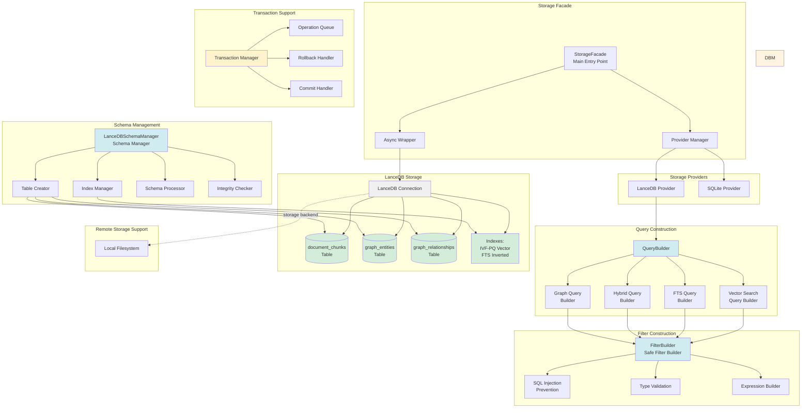

**Storage Backends:**

| Backend | Type | Embedding Strategy | Use Case |
|---------|------|-------------------|----------|
| **LanceDB** | `lancedb` | Local (SentenceTransformer) | Default for development |

**Embedding Strategies:**
- **Local (`"local"`)**: Client-side embedding using SentenceTransformer models (default)

- Auto-detects backend type from config
- Switches embedding strategy based on `embedding_strategy` setting

**Component Responsibilities:**

**StorageFacade (Main Entry Point):**
- Manages storage provider lifecycle
- Provides unified async interface to all backends
- Routes operations to appropriate providers
- Handles project isolation

**Storage Providers:**
- **LanceDB Provider**: Local vector database with Arrow format
- **SQLite Provider**: Event store and file tracking

**QueryBuilder (Query Construction):**
- Constructs safe, validated queries
- Supports vector, FTS, hybrid, and graph queries
- Provider-specific query translation
- Project-aware query construction

**SchemaManager (Schema Operations):**
- Creates and validates tables
- Manages indexes (IVF-PQ, FTS, GIN)
- Validates schema integrity
- Handles schema migrations

**FilterBuilder (Safe Filtering):**
- Prevents SQL injection attacks
- Validates filter types and values
- Builds safe filter expressions
- Supports complex filter composition

**Architecture:**

```
StorageFacade (unified interface)
├── Provider Registry (LanceDB, SQLite, memory)
├── QueryBuilder (query construction)
├── SchemaManager (schema operations)
└── FilterBuilder (safe filter construction)
```

**Key Components:**

#### StorageFacade

Main entry point for all storage operations:
- Manages provider lifecycle and routing
- Provides unified async interface across backends
- Handles provider-specific capabilities
- Supports project isolation

**Example:**
```python
from agentic_inquiry.storage.facade import StorageFacade
from agentic_inquiry.config import Config

config = Config()
storage = await StorageFacade.from_config(config, project_id="my_project")

# Unified interface works with any backend
await storage.upsert_chunks(chunks)
results = await storage.vector_search(query_vector=embedding, limit=10)
```

#### Storage Providers

Backend-specific implementations:
- **LanceDB Provider**: Local vector storage with Arrow format
- **SQLite Provider**: Event tracking and file metadata

- `embedding_strategy: "local"` - Client-side embedding with SentenceTransformer

**Example:**
```python
config.storage.backend = "lancedb"
```

#### QueryBuilder

Constructs safe, validated database queries:
- Vector similarity search
- Full-text search (FTS)
- Hybrid search with reranking
- Graph queries
- Provider-specific SQL generation

#### SchemaManager

Manages database schemas, tables, and indexes:
- Table creation and validation
- Index management (IVF-PQ, GIN, FTS)
- Schema integrity checks
- Provider-specific schema translation

#### FilterBuilder

Constructs safe filter expressions preventing injection:
- Proper escaping of special characters
- Type validation
- Fluent interface for filter composition
- Security-focused design

**Example:**
```python
from agentic_inquiry.database.filter_builder import FilterBuilder

builder = FilterBuilder()
builder.add_doc_id_filter(["doc1", "doc2"])
builder.add_project_filter("my_project")
builder.add_field_filter("language", "python")
filter_expr = builder.build()
# Result: "doc_id IN ('doc1', 'doc2') AND project_id = 'my_project' AND language = 'python'"
```

**Key Features:**
- **Local backends**: LanceDB, SQLite, memory
- **Unified interface**: Same code works across all backends
- Vector similarity search with IVF-PQ indexing
- Full-text search with a native inverted index
- Hybrid search with IDF-weighted content boost and score-aware RRF (k=30)
- SQL-like filtering with injection prevention
- **All operations fully async**

**Tables:**
- `document_chunks`: Parsed content with embeddings
- `graph_entities`: Code symbols and document entities
- `graph_relationships`: Entity relationships

**Backend Support:**
- **LanceDB**: local paths
- **SQLite**: Local metadata and events

**Learn More:**
- [Storage Backends](../backends/overview.md) - Backend comparison and configuration
- [Security Best Practices](../development/security.md) - Database security guidelines

**Related Sections:**
- [Indexing Pipeline](#indexing-pipeline) - Writes to database
- [Search Service](#search-service) - Queries database
- [Knowledge Graph](#knowledge-graph) - Graph storage
- [Async Patterns](#async-patterns-and-best-practices) - Async database operations

---

## Async Patterns and Best Practices

### Async I/O Operations

**File Operations:**
```python
import aiofiles

async def read_file_async(file_path: str) -> str:
    async with aiofiles.open(file_path, 'r') as f:
        return await f.read()
```

**Database Operations:**
```python
import aiosqlite

async def query_database(db_path: str, query: str):
    async with aiosqlite.connect(db_path) as db:
        async with db.execute(query) as cursor:
            return await cursor.fetchall()
```

**CPU-Bound Operations:**
```python
import asyncio

async def parse_with_tree_sitter(content: str):
    loop = asyncio.get_running_loop()  # Use get_running_loop() in async context
    # Run CPU-bound operation in thread pool
    return await loop.run_in_executor(None, tree_sitter_parse, content)
```

**Important:** Always use `asyncio.get_running_loop()` instead of the deprecated `asyncio.get_event_loop()` when running code in an async context. The `get_running_loop()` function ensures you're using the correct event loop and will raise an error if called outside an async context, preventing subtle bugs.

### Concurrency Control

**Semaphore for Rate Limiting:**
```python
class IndexingPipeline:
    def __init__(self, max_concurrent: int = 10):
        self._semaphore = asyncio.Semaphore(max_concurrent)
    
    async def index_file(self, file_path: str):
        async with self._semaphore:
            # Only max_concurrent files processed simultaneously
            return await self._process_file(file_path)
```

**Gather for Parallel Execution:**
```python
async def index_multiple_files(files: List[str]):
    # Process all files concurrently
    tasks = [index_file(f) for f in files]
    results = await asyncio.gather(*tasks, return_exceptions=True)
    return results
```

### Error Handling

**Graceful Degradation:**
```python
async def get_from_cache(key: str) -> Optional[Any]:
    try:
        return await cache.get(key)
    except Exception as e:
        logger.warning(f"Cache lookup failed: {e}")
        return None  # Graceful degradation
```

**Retry Logic:**
```python
async def query_with_retry(query: str, max_retries: int = 3):
    for attempt in range(max_retries):
        try:
            return await db.query(query)
        except Exception as e:
            if attempt == max_retries - 1:
                raise
            await asyncio.sleep(2 ** attempt)  # Exponential backoff
```

### Protocol Compliance

All protocols define async methods for consistent interfaces:

```python
from typing import Protocol

class ParserProtocol(Protocol):
    async def parse(self, file_path: str) -> ParsedDocument: ...
    async def can_parse(self, file_path: str) -> bool: ...

class CacheProtocol(Protocol):
    async def get(self, key: str) -> Optional[Any]: ...
    async def put(self, key: str, value: Any) -> None: ...

class StorageFacade:
    """Unified storage interface across all backends."""
    async def vector_search(self, query_vector: List[float], ...) -> List[Dict]: ...
    async def hybrid_search(self, query_vector: List[float], query_fts: str, ...) -> List[Dict]: ...
```

### Semaphore-Controlled Concurrency

This diagram illustrates how semaphores control concurrent operations to prevent resource exhaustion:

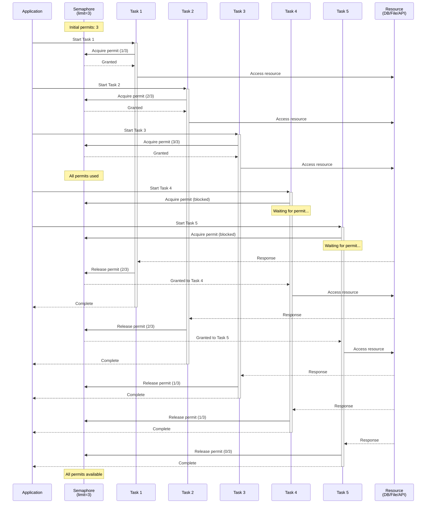

**Key Concepts:**

- **Permit Limit**: Semaphore initialized with maximum concurrent operations (e.g., 3, 10)
- **Acquire**: Task acquires permit before accessing resource; blocks if none available
- **Release**: Task releases permit after completing, allowing waiting tasks to proceed
- **Fairness**: Tasks acquire permits in order they requested (FIFO)
- **Resource Protection**: Prevents overwhelming databases, file systems, or APIs
- **Graceful Degradation**: System remains responsive even under high load

**Implementation Pattern:**

```python
class IndexingPipeline:
    def __init__(self, max_concurrent: int = 10):
        self._semaphore = asyncio.Semaphore(max_concurrent)
    
    async def index_file(self, file_path: str):
        async with self._semaphore:  # Acquire on enter, release on exit
            # Only max_concurrent files processed simultaneously
            return await self._process_file(file_path)
```

**Benefits:**

- Prevents resource exhaustion (memory, file handles, connections)
- Maintains system responsiveness under load
- Configurable concurrency limits per component
- Automatic cleanup via context manager
- Works seamlessly with async/await

### Parallel File Processing with asyncio.gather

This diagram shows how multiple files are processed concurrently using `asyncio.gather()`:

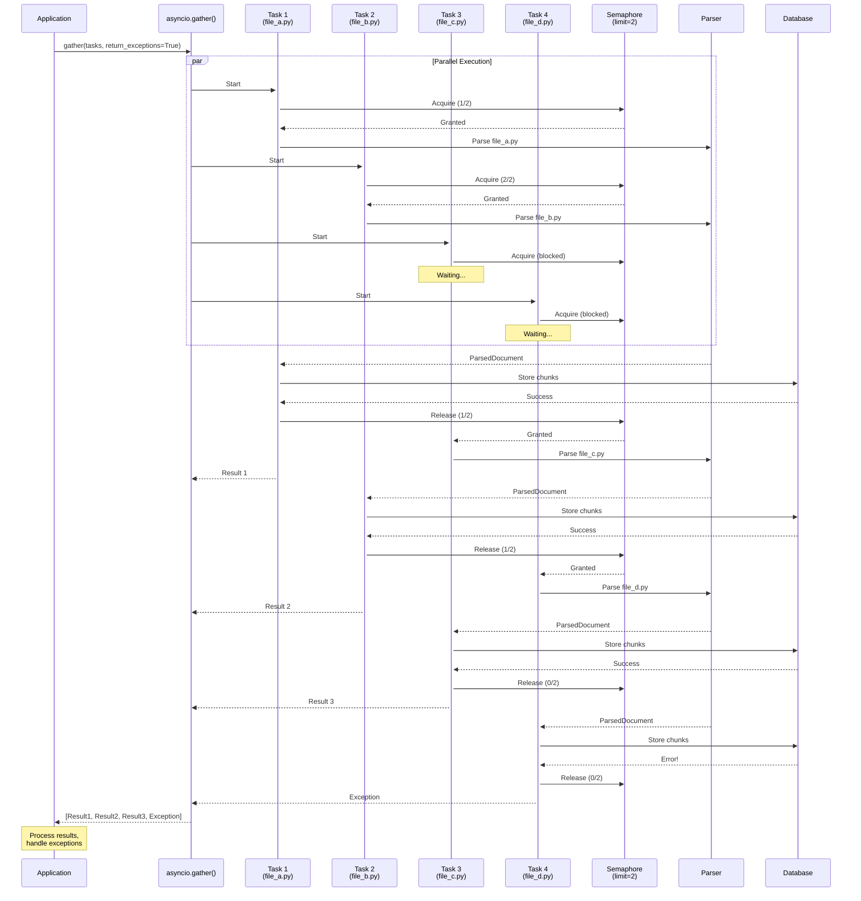

**Key Concepts:**

- **Concurrent Execution**: All tasks start simultaneously, limited by semaphore
- **Non-blocking**: Event loop switches between tasks during I/O operations
- **Exception Handling**: `return_exceptions=True` prevents one failure from canceling all tasks
- **Result Collection**: Returns list of results in same order as input tasks
- **Semaphore Integration**: Combines with semaphore for controlled parallelism

**Implementation Pattern:**

```python
async def index_multiple_files(files: List[str]):
    # Create tasks for all files
    tasks = [index_file(f) for f in files]
    
    # Execute all tasks concurrently
    # return_exceptions=True prevents one failure from canceling others
    results = await asyncio.gather(*tasks, return_exceptions=True)
    
    # Process results and handle exceptions
    for i, result in enumerate(results):
        if isinstance(result, Exception):
            logger.error("File %s failed: %s", files[i], result)
        else:
            logger.info("File %s indexed successfully", files[i])
    
    return results
```

**Benefits:**

- **Performance**: Process multiple files simultaneously (5-10x speedup)
- **Resilience**: One failure doesn't affect other tasks
- **Simplicity**: Single line to execute all tasks concurrently
- **Ordered Results**: Results match input order for easy correlation
- **Resource Control**: Works with semaphore to prevent overload

**Performance Impact:**

- Sequential: 100 files × 0.56s = 56 seconds
- Concurrent (10 workers): 100 files / 10 × 0.56s = 5.6 seconds
- **Actual: 5-10 seconds for 100 files**

### Event Loop Interactions

This diagram illustrates how the event loop manages async operations, I/O, and CPU-bound tasks:

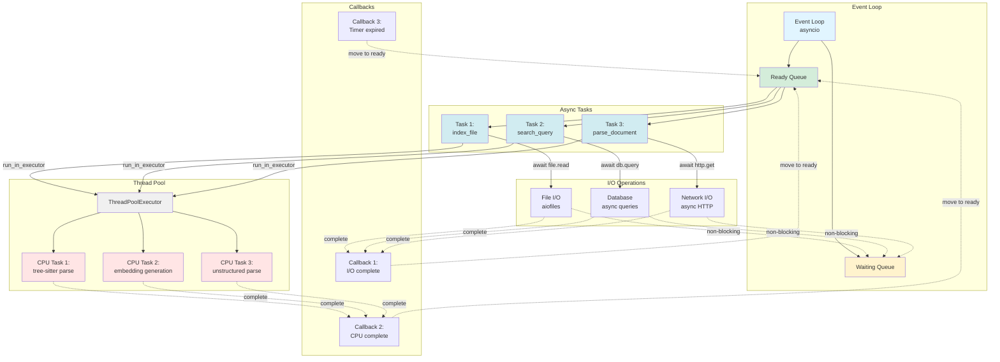

**Event Loop Lifecycle:**

1. **Task Creation**: Tasks added to ready queue
2. **Task Execution**: Event loop executes tasks from ready queue
3. **I/O Operations**: Tasks await I/O, moved to waiting queue
4. **CPU Operations**: CPU-bound work offloaded to thread pool
5. **Callback Registration**: Callbacks registered for completion
6. **Event Loop Continues**: Loop processes other ready tasks
7. **Completion Callbacks**: I/O or CPU completion triggers callback
8. **Task Resumption**: Callback moves task back to ready queue
9. **Result Processing**: Task resumes with result

**Key Concepts:**

- **Non-blocking I/O**: I/O operations don't block event loop
- **Cooperative Multitasking**: Tasks voluntarily yield control via `await`
- **Thread Pool Offloading**: CPU-bound work runs in separate threads
- **Callback-based**: Completion triggers callbacks to resume tasks
- **Single-threaded**: Event loop runs in single thread (except thread pool)

**Implementation Patterns:**

```python
# I/O operation (non-blocking)
async def read_file_async(file_path: str) -> str:
    async with aiofiles.open(file_path, 'r') as f:
        content = await f.read()  # Yields to event loop
    return content

# CPU-bound operation (thread pool)
async def parse_with_tree_sitter(content: str):
    loop = asyncio.get_running_loop()
    # Offload to thread pool, event loop continues
    result = await loop.run_in_executor(None, tree_sitter_parse, content)
    return result

# Database operation (non-blocking)
async def query_database(query: str):
    # LanceDB operations wrapped in async
    results = await db_manager.vector_search(query_vector)
    return results
```

**Benefits:**

- **Concurrency**: Multiple operations progress simultaneously
- **Responsiveness**: System never blocks on I/O
- **Efficiency**: Single thread handles many concurrent operations
- **Scalability**: Handles thousands of concurrent tasks
- **Resource Efficiency**: No thread-per-request overhead

**Common Pitfalls:**

- **Blocking Calls**: Never use blocking I/O in async code (use `aiofiles`, `aiosqlite`, etc.)
- **CPU-bound Work**: Always offload to thread pool via `run_in_executor`
- **Event Loop Access**: Use `get_running_loop()` not deprecated `get_event_loop()`
- **Synchronous Code**: Don't mix sync and async without proper bridging

### Async Operation Execution Sequence

This sequence diagram shows the complete lifecycle of an async indexing operation:

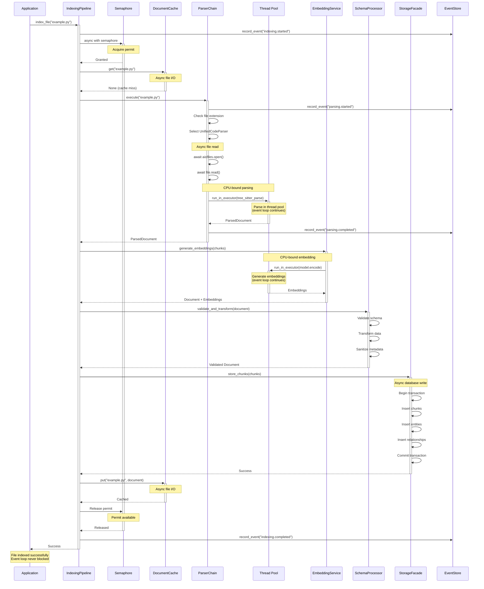

**Execution Flow:**

1. **Initiation**: Application calls `index_file()` on pipeline
2. **Event Emission**: Emit `indexing.started` event
3. **Semaphore Acquisition**: Acquire permit (may wait if limit reached)
4. **Cache Check**: Check document cache (async file I/O)
5. **Parser Selection**: Select appropriate parser based on file type
6. **File Reading**: Read file content (async I/O via `aiofiles`)
7. **Parsing**: Parse content in thread pool (CPU-bound)
8. **Embedding Generation**: Generate embeddings in thread pool (CPU-bound)
9. **Schema Processing**: Validate, transform, sanitize (fast, in-memory)
10. **Database Storage**: Store chunks, entities, relationships (async DB operations)
11. **Cache Update**: Update cache with parsed document (async file I/O)
12. **Semaphore Release**: Release permit for next task
13. **Event Emission**: Emit `indexing.completed` event
14. **Completion**: Return success to application

**Key Async Patterns:**

- **Context Managers**: `async with` for semaphore and file operations
- **Await Points**: Every I/O operation is an await point where event loop can switch tasks
- **Thread Pool Offloading**: CPU-bound operations (parsing, embedding) run in thread pool
- **Non-blocking Database**: All database operations are async
- **Event Emission**: Events emitted at key lifecycle points
- **Error Handling**: Exceptions propagate up, semaphore released in finally block

**Performance Characteristics:**

- **File Reading**: ~1-5ms (async, non-blocking)
- **Parsing**: ~50-200ms (CPU-bound, in thread pool)
- **Embedding**: ~100-500ms (CPU-bound, in thread pool)
- **Database Write**: ~10-50ms (async, non-blocking)
- **Cache Update**: ~1-5ms (async, non-blocking)
- **Total**: ~200-800ms per file
- **Concurrent**: 10 files simultaneously = ~200-800ms total (not 2-8 seconds)

**Benefits:**

- **True Concurrency**: Multiple files processed simultaneously
- **No Blocking**: Event loop never blocks on I/O
- **Resource Control**: Semaphore prevents resource exhaustion
- **Observability**: Events track operation lifecycle
- **Error Isolation**: One file failure doesn't affect others

## Data Flow

### Indexing Flow

Complete indexing flow from file input to database storage:

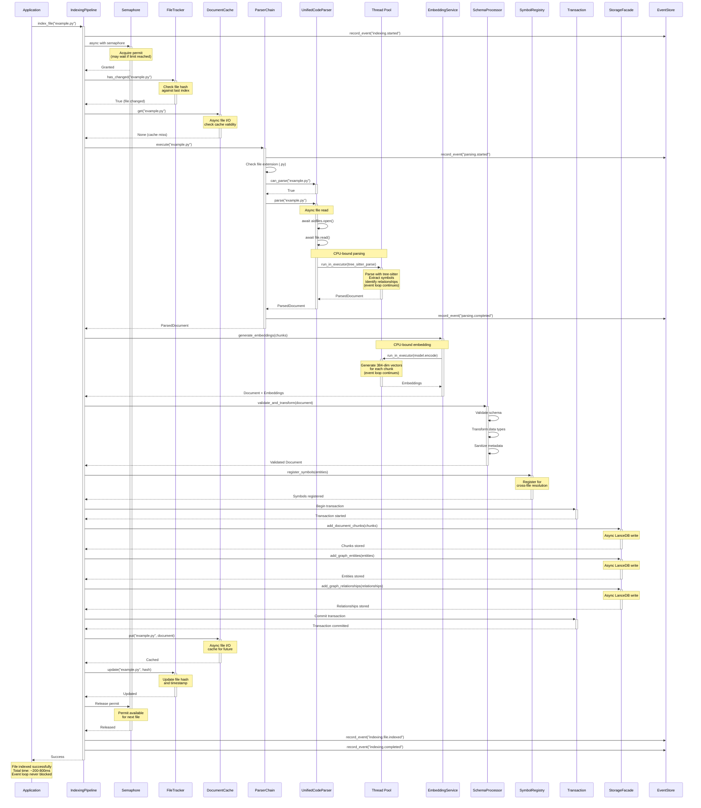

**Key Points:**
- Semaphore limits concurrent file processing (default: 10)
- FileTracker prevents re-indexing unchanged files
- All I/O operations are async and non-blocking
- CPU-bound operations (parsing, embedding) run in thread pool
- Transactional storage with rollback support
- Performance: ~200-800ms per file, 10 files concurrently

**Key Steps:**

1. **File Validation**: Check if file exists and is accessible
2. **Cache Check**: Verify if file has been indexed and hasn't changed
3. **Parser Selection**: Chain-of-responsibility pattern selects appropriate parser
4. **Parsing**: Extract structure and content (async file I/O, CPU-bound in executor)
5. **Embedding Generation**: Convert chunks to vectors (CPU-bound in executor)
6. **Schema Processing**: Validate, transform, and sanitize in single operation
7. **Transactional Storage**: Store chunks, entities, and relationships with rollback support
8. **Symbol Registration**: Register symbols for cross-file resolution
9. **Cache Update**: Update cache and file tracker for incremental indexing
10. **Event Emission**: Track operation lifecycle and progress

**Error Handling:**
- File not found → Early exit with error
- No parser available → Fallback to text parser or error
- Parse failure → Log error and skip file
- Embedding failure → Retry or skip file
- Schema validation failure → Reject invalid data
- Storage failure → Rollback transaction, preserve data integrity

**Concurrency:**
- Multiple files processed simultaneously (default: 10 concurrent)
- Semaphore controls maximum concurrent operations
- No event loop blocking at any step
- Event emission is direct handler invocation (microseconds)

### Search Flow

Hybrid search execution combining vector similarity and full-text search:

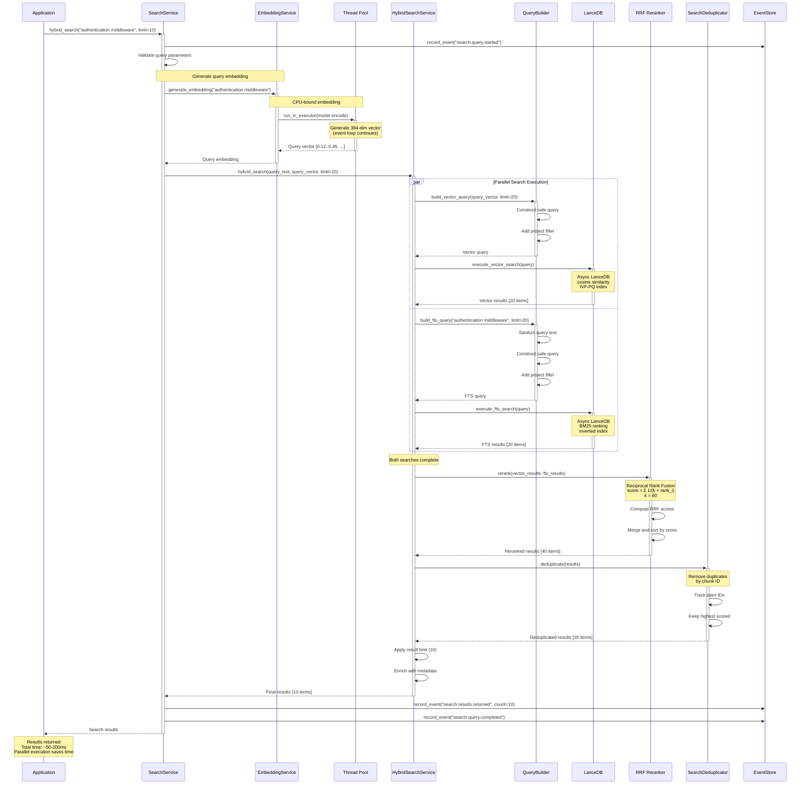

**Key Points:**
- Vector and FTS searches run concurrently via `asyncio.gather()`
- Embedding generation in thread pool (CPU-bound)
- Score-aware RRF reranking with IDF-weighted content boost
- Deduplication removes duplicate chunks
- Performance: ~50-200ms, parallel execution saves ~50% vs sequential

### Event Tracking

Components emit events directly to EventStore (SQLite) for operation tracking:

```python
await event_store.record_event(
    event_type="indexing.completed",
    data={"file_path": path, "chunks": count},
    project_id="my_project"
)
```

**Common Event Types:**
- `parsing.started`, `parsing.completed`, `parsing.failed`
- `indexing.started`, `indexing.file.indexed`, `indexing.completed`
- `search.query.started`, `search.results.returned`, `search.query.completed`

**Key Points:**
- Direct async writes to SQLite (<1ms)
- WAL mode for concurrent reads during writes
- Project isolation via project_id
- Query event history for debugging and analytics
- No EventBus intermediary (removed for simplicity)

## Configuration

Configuration controls system behavior through YAML files and environment variables.

**Configuration Sources (priority order):**
1. Environment variables (`AI_*`)
2. Project configuration (`agentic-inquiry.yaml`)
3. Default configuration (`config/default.yaml`)

**Key Configuration Areas:**
- Storage location and table names
- Cache size and eviction policy
- Search weights and limits
- Embedding provider and model
- Parser priorities

**Example:**
```yaml
storage:
  uri: "./vector_db"

embeddings:
  provider: "sentence_transformer"
  model: "all-MiniLM-L6-v2"

search:
  default_limit: 10
  hybrid_search:
    vector_weight: 0.7
    fts_weight: 0.3
```


## Component Architecture

### Direct Instantiation Design

Agentic Inquiry uses concrete classes with clear interfaces. This enables:
- **Simplicity**: Direct instantiation without factory wrappers
- **Testability**: Easy to create mock implementations
- **Type Safety**: Static type checking with mypy using concrete types
- **Clear Interfaces**: Well-defined class APIs
- **IDE Support**: Better navigation and autocomplete

**Core Components:**
- `StorageFacade`: Unified storage interface across all backends
- `DocumentCache`: Document caching operations
- `EmbeddingService`: Embedding generation (simplified from multi-tier)
- `SchemaProcessor`: Unified schema validation, transformation, and sanitization
- `Parser`: Base class for document parsing (code, documents, etc.)
- `SymbolRegistry`: Symbol resolution and tracking

### Direct Instantiation

Components are instantiated directly with their dependencies:

```python
from agentic_inquiry.storage.facade import StorageFacade
from agentic_inquiry.indexing.pipeline import IndexingPipeline

# Direct instantiation with from_config()
storage = await StorageFacade.from_config(config, project_id="my_project")

# Direct instantiation with constructor
pipeline = IndexingPipeline(
    config=config,
    project_id="my_project"
)

# Or inject custom implementations
pipeline = IndexingPipeline(
    config=config,
    project_id="my_project",
    storage=my_custom_storage,
    embedding_service=my_embeddings,
    symbol_registry=my_symbols
)
```

**Benefits:**
- No factory function indirection
- Clear dependency relationships visible at call site
- Easy to test with mocks
- Supports multiple projects simultaneously
- Better IDE navigation to implementations

## Extension Points

Agentic Inquiry is designed to be extensible at multiple points.

### Custom Parsers

Add support for new file formats by implementing `ParserProtocol`:

```python
from agentic_inquiry.protocols import ParserProtocol
from agentic_inquiry.parsers.models import ParsedDocument, register_parser
from agentic_inquiry.events import get_event_system

@register_parser("my_parser")
class MyCustomParser:
    def __init__(self):
        self.events = get_event_system()
    
    async def can_parse(self, file_path: str) -> bool:
        return file_path.endswith(".custom")
    
    async def parse(self, file_path: str) -> ParsedDocument:
        # Emit event for tracking
        await self.events.emit(
            "parsing.custom.started",
            source="MyCustomParser",
            file_path=file_path
        )
        
        try:
            # Parse file and return ParsedDocument
            result = await self._do_parse(file_path)
            
            await self.events.emit(
                "parsing.custom.completed",
                source="MyCustomParser",
                file_path=file_path,
                chunks=len(result.chunks)
            )
            
            return result
        except Exception as e:
            await self.events.emit(
                "parsing.custom.failed",
                source="MyCustomParser",
                file_path=file_path,
                error=str(e)
            )
            raise
```

### Custom Embeddings

Agentic Inquiry supports multiple embedding providers out of the box:

#### Built-in Embedders

**LocalModelEmbedder** - Uses locally-stored ONNX models:
```python
from agentic_inquiry.embeddings.local_model import LocalModelEmbedder
from agentic_inquiry.embeddings.registry import embedding_registry

# Create local model embedder
embedder = LocalModelEmbedder(
    model_path="models/all-MiniLM-L6-v2",
    normalize=True,
    batch_size=32
)

# Register as default
embedding_registry.configure_default_embedder(embedder, ndims=384)
```

**Benefits:**
- Completely offline operation
- No external API dependencies
- Consistent performance
- Custom model support

**SentenceTransformerEmbedder** - Uses HuggingFace models:
```python
from agentic_inquiry.embeddings.sentence_transformer import SentenceTransformerEmbedder

embedder = SentenceTransformerEmbedder(model_name="all-MiniLM-L6-v2")
```

**HashingEmbedder** - Fast deterministic hashing:
```python
from agentic_inquiry.embeddings.hashing import HashingEmbedder

embedder = HashingEmbedder(ndims=128)
```

#### Custom Implementation

Implement `EmbeddingProtocol` for custom providers:

```python
from agentic_inquiry.protocols import EmbeddingProtocol
from typing import List

class MyEmbeddingProvider:
    def embed(self, text: str) -> List[float]:
        # Generate embedding
        return [0.1, 0.2, ...]
    
    def embed_batch(self, texts: List[str]) -> List[List[float]]:
        # Batch embedding for efficiency
        return [self.embed(text) for text in texts]
```

**Learn More:** [Custom Embeddings](../customization/extending.md#custom-embeddings)

### Event Tracking Integration

Add event tracking to custom components for observability:

```python
from agentic_inquiry.events import EventSystem, track_operation
from agentic_inquiry.events.types import EventTypes

class MyCustomComponent:
    def __init__(self, project_id: str):
        self.project_id = project_id
        self.events = None
    
    async def initialize(self):
        """Initialize with event tracking."""
        self.events = await EventSystem.from_config(
            project_id=self.project_id
        )
        await self.events.start()
        
        await self.events.emit(
            "mycomponent.initialized",
            source="MyCustomComponent",
            project_id=self.project_id
        )
    
    async def process_data(self, data: List[str]):
        """Process data with automatic event tracking."""
        # Use track_operation for automatic lifecycle events
        async with track_operation(
            self.events,
            "mycomponent.process",
            "MyCustomComponent"
        ) as op:
            for i, item in enumerate(data):
                await self._process_item(item)
                
                # Emit progress events
                await op.progress(
                    items_processed=i+1,
                    total=len(data),
                    percent_complete=(i+1)/len(data)*100
                )
            
            # Completion event emitted automatically
    
    async def cleanup(self):
        """Clean up with event tracking."""
        if self.events:
            await self.events.emit(
                "mycomponent.cleanup",
                source="MyCustomComponent"
            )
            await self.events.stop()
```

**Integration Benefits:**
- **Observability**: Track all operations across components
- **Debugging**: Trace issues through event history
- **Monitoring**: Real-time metrics and health checks
- **Correlation**: Automatic operation grouping via correlation IDs
- **Performance**: < 1ms overhead per event

**Learn More:** [Event System Architecture](event-system.md)

#### Embedding Architecture

The embedding system follows a simplified architecture with single dimension support:

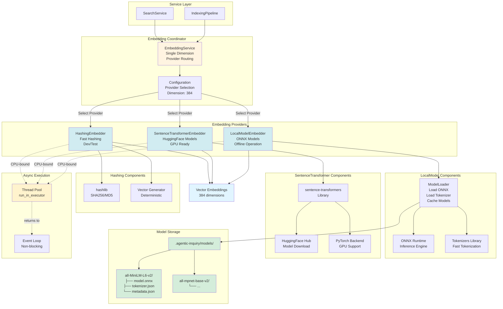

**Provider Selection Flow:**

1. **Configuration**: EmbeddingService reads provider from config
2. **Provider Routing**: Routes to appropriate embedder implementation
3. **Lazy Loading**: Models loaded on first use, not at initialization
4. **Async Execution**: CPU-bound operations run in thread pool
5. **Caching**: Models cached in memory to avoid repeated loading

**Provider Comparison:**

| Provider | Use Case | Dependencies | Offline | GPU Support |
|----------|----------|--------------|---------|-------------|
| LocalModelEmbedder | Production, offline | ONNX Runtime | ✅ Yes | ❌ No |
| SentenceTransformerEmbedder | Development, GPU | sentence-transformers | ❌ No | ✅ Yes |
| HashingEmbedder | Testing, dev | hashlib (stdlib) | ✅ Yes | N/A |

**Design Decisions:**

1. **Simplified Architecture**: Single dimension configuration (removed multi-tier complexity)
2. **Provider Selection**: EmbeddingService routes to appropriate provider based on configuration
3. **Lazy Loading**: Models loaded on first use, not at initialization
4. **Async Support**: All embedders support async operations via thread pool executors
5. **Workspace-Aware**: Model paths resolved relative to storage root
6. **Caching**: Models cached in memory to avoid repeated loading

**Model Conversion Workflow:**

```
HuggingFace Hub → [convert_model.py] → ONNX + Tokenizer + Metadata
                         │
                         ▼
              .agentic-inquiry/models/
                         │
                         ▼
              LocalModelEmbedder loads model
                         │
                         ▼
              Embeddings generated offline
```

### Custom Storage Backend

Create a custom storage backend by implementing the storage provider protocols:

```python
from agentic_inquiry.storage.protocols import VectorStoreProtocol, GraphStoreProtocol

class MyVectorProvider(VectorStoreProtocol):
    """Custom vector storage provider."""

    async def upsert_chunks(self, chunks: List[Dict], project_id: str) -> None:
        # Store chunks in your database
        pass

    async def vector_search(self, query_vector: List[float],
                           limit: int = 10, filters: Optional[Dict] = None) -> List[Dict]:
        # Search and return results
        pass
    
    # Implement other methods as needed
```

**Learn More:** [Extending Agentic Inquiry](../customization/extending.md)

## Design Principles

### Progressive Disclosure

The system is designed with layers of abstraction:
- **High-level API**: Simple interfaces for common tasks
- **Mid-level API**: Configurable components for customization
- **Low-level API**: Direct database access for advanced use cases

### Modularity

Each component is independent and replaceable:
- Swap parsers without affecting search
- Change embedding providers without reindexing
- Replace database backend with minimal changes

### Performance

Optimizations throughout the system:
- **Caching**: Parsed documents and embeddings are cached
- **Batch Processing**: Index multiple files efficiently
- **Incremental Updates**: Only re-index changed files
- **Vector Indexing**: IVF-PQ for fast similarity search

## Performance Characteristics

Understanding the performance profile of Agentic Inquiry helps you optimize your usage:

### Indexing Performance

**Sequential (blocking I/O):**
- 100 files × 0.56s = 56 seconds
- Single-threaded, blocking on each file

**Concurrent (async, 10 workers):**
- 100 files / 10 × 0.56s = 5.6 seconds (theoretical)
- **Actual measured: 5-10 seconds for 100 files**
- **5-10x speedup** over sequential processing

**Per-File Breakdown:**
- File Reading: ~1-5ms (async, non-blocking)
- Parsing: ~50-200ms (CPU-bound, in thread pool)
- Embedding: ~100-500ms (CPU-bound, in thread pool)
- Database Write: ~10-50ms (async, non-blocking)
- Cache Update: ~1-5ms (async, non-blocking)
- **Total: ~200-800ms per file**

**Concurrency Benefits:**
- 10 files processed simultaneously
- Event loop never blocks on I/O
- CPU-bound work offloaded to thread pool
- Semaphore prevents resource exhaustion

### Search Performance

**Query Execution:**
- Embedding Generation: ~10-50ms (CPU-bound, in thread pool)
- Vector Search: ~20-100ms (depends on index size)
- FTS Search: ~10-50ms (depends on corpus size)
- Hybrid Search: ~50-200ms (parallel execution)
- Graph Traversal: ~10-100ms (depends on depth)

**Optimization Strategies:**
- Use hybrid search for best relevance
- Configure appropriate result limits
- Enable caching for repeated queries
- Use graph search for relationship queries
- Consider reranking strategy based on use case

### Event System Performance

**Event Emission:**
- Direct handler invocation: < 1ms
- No queue overhead or backpressure
- Minimal memory usage (no buffering)
- Optional persistence: ~1-5ms (async SQLite)

**Scalability:**
- Handles thousands of events per second
- No performance degradation with multiple handlers
- Error isolation prevents cascading failures

---

## Related Documentation

### By Topic

**Architecture & Design:**
- [Design Decisions](design-decisions.md) - Key architectural choices and rationale
- [Async Architecture](async-architecture.md) - Async-first design patterns
- [Event System](event-system.md) - Event tracking architecture

**Component Deep Dives:**
- [Parser System](parsers.md) - Parser architecture and chain-of-responsibility
- [Indexing Pipeline](indexing.md) - Indexing architecture and flow
- [Search System](search.md) - Search strategies and ranking
- [Knowledge Graph](knowledge-graph.md) - Graph structure and relationships

**Implementation Guides:**
- [Event System Architecture](event-system.md) - How to track operations

**Extension & Customization:**
- [Extending Agentic Inquiry](../customization/extending.md) - Custom components
- [Development Guide](../development/README.md) - Contributing and development
- [Security Best Practices](../development/security.md) - Security guidelines

**Reference:**
- [API Reference](../api-reference/api.md) - Complete API documentation
- [FAQ](../FAQ.md) - Frequently asked questions

### By Role

**Backend Engineers:**
1. [System Architecture](#system-architecture) (this document)
2. [Database Layer](#database-layer) (this document)
3. [Design Decisions](design-decisions.md)
4. [API Reference](../api-reference/api.md)

**Integration Engineers:**
1. [Extension Points](#extension-points) (this document)
2. [Extending Agentic Inquiry](../customization/extending.md)

**Performance Engineers:**
1. [Async-First Design](#async-first-design-philosophy) (this document)
2. [Async Architecture](async-architecture.md)
3. [Performance Characteristics](#performance-characteristics) (this document)
4. [Design Decisions](design-decisions.md)

**Extension Developers:**
1. [Extension Points](#extension-points) (this document)
2. [Custom Parsers](#custom-parsers) (this document)
3. [Extending Agentic Inquiry](../customization/extending.md)
4. [Development Guide](../development/README.md)

---

## Next Steps

### Deep Dives
- **How does parsing work?** → [Parser System](parsers.md)
- **How does indexing work?** → [Indexing Pipeline](indexing.md)
- **How does search work?** → [Search System](search.md)
- **How does the graph work?** → [Knowledge Graph](knowledge-graph.md)

### Extending the System
- **Adding custom parsers?** → [Custom Parsers](#custom-parsers) and [Extending Guide](../customization/extending.md)
- **Custom embeddings?** → [Custom Embeddings](#custom-embeddings)
- **Custom database backend?** → [Custom Database Backend](#custom-database-backend)
- **Event tracking integration?** → [Event Tracking Integration](#event-tracking-integration)

### Understanding Design
- **Why these choices?** → [Design Decisions](design-decisions.md)
- **Why async-first?** → [Async Architecture](async-architecture.md)
- **How does event tracking work?** → [Event System](event-system.md)
- **Security considerations?** → [Security Best Practices](../development/security.md)

### Contributing
- **Want to contribute?** → [Contributing Guide](../CONTRIBUTING.md)
- **Development setup?** → [Development Guide](../development/README.md)
- **Code style?** → [Style Guide](../STYLE_GUIDE.md)
