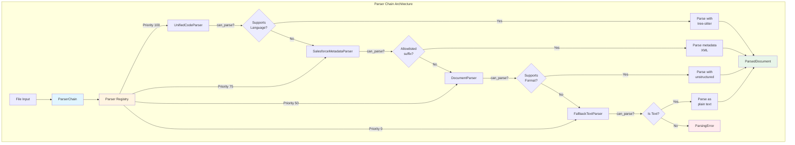

# Parser System Architecture

The parser system is responsible for extracting structure and content from various file formats. This document explains the parser architecture, how parsers work, and how to extend the system.

## Quick Navigation

**Choose your focus:**

### 📚 Understanding the Architecture
- [Overview](#overview) - High-level parser system design
- [Parser Chain](#parser-chain) - Chain-of-responsibility pattern
- [Built-in Parsers](#built-in-parsers) - Available parser implementations

### 🔧 Working with Parsers
- [Core Concepts](#core-concepts) - Parser protocol and data models
- [Chunking Strategies](#chunking-strategies) - How content is split
- [Entity Extraction](#entity-extraction) - What entities are extracted
- [Relationship Extraction](#relationship-extraction) - How relationships are identified

### 🚀 Extending the System
- [Parser Registration](#parser-registration) - How to register custom parsers
- [Testing Parsers](#testing-parsers) - How to test parser implementations
- [Error Handling](#error-handling) - Graceful degradation strategies

### ⚡ Performance & Optimization
- [Performance Optimization](#performance-optimization) - Parser selection and caching
- [Lazy Loading](#lazy-loading) - On-demand parsing strategies

---

## Overview

The parser system uses a **chain-of-responsibility pattern** where multiple parsers are tried in priority order until one succeeds. This allows for flexible handling of diverse file formats while maintaining a clean, extensible architecture.

**Key Features:**
- **Multi-format support**: Code (Python, JS, TS, Java, etc.) and documents (MD, PDF, DOCX, etc.)
- **Extensible**: Easy to add new parsers via registration
- **Graceful degradation**: Falls back to simpler parsers if specialized ones fail
- **Async-first**: All parsing operations are non-blocking
- **Structured output**: Consistent `ParsedDocument` format across all parsers

**Related Documentation:**
- [Architecture Overview](overview.md#parser-system) - Parser system in context
- [Custom Parsers](../customization/extending.md#custom-parsers) - How to extend

## Core Concepts

### Parser Protocol

All parsers implement the `ParserProtocol` interface:

```python
class ParserProtocol(Protocol):
    def can_parse(self, file_path: str) -> bool:
        """Check if this parser can handle the file."""
        ...
    
    def parse(self, file_path: str) -> ParsedDocument:
        """Parse the file and return structured document."""
        ...
```

### ParsedDocument

Parsers return a `ParsedDocument` containing:

```python
@dataclass
class ParsedDocument:
    file_path: str              # Path to source file
    language: str               # Programming language or document type
    chunks: List[ParserChunk]   # Parsed content chunks
    entities: List[ParserEntity]  # Extracted entities
    relationships: List[ParserRelationship]  # Entity relationships
    metadata: Dict[str, Any]    # Additional metadata
```

### ParserChunk

Individual content chunks with structure:

```python
@dataclass
class ParserChunk:
    content: str                # Chunk text content
    start_line: int             # Starting line number
    end_line: int               # Ending line number
    symbols: List[Dict]         # Code symbols (for code files)
    entities: List[Dict]        # Document entities (for documents)
    metadata: Dict[str, Any]    # Additional metadata
```

## Parser Chain

### Internal Architecture

The parser system uses a chain-of-responsibility pattern with priority-based selection:



### Chain Execution

The `ParserChain` orchestrates parser selection and execution:

**Algorithm:**
1. For each parser in priority order:
   - Check if `can_parse(file_path)` returns `True`
   - If yes, call `parse(file_path)`
   - If parsing succeeds, return `ParsedDocument`
   - If parsing fails, try next parser
2. If all parsers fail, raise `ParsingError`

### Priority Configuration

Parser priority is configured in `agentic-inquiry.yaml`:

```yaml
parsers:
  unified_code:
    enabled: true
    priority: 100  # Highest priority

  salesforce_metadata:
    enabled: true
    priority: 75   # Source-format Salesforce metadata allowlist

  document:
    enabled: true
    priority: 50   # Medium priority
  
  fallback_text:
    enabled: true
    priority: 0    # Lowest priority (last resort)
```

**Default Priority:**
1. `unified_code` (100) - Code files
2. `salesforce_metadata` (75) - Salesforce source-format metadata (five suffixes)
3. `document` (50) - Structured documents
4. `fallback_text` (0) - Plain text fallback

## Built-in Parsers

### 1. Unified Code Parser

Handles source code files using tree-sitter.

**Supported Languages:**
- Python (`.py`)
- JavaScript (`.js`, `.jsx`)
- TypeScript (`.ts`, `.tsx`)
- Java (`.java`)
- C/C++ (`.c`, `.cpp`, `.h`, `.hpp`)
- Go (`.go`)
- Rust (`.rs`)
- Ruby (`.rb`)
- PHP (`.php`)

**Extraction:**
- **Symbols**: Functions, classes, methods, variables
- **Relationships**: Function calls, imports, class inheritance
- **Structure**: Module organization, nesting

**Example Output:**
```python
ParsedDocument(
    file_path="src/parser.py",
    language="python",
    chunks=[
        ParserChunk(
            content="def parse_file(path):\n    ...",
            start_line=10,
            end_line=20,
            symbols=[
                {
                    "name": "parse_file",
                    "type": "function",
                    "start_line": 10,
                    "end_line": 20
                }
            ]
        )
    ],
    entities=[
        ParserEntity(
            name="parse_file",
            type="function",
            file_path="src/parser.py",
            start_line=10,
            end_line=20
        )
    ],
    relationships=[
        ParserRelationship(
            source="parse_file",
            target="open",
            type="calls"
        )
    ]
)
```

**Implementation:** `agentic_inquiry/parsers/implementations/unified_code.py`

### 2. Salesforce Metadata Parser

Handles a short allowlist of Salesforce DX source-format metadata files. `can_parse` looks at the filename suffix only; it does not read file bytes. Other XML (Maven POMs, `*.cls-meta.xml`, MDAPI `.object` files) stays on the document parser.

**Claimed suffixes:**
- `.object-meta.xml`
- `.field-meta.xml`
- `.flow-meta.xml`
- `.flexipage-meta.xml`
- `.layout-meta.xml`

**Extraction:**
- Object and field API names
- `salesforce_field`, `salesforce_touches`, and `salesforce_invokes` relationships for impact/lineage

**Implementation:** `agentic_inquiry/parsers/implementations/salesforce_metadata.py`

### 3. Document Parser

Handles structured documents using the `unstructured` library.

**Supported Formats:**
- Markdown (`.md`)
- PDF (`.pdf`)
- Word (`.docx`, `.doc`)
- HTML (`.html`, `.htm`)
- Text (`.txt`)

**Extraction:**
- **Entities**: Headings, sections, figures, tables, lists
- **Structure**: Document hierarchy, nesting levels
- **Metadata**: Title, author, creation date

**Example Output:**
```python
ParsedDocument(
    file_path="docs/guide.md",
    language="markdown",
    chunks=[
        ParserChunk(
            content="# Installation\n\nTo install...",
            start_line=1,
            end_line=10,
            entities=[
                {
                    "name": "Installation",
                    "type": "heading",
                    "level": 1,
                    "start_line": 1
                }
            ]
        )
    ],
    entities=[
        ParserEntity(
            name="Installation",
            type="heading",
            file_path="docs/guide.md",
            start_line=1,
            metadata={"level": 1}
        )
    ]
)
```

**Implementation:** `agentic_inquiry/parsers/implementations/document.py`

#### Thread Safety and File Size Limits

The DocumentParser includes important constraints for production stability:

**Thread Safety:**
- **Single-threaded executor**: Uses `ThreadPoolExecutor(max_workers=1)` for all document parsing
- **Reason**: The `unstructured` library has import deadlocks and pypdfium2 (PDF backend) segfaults under concurrent execution
- **Impact**: Document parsing is sequential but stable

**File Size Limits:**
- **Maximum file size**: 50MB (`_MAX_DOC_FILE_SIZE = 50 * 1024 * 1024`)
- **Graceful degradation**: Oversized files return empty `ParsedDocument` with skipped metadata
- **Reason**: Large PDFs/DOCX can cause memory issues and processing timeouts

**Example handling:**
```python
# In DocumentParser.parse()
file_size = os.path.getsize(file_path)
if file_size > _MAX_DOC_FILE_SIZE:
    logger.warning(f"Skipping {file_path}: size {file_size} exceeds {_MAX_DOC_FILE_SIZE}")
    return ParsedDocument(
        file_path=file_path,
        language=self._get_language(file_path),
        chunks=[],
        entities=[],
        relationships=[],
        metadata={"skipped": True, "reason": "file_too_large", "size_bytes": file_size}
    )
```

**Best Practices:**
- Monitor document processing times in production
- Consider pre-filtering large files before indexing
- Use timeout configurations for large directory indexing:
  ```python
  await pipeline.index_directory(
      path=directory,
      timeout=1800,          # 30 minutes total
      timeout_per_file=120,  # 2 minutes per file
      base_timeout=120
  )
  ```

### 4. Fallback Text Parser

Handles any text file as plain text.

**Supported Formats:**
- Any text-based file

**Extraction:**
- **Chunks**: Fixed-size or line-based chunks
- **No Structure**: No entities or relationships extracted

**Example Output:**
```python
ParsedDocument(
    file_path="data/notes.txt",
    language="text",
    chunks=[
        ParserChunk(
            content="This is plain text content...",
            start_line=1,
            end_line=50,
            symbols=[],
            entities=[]
        )
    ],
    entities=[],
    relationships=[]
)
```

**Implementation:** `agentic_inquiry/parsers/implementations/fallback_text.py`

## Parser Registration

Parsers are registered using the `@register_parser` decorator:

```python
from agentic_inquiry.parsers.executor import register_parser

@register_parser("my_parser")
class MyParser:
    def can_parse(self, file_path: str) -> bool:
        return file_path.endswith(".custom")
    
    def parse(self, file_path: str) -> ParsedDocument:
        # Parse file
        return ParsedDocument(...)
```

**Registration Process:**
1. Decorator adds parser to global registry
2. Parser is available by name: `"my_parser"`
3. Can be used in `ParserChain`: `ParserChain(["my_parser", "fallback_text"])`

## Chunking Strategies

Parsers use different chunking strategies based on file type:

### Code Chunking

**Strategy:** Symbol-based chunking
- Each function/class/method is a chunk
- Preserves code structure
- Enables symbol-level search

**Example:**
```python
# File: src/utils.py
def function_a():  # Chunk 1
    pass

def function_b():  # Chunk 2
    pass

class MyClass:     # Chunk 3
    def method():  # Chunk 4
        pass
```

### Document Chunking

**Strategy:** Section-based chunking
- Each heading section is a chunk
- Preserves document structure
- Enables section-level search

**Example:**
```markdown
# Chapter 1        <!-- Chunk 1 -->
Content here...

## Section 1.1     <!-- Chunk 2 -->
More content...

## Section 1.2     <!-- Chunk 3 -->
Even more...
```

### Text Chunking

**Strategy:** Fixed-size or line-based chunking
- Chunks of N lines or N characters
- Overlapping chunks for context
- Simple but effective

## Entity Extraction

### Code Entities

**Entity Types:**
- `function`: Function definitions
- `class`: Class definitions
- `method`: Class methods
- `variable`: Global/class variables
- `import`: Import statements

**Metadata:**
- Name, type, file path
- Start/end line numbers
- Parent entity (for methods)
- Visibility (public/private)

### Document Entities

**Entity Types:**
- `heading`: Document headings (H1-H6)
- `section`: Document sections
- `figure`: Images and figures
- `table`: Tables
- `list`: Lists (ordered/unordered)

**Metadata:**
- Name, type, file path
- Start/end line numbers
- Level (for headings)
- Caption (for figures/tables)

## Relationship Extraction

### Code Relationships

**Relationship Types:**
- `calls`: Function/method calls
- `imports`: Module imports
- `contains`: Containment (class contains method)
- `inherits`: Class inheritance
- `references`: Variable references

**Example:**
```python
# File: src/main.py
from utils import helper  # imports relationship

class MyClass:            # contains relationship
    def method(self):     
        helper()          # calls relationship
```

### Document Relationships

**Relationship Types:**
- `contains`: Section contains subsection
- `references`: Cross-references between sections
- `follows`: Sequential ordering

**Example:**
```markdown
# Chapter 1              <!-- contains -->
## Section 1.1           
See Chapter 2...        <!-- references -->

# Chapter 2              <!-- follows Chapter 1 -->
```

## Error Handling

### Parsing Errors

**Strategy:** Graceful degradation
1. Try primary parser
2. If fails, try next parser in chain
3. If all fail, raise `ParsingError`

**Example:**
```python
try:
    doc = parser_chain.parse("file.py")
except ParsingError as e:
    logger.error(f"Failed to parse file: {e}")
    # Handle error (skip file, use fallback, etc.)
```

### Partial Parsing

**Strategy:** Best-effort parsing
- If some chunks fail, return successful chunks
- Log warnings for failed chunks
- Continue processing

## Performance Optimization

### Parser Selection

**Optimization:** `can_parse` check before parsing
- Fast file extension check
- Avoid expensive parsing attempts
- Skip incompatible parsers

### Caching

**Optimization:** Cache parsed documents
- Hash file content for cache key
- Reuse cached results for unchanged files
- Configurable cache size and TTL

### Lazy Loading

**Optimization:** Parse on demand
- Don't parse until needed
- Stream large files
- Process in chunks

## Testing Parsers

### Unit Tests

Test individual parser functionality:

```python
def test_unified_code_parser():
    parser = UnifiedCodeParser()
    doc = parser.parse("test.py")
    
    assert doc.language == "python"
    assert len(doc.chunks) > 0
    assert len(doc.entities) > 0
```

### Integration Tests

Test parser chain:

```python
def test_parser_chain():
    chain = ParserChain(["unified_code", "fallback_text"])
    doc = chain.parse("test.py")
    
    assert doc is not None
    assert doc.file_path == "test.py"
```

---

## Related Documentation

### Architecture & Design
- [Architecture Overview](overview.md) - Complete system architecture
- [Design Decisions](design-decisions.md) - Why chain-of-responsibility pattern
- [Async Architecture](async-architecture.md) - Async parsing implementation

### Implementation Guides
- [Development Guide](../development/README.md) - Parser development guidelines

### Extension & Customization
- [Extending Agentic Inquiry](../customization/extending.md#custom-parsers) - Custom parser guide
- [Parser Guidelines](../development/parser-guidelines.md) - Parser implementation best practices

### Reference
- [API Reference](../api-reference/api.md#parsers) - Parser API documentation

---

## Next Steps

### Understanding Parsers
- **How does parsing fit in?** → [Architecture Overview](overview.md#parser-system)
- **What happens after parsing?** → [Indexing Pipeline](overview.md#indexing-pipeline)

### Building Custom Parsers
- **Want to add a new parser?** → [Custom Parsers](../customization/extending.md#custom-parsers)
- **Need parser guidelines?** → [Parser Guidelines](../development/parser-guidelines.md)
- **Testing your parser?** → [Testing Parsers](#testing-parsers)

### Deep Dives
- **Why this design?** → [Design Decisions](design-decisions.md)
- **How does async work?** → [Async Architecture](async-architecture.md)
- **Performance optimization?** → [Performance Optimization](#performance-optimization)
