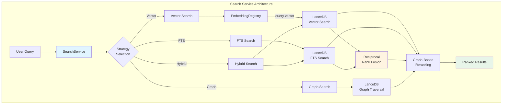
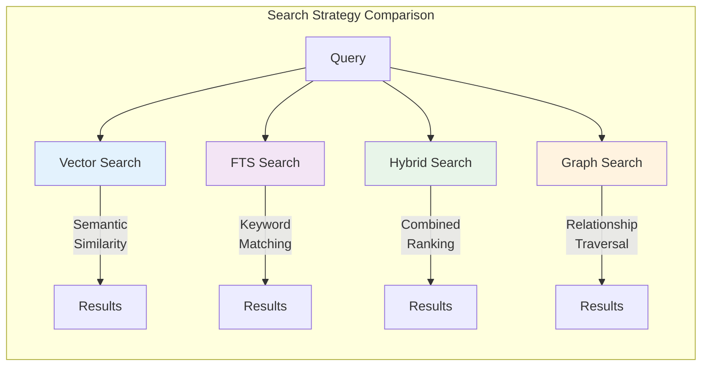
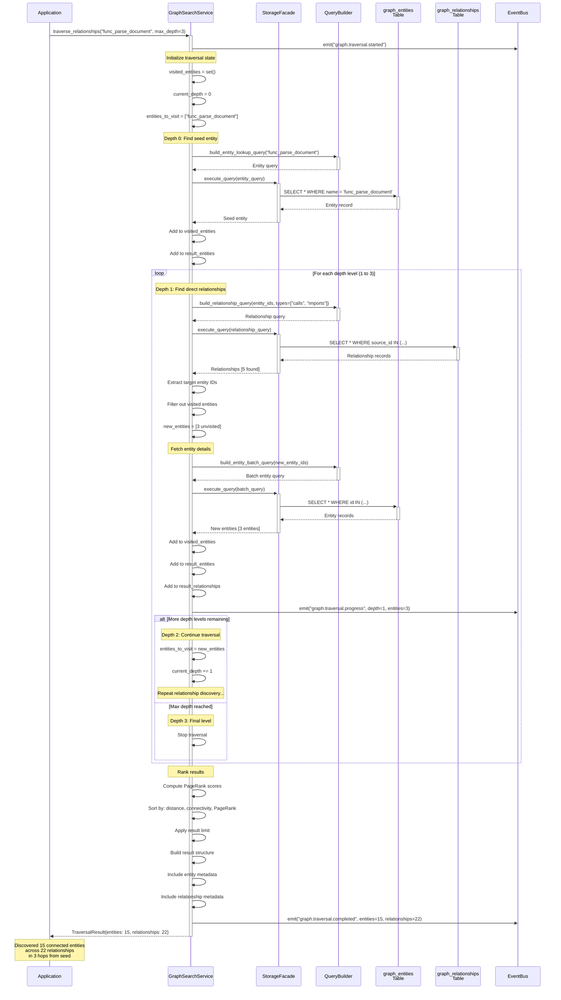
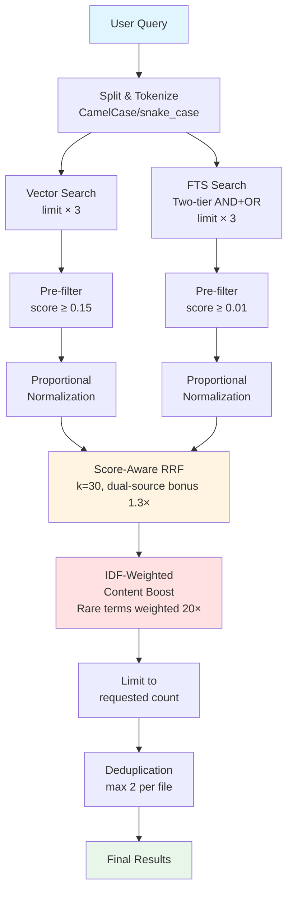

# Search Architecture

> Historical reference. This page describes PostgreSQL-family providers, cloud connectors or remote embedders that are not part of this local-only distribution. It is retained as design input for the external provider contract in [storage-backends.md](../storage-backends.md).

The search system provides multiple search strategies with intelligent ranking. This document explains how search works, the different strategies available, and how results are ranked.

## Quick Navigation

**Choose your focus:**

### 🔍 Understanding Search Strategies
- [Overview](#overview) - High-level search architecture
- [Search Strategies](#search-strategies) - Vector, FTS, Hybrid, and Graph search
- [Strategy Comparison](#search-strategies-comparison) - When to use each strategy

### 📊 Ranking & Results
- [Result Ranking](#result-ranking) - How results are ranked
- [Graph-Based Reranking](#graph-based-reranking) - PageRank-style reranking
- [Search Result Format](#search-result-format) - Result structure

### 🎯 Filtering & Optimization
- [Filtering](#filtering) - Filter by metadata
- [Performance Optimization](#performance-optimization) - Indexing and caching
- [Result Limits](#result-limits) - Configuring result limits

### 🔧 Implementation Details
- [Architecture](#architecture) - Search service architecture
- [Error Handling](#error-handling) - Graceful degradation
- [Testing](#testing) - Unit and integration tests

---

## Overview

The `SearchService` provides **four main search strategies**, each optimized for different use cases:

1. **Vector Search**: Semantic similarity using embeddings (best for "meaning-based" queries)
2. **Full-Text Search (FTS)**: Keyword matching with BM25 (best for exact terms)
3. **Hybrid Search**: Combines vector and FTS with Reciprocal Rank Fusion (best for general use)
4. **Graph Search**: Traverses entity relationships (best for finding related content)

**Key Features:**
- **Multiple strategies**: Choose the right search for your use case
- **Intelligent ranking**: RRF and graph-based reranking
- **Flexible filtering**: Filter by file path, language, and metadata
- **Async-first**: All search operations are non-blocking
- **Configurable**: Tune weights, limits, and reranking strategies

**Related Documentation:**
- [Architecture Overview](overview.md#search-service) - Search in system context
- [Knowledge Graph](knowledge-graph.md) - Graph search details

## Architecture

### Search Service Architecture

The search service provides multiple strategies with intelligent ranking:



### Strategy Comparison



## Search Strategies

### 1. Vector Search

Finds semantically similar content using vector embeddings.

**How It Works:**
1. Convert query to vector embedding
2. Compute cosine similarity with all document embeddings
3. Return top-k most similar documents

**Algorithm:**
```
similarity(query, doc) = cosine(embed(query), embed(doc))
                       = (query · doc) / (||query|| × ||doc||)
```

**Example:**
```python
from agentic_inquiry.search.service import SearchService

search = SearchService(db_manager)

# Generate query embedding
query_embedding = embedding_registry.embed("machine learning")

# Search
results = await search.vector_search(
    query_vector=query_embedding,
    limit=10
)
```

**Advantages:**
- Finds semantically similar content
- Works with synonyms and paraphrases
- Language-agnostic (with multilingual models)

**Disadvantages:**
- May miss exact keyword matches
- Requires embedding generation
- Sensitive to embedding quality

### 2. Full-Text Search (FTS)

Finds documents containing specific keywords using BM25 ranking.

**How It Works:**
1. Tokenize query into keywords
2. Search inverted index for matching documents
3. Rank using BM25 algorithm

**BM25 Algorithm:**
```
score(doc, query) = Σ IDF(term) × (f(term, doc) × (k1 + 1)) / 
                                   (f(term, doc) + k1 × (1 - b + b × |doc| / avgdl))

where:
- IDF(term) = inverse document frequency
- f(term, doc) = term frequency in document
- |doc| = document length
- avgdl = average document length
- k1, b = tuning parameters
```

**Example:**
```python
# Search for exact keywords
results = await search.fts_search(
    query_fts="machine learning algorithms",
    limit=10
)
```

**Advantages:**
- Fast keyword matching
- Exact phrase matching
- No embedding required

**Disadvantages:**
- Misses semantic similarity
- Sensitive to exact wording
- No synonym handling

### 3. Hybrid Search

Combines vector and FTS using Score-Aware Reciprocal Rank Fusion (RRF) with IDF-weighted content boosting.

For a detailed sequence diagram showing the complete hybrid search execution flow, see the [Hybrid Search Execution Sequence Diagram](overview.md#hybrid-search-execution-sequence-diagram) in the Architecture Overview.

**How It Works:**
1. Perform vector search (limit × 3 for wider candidate pool)
2. Perform FTS search with two-tier AND+OR queries
3. Pre-filter noisy candidates (MIN_VECTOR_SCORE=0.15, MIN_FTS_SCORE=0.01)
4. Merge results using score-aware RRF
5. Apply IDF-weighted content boost to prioritize chunks with distinctive query terms
6. Optionally rerank using graph metadata
7. Deduplicate (max 2 results per file)

**Score-Aware Reciprocal Rank Fusion:**
```
RRF_score(doc) = Σ weight_i × score_factor_i / (k + rank_i(doc))

where:
- rank_i(doc) = rank of doc in result set i
- score_factor_i = max(0.1, actual_score_i) to weight by quality
- k = 30 (reduced from 60 to emphasize top results)
- weight_i = vector_weight or fts_weight from config
- dual_source_bonus = 1.3× for results in both vector and FTS
```

Unlike classic RRF which ignores relevance scores, this variant multiplies rank-based scores by actual similarity/BM25 scores. This prevents low-quality results from ranking high purely due to position.

**Example:**
```python
# Hybrid search with custom weights
results = await search.hybrid_search(
    query_vector=query_embedding,  # Pass embedding vector (or string for AlloyDB)
    query_fts="machine learning",   # Original query text
    limit=10,
    rerank_by_graph=True
)
```

**API Note:**
- `query_vector`: Embedding vector (list of floats) for most backends, or raw query string for AlloyDB server-side embedding
- `query_fts`: Original query text for FTS and content boosting

**Configuration:**
```yaml
search:
  hybrid_search:
    reranker_type: "rrf"  # RRF (default), linear_combination, cross_encoder, colbert
    reranker_params:
      k: 30  # RRF rank constant (lower = favor top results more aggressively)
      dual_source_bonus: 1.3  # Multiplicative bonus for results in both vector and FTS
    vector_weight: 0.7    # Weight for vector results (used in score-aware RRF)
    fts_weight: 0.3       # Weight for FTS results (used in score-aware RRF)
    rerank_by_graph: true # Enable graph-based reranking (optional)
```

**Advantages:**
- Best of both worlds (semantic + keyword)
- Robust to query variations and embedding drift
- Score-aware ranking prevents low-quality results from ranking high
- IDF weighting rescues results when vector search misses
- Two-tier FTS captures both exact and partial matches
- Configurable weights and reranker types
- Achieved 10.0/10 relevance score at scale (140K+ chunks)

**Disadvantages:**
- Slower than individual strategies (typically 2-3× the latency)
- More complex configuration (multiple tuning parameters)

### 4. Graph Search

Traverses entity relationships to find connected content.

#### Graph Traversal Sequence Diagram

This sequence diagram shows how the system traverses entity relationships to discover connected content:



**Key Observations:**

- **Breadth-First Traversal**: Explores all entities at depth N before moving to depth N+1
- **Visited Tracking**: Prevents infinite loops and duplicate processing
- **Batch Queries**: Fetches multiple entities in single query for efficiency
- **Relationship Filtering**: Only follows specified relationship types (calls, imports, etc.)
- **Async Operations**: All database queries are non-blocking
- **Progressive Discovery**: Emits progress events at each depth level
- **Ranking**: Results ranked by distance from seed, connectivity, and PageRank
- **Performance**: ~10-50ms per depth level, total ~30-150ms for 3 levels

**How It Works:**
1. Find initial entities matching query
2. Traverse relationships up to max_depth
3. Collect connected entities
4. Return ranked results

**Traversal Algorithm:**
```
1. Start with seed entities (from query)
2. For each depth level (1 to max_depth):
   a. Get relationships for current entities
   b. Follow relationships of specified types
   c. Add target entities to result set
3. Rank entities by:
   - Distance from seed (closer = higher)
   - Number of connections (more = higher)
   - PageRank score (higher = higher)
```

**Example:**
```python
# Graph search with relationship filtering
results = await search.graph_search(
    query="parse_document function",
    max_depth=3,
    relationship_types=["calls", "imports"],
    limit=10
)
```

**Configuration:**
```yaml
search:
  graph_search:
    max_depth: 3
    relationship_types:
      - "calls"
      - "imports"
      - "contains"
      - "references"
```

**Advantages:**
- Discovers related content
- Follows code/document structure
- Finds indirect connections

**Disadvantages:**
- Slower for deep traversals
- May return irrelevant connections
- Requires relationship data

## Result Ranking

### Base Ranking

Each search strategy produces an initial ranking:

**Vector Search:**
- Rank by cosine similarity (descending)

**FTS Search:**
- Rank by BM25 score (descending)

**Hybrid Search:**
- Rank by RRF score (descending)

**Graph Search:**
- Rank by distance and connectivity

### Graph-Based Reranking

Optionally rerank results using graph metadata (PageRank-style).

**Algorithm:**
```
1. Compute PageRank for all entities:
   PR(entity) = (1-d) + d × Σ PR(neighbor) / out_degree(neighbor)
   
2. Rerank search results:
   final_score(doc) = base_score(doc) × (1 + α × PR(entity))
   
where:
- d = damping factor (typically 0.85)
- α = graph weight (typically 0.2)
```

**Example:**
```python
# Enable graph reranking
results = await search.hybrid_search(
    query_vector=query_embedding,
    query_fts="machine learning",
    rerank_by_graph=True,  # Enable reranking
    limit=10
)
```

**Effect:**
- Boosts well-connected entities
- Promotes central/important content
- Reduces noise from isolated content

## Search Result Format

All search strategies return results in a consistent format:

```python
@dataclass
class SearchResult:
    id: str                      # Chunk ID
    file_path: str               # Source file
    content: str                 # Chunk content
    score: float                 # Relevance score
    start_line: int              # Start line number
    end_line: int                # End line number
    symbols: List[Dict]          # Code symbols (if any)
    entities: List[Dict]         # Document entities (if any)
    metadata: Dict[str, Any]     # Additional metadata
```

**Example:**
```python
for result in results:
    print(f"Score: {result.score:.3f}")
    print(f"File: {result.file_path}")
    print(f"Lines: {result.start_line}-{result.end_line}")
    print(f"Content: {result.content[:200]}...")
    print()
```

## Filtering

All search strategies support filtering by metadata:

```python
# Filter by file path
results = await search.hybrid_search(
    query_vector=query_embedding,
    query_fts="machine learning",
    filters={"file_path": "src/ml/*.py"},
    limit=10
)

# Filter by language
results = await search.hybrid_search(
    query_vector=query_embedding,
    query_fts="machine learning",
    filters={"language": "python"},
    limit=10
)

# Multiple filters
results = await search.hybrid_search(
    query_vector=query_embedding,
    query_fts="machine learning",
    filters={
        "language": "python",
        "file_path": "src/*.py",
        "symbols.type": "function"
    },
    limit=10
)
```

## Performance Optimization

### Vector Search Optimization

**LanceDB IVF-PQ Index:**
- Inverted File (IVF): Partitions vector space
- Product Quantization (PQ): Compresses vectors
- Trade-off: Speed vs. accuracy

**Configuration:**
```python
# Create IVF-PQ index
await db_manager.create_index(
    table="document_chunks",
    column="vector",
    index_type="IVF_PQ",
    num_partitions=256,
    num_sub_vectors=96
)
```

### FTS Optimization

**Inverted Index:**
- Automatically created by LanceDB
- Fast keyword lookup
- Supports phrase queries

### Caching

**Query Cache:**
```python
# Cache search results
cache_key = f"{query}:{limit}:{filters}"
cached_results = query_cache.get(cache_key)
if cached_results:
    return cached_results

results = await search.hybrid_search(...)
query_cache.set(cache_key, results)
```

### Result Limits

**Configuration:**
```yaml
search:
  default_limit: 10    # Default number of results
  max_limit: 100       # Maximum allowed results
```

**Usage:**
```python
# Use default limit
results = await search.hybrid_search(query_vector, query_fts)

# Custom limit
results = await search.hybrid_search(query_vector, query_fts, limit=50)

# Exceeds max_limit → capped at max_limit
results = await search.hybrid_search(query_vector, query_fts, limit=200)
```

## Search Strategies Comparison

| Strategy | Speed | Semantic | Keyword | Relationships | Relevance | Use Case |
|----------|-------|----------|---------|---------------|-----------|----------|
| Vector   | Fast  | ✓        | ✗       | ✗             | 7/10      | Semantic search, concept matching |
| FTS      | Fastest | ✗      | ✓       | ✗             | 6/10      | Exact keyword search |
| **Hybrid** | **Medium** | **✓** | **✓** | **✗** | **10/10** | **General search (recommended)** |
| Graph    | Slow  | ✗        | ✗       | ✓             | N/A       | Related content discovery |

**Recommendation:** Use hybrid search for most use cases. It combines the strengths of both vector and FTS while mitigating their individual weaknesses through score-aware RRF and IDF-weighted content boosting.

## Error Handling

### Embedding Errors

```python
try:
    query_embedding = embedding_registry.embed(query)
except Exception as e:
    logger.error(f"Failed to generate embedding: {e}")
    # Fall back to FTS only
    return await search.fts_search(query, limit=limit)
```

### Database Errors

```python
try:
    results = await search.hybrid_search(...)
except Exception as e:
    logger.error(f"Search failed: {e}")
    return []  # Return empty results
```

### Invalid Filters

```python
try:
    results = await search.hybrid_search(
        query_vector=query_embedding,
        query_fts=query,
        filters={"invalid_field": "value"}
    )
except ValueError as e:
    logger.error(f"Invalid filter: {e}")
    # Retry without filters
    return await search.hybrid_search(query_vector, query_fts)
```

## Testing

### Unit Tests

Test individual search strategies:

```python
async def test_vector_search():
    search = SearchService(db_manager)
    query_embedding = [0.1] * 384
    
    results = await search.vector_search(
        query_vector=query_embedding,
        limit=10
    )
    
    assert len(results) <= 10
    assert all(r.score >= 0 for r in results)
```

### Integration Tests

Test end-to-end search:

```python
async def test_hybrid_search():
    # Index test data
    pipeline.index_directory("./test_data")
    
    # Search
    search = SearchService(db_manager)
    results = await search.hybrid_search(
        query_vector=query_embedding,
        query_fts="test query",
        limit=10
    )
    
    assert len(results) > 0
    assert results[0].score > results[-1].score  # Descending order
```

---

## Related Documentation

### Architecture & Design
- [Architecture Overview](overview.md) - Complete system architecture
- [Design Decisions](design-decisions.md) - Why hybrid search and RRF
- [Knowledge Graph](knowledge-graph.md) - Graph search architecture
- [Async Architecture](async-architecture.md) - Async search implementation

### Extension & Customization
- [Extending Agentic Inquiry](../customization/extending.md) - Custom search strategies

### Reference
- [API Reference](../api-reference/api.md#search) - Search API documentation

---

## Next Steps

### Understanding Search
- **How does search fit in?** → [Architecture Overview](overview.md#search-service)
- **What happens before search?** → [Indexing Pipeline](overview.md#indexing-pipeline)

### Choosing a Strategy
- **Semantic search?** → [Vector Search](#1-vector-search)
- **Keyword search?** → [Full-Text Search](#2-full-text-search-fts)
- **Best of both?** → [Hybrid Search](#3-hybrid-search)
- **Related content?** → [Graph Search](#4-graph-search)

### Optimization
- **Improving performance?** → [Performance Optimization](#performance-optimization)
- **Better ranking?** → [Graph-Based Reranking](#graph-based-reranking)
- **Filtering results?** → [Filtering](#filtering)

### Deep Dives
- **Why this design?** → [Design Decisions](design-decisions.md)
- **How does async work?** → [Async Architecture](async-architecture.md)
- **Graph traversal details?** → [Knowledge Graph](knowledge-graph.md)

---

## Search Relevance Enhancements

Agentic Inquiry achieved **10.0/10 search relevance** through systematic improvements to the hybrid search pipeline. Starting from a baseline of 3.8/10 with default configuration, four phases of enhancements brought search to perfect relevance across keyword, conceptual, and structural queries.

**What changed:** The hybrid search pipeline now uses score-aware RRF (not rank-only), IDF-weighted content boosting (rare terms weighted 20× more than common terms), two-tier AND+OR FTS queries, pre-filtering of noisy candidates, proportional normalization, CamelCase/snake_case splitting, file path indexing, and wider candidate fetching. These changes address result dilution at scale, embedding drift, and the "import chunk" problem.

This section documents the key enhancements and their impact.

### Performance Results

**Final Score: 10.0/10** (tested on AlloyDB with 140K+ chunks, 2,000+ source files)
- **Overall**: 10.0/10
- **Keyword queries**: 10.0/10 (exact terms, file paths, identifiers)
- **Conceptual queries**: 10.0/10 (semantic understanding)
- **Structural queries**: 10.0/10 (architecture patterns)

All 10 test queries achieved perfect 10.0/10 scores. Test script: `scripts/deep_search_test.py`

### Search Pipeline Flow



### Key Improvements

The search enhancements are organized into four phases, each addressing specific relevance challenges:

#### Phase 1: Foundation (3.8 → 6.9/10)

**1.1. CamelCase/snake_case Splitting**

Location: `agentic_inquiry/parsers/implementations/unified_code.py` (`_split_compound_identifier()`)

Code identifiers use compound naming. Splitting enables better token matching.

```python
# Examples:
parseDocument → ["parse", "Document"]
user_service → ["user", "service"]
BPMWorkflow → ["BPM", "Workflow"]
```

**Impact:** FTS matches partial identifier components (e.g., "parse" matches "parseDocument")

**1.2. File Path in FTS Index**

Location: `agentic_inquiry/storage/providers/postgresql/vector.py`

File paths contain valuable search context (package names, module structure).

```sql
-- Added to tsvector:
setweight(to_tsvector('simple', coalesce($4, '')), 'C')  -- file_path with weight C
```

**Impact:** Queries like "BPM workflow" match files in `bpm/workflow/` paths.

**1.3. Proportional Normalization**

Location: `agentic_inquiry/search/normalization.py` (default changed to "proportional")

Min-max normalization destroys absolute quality signal. Proportional normalization (divide by max) preserves relative differences.

```python
# Proportional: preserves quality signal
proportional_score = score / max(scores)

# Min-max: forces worst result to 0.0
min_max_score = (score - min) / (max - min)
```

**Impact:** High-quality results maintain their advantage over mediocre results.

**1.4. Deduplication: max_results_per_file=2**

Location: `agentic_inquiry/search/deduplicator.py`

Changed from 1 to 2 results per file to show more context per file while maintaining diversity.

**Impact:** Better file representation in results.

**1.5. Stemmer Selection by Content Type**

Location: `agentic_inquiry/storage/providers/postgresql/vector.py`

Code uses exact terms; documentation uses natural language.

```python
# Code chunks: 'simple' stemmer (no stemming)
# Documentation: 'english' stemmer (linguistic stemming)
```

**Impact:** Preserves exact code terms while enabling semantic doc search.

#### Phase 2: Scale (6.9 → 7.2/10)

**2.1. Score-Aware RRF Reranking**

Location: `agentic_inquiry/search/rerankers/rrf.py`

Traditional RRF ignores score quality, treating rank 1 from vector search (score 0.95) the same as rank 1 from FTS (score 0.05). The enhanced RRF multiplies rank-based scores by actual relevance scores.

**Changes:**
- `k=30` (reduced from 60) - Emphasizes top results
- Score factor multiplication: `weight × score_factor / (k + rank)` where `score_factor = max(0.1, actual_score)`
- Dual-source bonus: 1.3× boost for results appearing in both vector and FTS
- Proportional normalization to stay in [0,1] range

**Impact:** Prevents low-quality results from ranking high purely due to position.

**2.2. Pre-Filtering Noisy Candidates**

Location: `agentic_inquiry/search/hybrid_search.py`

Low-quality candidates dilute RRF effectiveness. Pre-filtering removes noise before ranking.

**Thresholds:**
- `MIN_VECTOR_SCORE = 0.15` - Remove semantically irrelevant results
- `MIN_FTS_SCORE = 0.01` - Remove token-only matches

**Impact:** Cleaner candidate pool improves final ranking quality. At 50K+ chunks, this prevents marginally-relevant results from competing for top positions.

**2.3. OR-Based FTS Queries**

Location: `agentic_inquiry/storage/providers/postgresql/vector.py`

AND-only FTS misses partial matches. Two-tier query strategy captures both exact and partial matches.

**Query Structure:**
1. Generate AND query: all terms required
2. Generate OR query: any term matches
3. Split CamelCase identifiers for better matching (reuses `_split_compound_identifier()`)
4. Execute both queries with UNION
5. Apply 2× rank boost to AND results

**Example:** Query "Kafka consumer service" generates:
```sql
-- AND query (exact matches, 2x rank boost)
plainto_tsquery('simple', 'Kafka & consumer & service')

-- OR query (partial matches)
plainto_tsquery('simple', 'Kafka | consumer | service')
```

**Impact:** Catches partial matches while prioritizing exact matches. Critical for queries with rare technical terms.

#### Phase 3: Coverage (7.2 → 9.5/10)

**3.1. Query-Term Content Boost**

Location: `agentic_inquiry/search/hybrid_search.py` (`_apply_query_content_boost()`)

Import-only chunks rank above actual implementations. Content boost prioritizes chunks containing actual query terms in code/documentation.

**Algorithm:**
1. Tokenize query: split CamelCase, snake_case, spaces
2. Filter stop words and short terms (< 2 chars)
3. Deduplicate terms (case-insensitive)
4. Calculate match ratio: `matched_terms / total_terms`
5. Apply multiplicative boost: `score × (1 + (boost_factor - 1) × ratio)`
6. Re-normalize proportionally

**Example:**
```
Query: "BPMWorkflowService processRequest"
Terms: ["BPM", "Workflow", "Service", "process", "Request"]

Chunk A (import): "import com.bpm.workflow.BPMWorkflowService;"
Match ratio: 3/5 = 0.6 → boost 1.3×

Chunk B (implementation): "class BPMWorkflowService { void processRequest() { ... } }"
Match ratio: 5/5 = 1.0 → boost 1.5×
```

**Impact:** Implementation code ranks above import statements.

**3.2. Wider Candidate Fetch**

Location: `agentic_inquiry/search/hybrid_search.py`

Fetching only `limit × 2` candidates leaves insufficient headroom for content boost re-ranking.

**Changed:** Fetch `limit × 3` candidates (was `limit × 2`)

**Impact:** More candidates for content boost to select from. Essential when top vector results don't contain actual query terms.

#### Phase 4: IDF Weighting (9.5 → 10.0/10)

**4.1. IDF-Weighted Content Boost**

Location: `agentic_inquiry/search/hybrid_search.py` (`_apply_query_content_boost()`)

Vector embeddings can drift from query intent (e.g., "Oracle BPM" → OPA adapter files). IDF weighting rescues correct results by identifying chunks containing distinctive query terms.

**Algorithm:**
1. Pre-scan candidates to calculate per-term document frequency
2. Compute IDF weights: `weight = 1.0 / max(0.05, frequency)` (capped at 20×)
   - Rare terms: "BPM" in 5% of docs → weight 20×
   - Common terms: "service" in 60% → weight 1.7×
3. Calculate weighted match ratio: `sum(matched_term_weights) / sum(all_term_weights)`
4. Apply multiplicative boost: `score × (1 + (boost_factor - 1) × weighted_ratio)`
5. Apply additive floor for `weighted_ratio >= 0.5`: guarantee competitive score even if vector search missed
6. Re-normalize proportionally to preserve score distribution

**Example:**
```
Query: "Oracle BPM workflow"
Term frequencies in 1000 candidates:
- "Oracle": 15% → weight 6.7×
- "BPM": 5% → weight 20×
- "workflow": 40% → weight 2.5×
Total weight: 29.2

Chunk A (OPA file): contains "Oracle" only
Weighted ratio: 6.7/29.2 = 0.23 → boost 1.1×

Chunk B (BPM file): contains "BPM" and "workflow"
Weighted ratio: (20 + 2.5)/29.2 = 0.77 → boost 1.4× + floor guarantee
```

**Impact:** Results matching rare, distinctive query terms appear in top results even when vector search completely misses. This was the final breakthrough to 10.0/10.

### Evolution Timeline

| Phase | Score | Key Changes | Key Files |
|-------|-------|-------------|-----------|
| Baseline | 3.8/10 | Default configuration | - |
| Phase 1 | 6.9/10 | CamelCase splitting, file path FTS, proportional norm, dedup=2, stemmer selection | `unified_code.py`, `postgresql/vector.py`, `normalization.py`, `deduplicator.py` |
| Phase 2 | 7.2/10 | Score-aware RRF (k=30, dual-source bonus), pre-filtering (0.15/0.01), OR-based FTS | `rrf.py`, `hybrid_search.py`, `postgresql/vector.py` |
| Phase 3 | 9.5/10 | Query-term content boost, wider candidates (limit × 3) | `hybrid_search.py` |
| **Phase 4** | **10.0/10** | **IDF-weighted content boost with additive floor** | `hybrid_search.py` (`_apply_query_content_boost()`) |

**Total improvement:** 163% increase in relevance score (3.8 → 10.0)

### Key Insights

1. **Result dilution at scale**: Purely rank-based RRF ignores score quality. Score multiplication essential at 50K+ chunks.
2. **Embedding drift**: Vector search can completely miss target when embeddings drift. FTS-based IDF weighting rescues correct results.
3. **AND vs OR**: AND-only FTS misses partial matches. Two-tier strategy captures both.
4. **Normalization matters**: Min-max destroys absolute quality signal. Proportional normalization preserves it.
5. **Content over imports**: Boost implementation code above import-only chunks.

### Testing Methodology

Test script (`scripts/deep_search_test.py`) evaluates 10 queries across three categories:
1. **Keyword**: Exact terms, file paths, identifiers
2. **Conceptual**: Semantic understanding, architectural patterns
3. **Structural**: Multi-file patterns, cross-cutting concerns

Each query specifies expected files and scoring criteria. Results scored 0-10 based on:
- Presence of expected files in top 10
- Relevance of returned results
- Absence of noise/false positives

### Key Insights

1. **Result dilution at scale**: Purely rank-based RRF ignores score quality. Score multiplication essential at 50K+ chunks.
2. **Embedding drift**: Vector search can completely miss the target when embeddings drift (e.g., "Oracle BPM" → OPA files). FTS-based IDF weighting rescues correct results.
3. **AND vs OR**: AND-only FTS misses partial matches. Two-tier strategy captures both while prioritizing exact matches.
4. **Normalization matters**: Min-max destroys absolute quality signal. Proportional normalization preserves it.
5. **Content over imports**: Boost implementation code above import-only chunks. IDF weighting ensures rare terms dominate.
6. **Candidate pool size**: Need `limit × 3` for content boost to work effectively. Too few candidates = not enough room for re-ranking.
7. **Pre-filtering is critical**: Remove noisy candidates before RRF to prevent rank dilution.

### Implementation Reference

**Key files for search enhancements:**
- `agentic_inquiry/search/hybrid_search.py` - Orchestration, IDF-weighted content boost, pre-filtering, candidate fetching
- `agentic_inquiry/search/rerankers/rrf.py` - Score-aware RRF with dual-source bonus
- `agentic_inquiry/search/normalization.py` - Proportional normalization
- `agentic_inquiry/search/deduplicator.py` - File-level deduplication (max 2 per file)
- `agentic_inquiry/storage/providers/postgresql/vector.py` - Two-tier AND+OR FTS, file path indexing, stemmer selection
- `agentic_inquiry/parsers/implementations/unified_code.py` - CamelCase/snake_case splitting

**Configuration options** (`config.yaml`):
```yaml
search:
  hybrid_search:
    reranker_type: "rrf"  # or "linear_combination", "cross_encoder", etc.
    reranker_params:
      k: 30  # RRF rank constant (lower = favor top results more)
      dual_source_bonus: 1.3  # Bonus for results in both vector and FTS
    vector_weight: 0.7  # Weight for vector search results
    fts_weight: 0.3  # Weight for FTS results
```
